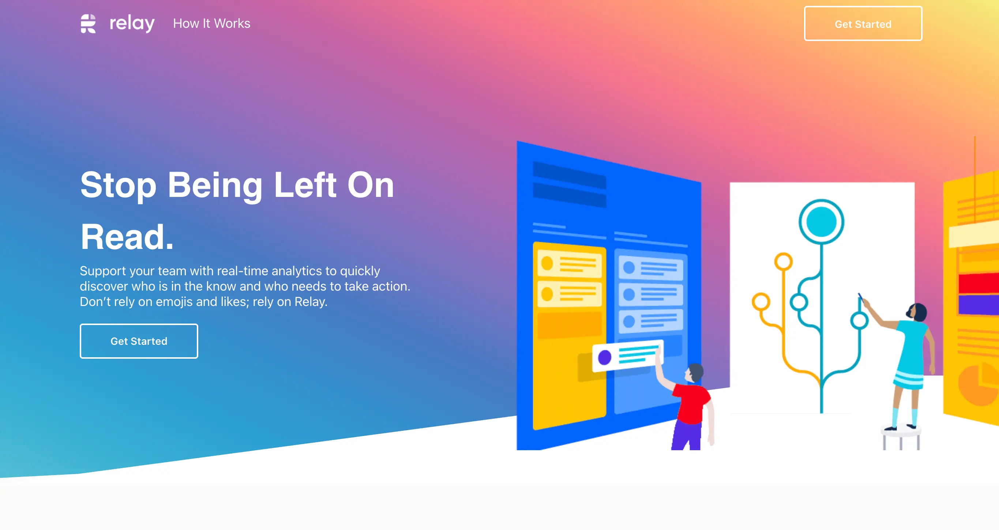
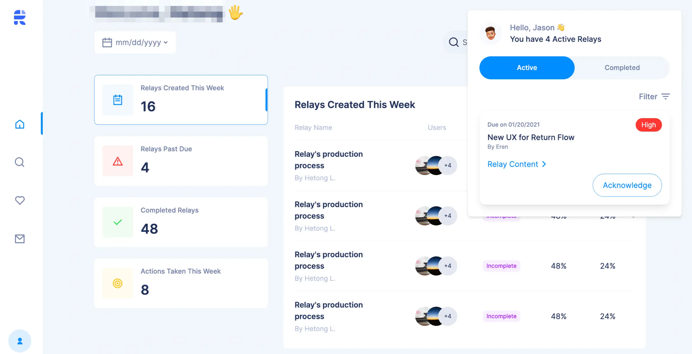
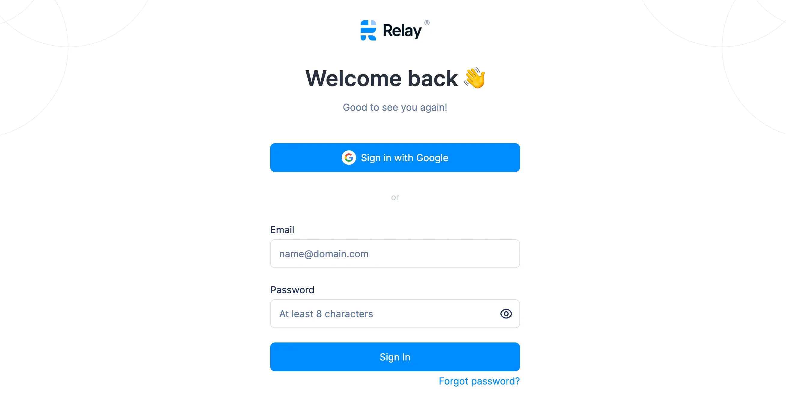

## In brief
* Relay is an extension tool that decreases micromanagement by automating workflows.
* Relay's first engagement with Dwarves aims to ship their MVP to market as quick as possible for early user acquisition.
* We dive in with 2 quickly adapt engineers. We keep a stable pace of feature shipment and adjust along with the requirements. 

## Highlights
* Slack app & Chrome extension.
* Custom semantic versioning for chrome extension.
* Combine flipper, sidekiq for A/B testing and gradually roll out new version.
* Action tracking system design.
* Monorepo source code.

## The Context
Relay was in the early stage. Hetong, the PO, stated clearly she needed a viable version with basic features.

The MVP must be finished fast and clean for potential customer acquirement and seeding round.

It must be done fast. And the requirement can be changed as market demands. Due to that, Hetong wants a team to quickly pick up the product context and be ready to adjust along the way. Meanwhile, keeping a stable pace for feature shipment.

*The context changes. We change accordingly.*

## Engagement Model
At first, we were expected to join them for the first few months. As the product goes, the trustworthy collaboration escalated that we could involve more in the development process. They welcome us to contribute the idea instead of just getting the tasks done.

**Teck stacks**

* Backend: Ruby on Rails
* Frontend: React + TailwindCSS, Storybook 
* Infra: AWS Amplify
* Real-time update: WebSocket
* EventTracking: Amplitude
Relay places their effort on development pace and reuses what's helpful to speed up the development progress. 

The combo of React, TailwindCSS and Storybook allows us to get that done with no sweat.

**Communication**

Slack is definitely for team communication, while Notion is perfect for documents management. 

We take Trello onboard for task management, while all the designs are stored in Figma. 

### Outcome

Through months of development, we are able to roll out the first MVP. 

That comes with **a Google Extension**, **a web app**, **an Analytics Dashboard** and **a Relay bot** integrated straight into Slack workspace.

Relay starts to acquire paid users and prepares for their next funding seed. Followed by their **[May Product Updates](https://teamrelay.medium.com/relay-product-updates-may-2021-f7b3db7002c5)**, we're delighted to be a part of this journey. The work evolves with two more features: Relay Sequence Chart and Relay Progress - both for team productivity boosting.