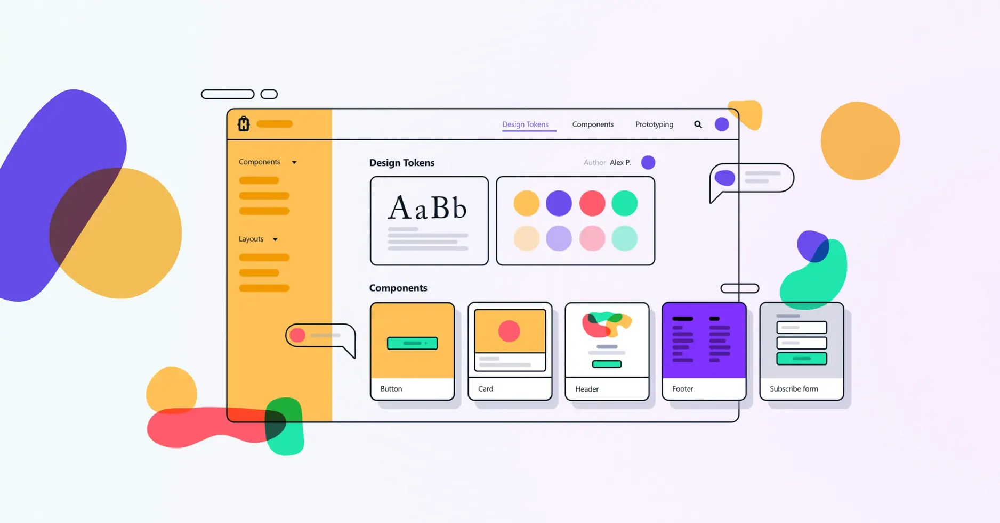

**Industry**\
E-commerce / Web Development

**Location**\
Southeast Asia

**Business context**\
Swift's growing e-commerce platform faced development bottlenecks, inconsistent user experiences, and duplicate code across applications

**Solution**\
Implemented a micro frontend architecture with a shared design system that all applications could use

**Outcome**\
Successfully delivered a flexible system that improved development speed, code quality, and user experience consistency

**Our service**\
Frontend Architecture / Design Systems / Component Libraries

## Technical highlights

- **Component development**: React for building reusable UI elements
- **Documentation**: Storybook for showcasing and testing components
- **Styling**: CSS-in-JS for encapsulated component styles
- **Distribution**: npm package for version management and sharing
- **Implementation strategy**: Independent development before integration
- **Validation**: Thorough testing in multiple application environments
- **Deployment**: Independent pipelines for each micro frontend

## What we did with Swift

We've partnered with Swift, an e-commerce company, for several years. In our most recent collaboration, we helped them implement a micro frontend architecture with a shared design system that all their applications could use.

Micro frontend is an architectural approach that breaks down a large website into smaller, independent pieces. Different teams can work on different pieces without stepping on each other's toes, and everything comes together seamlessly for the end user.

For Swift, this approach solved several critical challenges they were facing with their growing e-commerce platform. We focused particularly on building a shared design system that would create consistency across all their applications while making development more efficient.

*Note: "Swift" isn't the company's real name - we've changed it to respect their privacy. But everything shared here comes from real interviews and experiences.*

## The challenge Swift faced

As Swift's e-commerce platform grew, their development process became increasingly complex and difficult to manage. Large projects were becoming unwieldy, with multiple teams trying to work on the same codebase simultaneously.

They faced several key challenges:

- **Development bottlenecks**: Teams were waiting on each other to complete work before they could proceed
- **Inconsistent user experience**: Different parts of the platform had different looks and behaviors
- **Duplicate code**: Teams were recreating the same UI components multiple times
- **Slow release cycles**: The monolithic structure meant even small changes required extensive testing

They needed a way to make their development more efficient while ensuring a consistent user experience across all their applications.

## How we built it

After analyzing Swift's needs, we helped them implement a micro frontend architecture with a shared design system at its core.

### Technical approach

We divided the platform into smaller, more manageable chunks based on page and business purpose. This resulted in at least ten separate applications, each with a dedicated team:

- Login screens
- User profiles
- Ad management tools
- Messaging system
- Design system components
- And several others

For the shared design system, we implemented a comprehensive solution using:

- **React components**: We built reusable UI elements that could be shared across all applications, ensuring consistency while allowing for customization where needed.
- **Storybook documentation**: We created extensive documentation and interactive examples using Storybook, making it easy for all teams to understand how to use each component.
- **Component-scoped styling**: We bundled CSS with each component using CSS-in-JS techniques, preventing style conflicts when components are used in different applications.
- **npm package distribution**: We packaged the design system as an npm package with proper versioning, making it easy for teams to install and update.
- **Testing framework**: We established thorough testing procedures to ensure components worked correctly in all environments and use cases.

### Implementation strategy

The biggest technical challenge was creating components flexible enough to work across all the different applications. We implemented a rigorous development process that included:

1. Identifying common UI patterns across applications
2. Building components with the right balance of flexibility and consistency
3. Thoroughly testing components in multiple environments
4. Creating clear documentation so all teams could easily understand how to use them

### Team workflow

The process we established is straightforward:

1. The design system team builds and thoroughly tests components
2. The package is published to npm with proper versioning
3. Other teams install the package and import just the components they need
4. Teams provide feedback to continuously improve the system

We recommended building UI independently in each app first, then identifying shared components to add to the design system only after everything was stable. This approach reduces risk when upgrading because components have already been thoroughly tested.

## What we achieved

The micro frontend architecture and shared design system have genuinely improved Swift's development process. The first version has been successfully released and implemented in production applications.

Key benefits include:

- **Faster development cycles**: Teams can now work independently without blocking each other, leading to more rapid feature releases.
- **Consistent user experience**: All applications share the same UI components, creating a unified experience for users across the platform.
- **Reduced code duplication**: Common components are built once and shared, eliminating redundant work and improving code quality.
- **Easier maintenance**: Updates to the design system automatically improve all applications, making it simpler to implement platform-wide changes.
- **Better scalability**: New teams and applications can be added without disrupting existing work, allowing the platform to grow more efficiently.

We've already successfully integrated the shared design system into Swift's Ads Management Dashboard, with plans to expand to other applications soon.

The Swift team considers this implementation a success and plans to continue using this approach for future development. The architecture we helped them build is well-suited to their specific business needs and will support their growth for years to come.

This project is just one example of how we're helping partners implement micro frontend architecture. As we work with more companies on similar challenges, we'll continue sharing insights and best practices.
