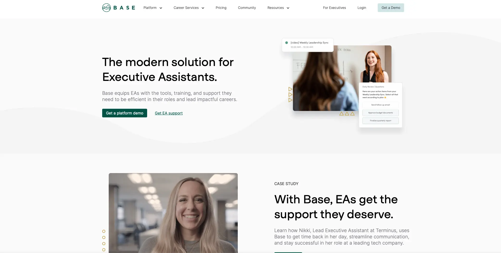
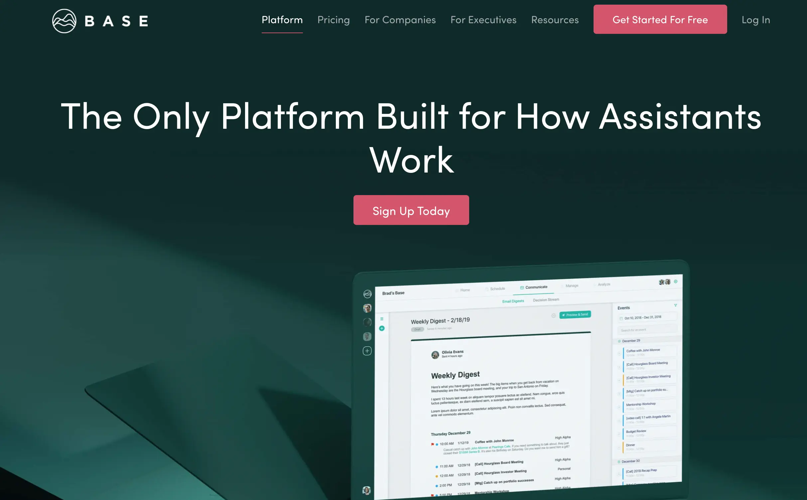
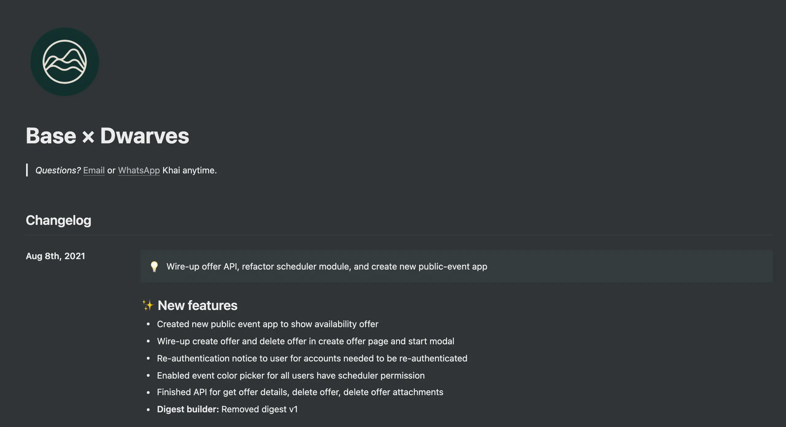
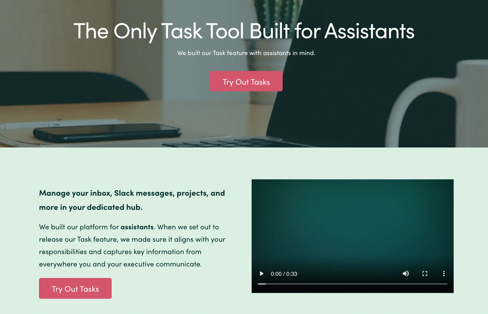
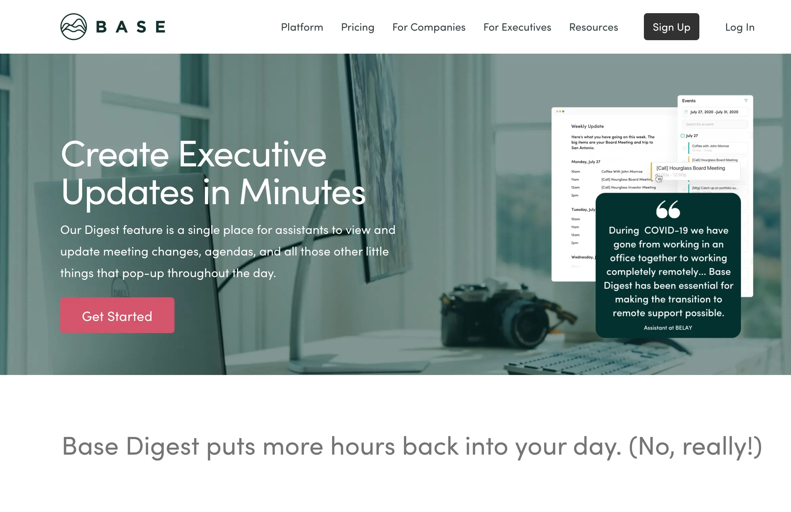
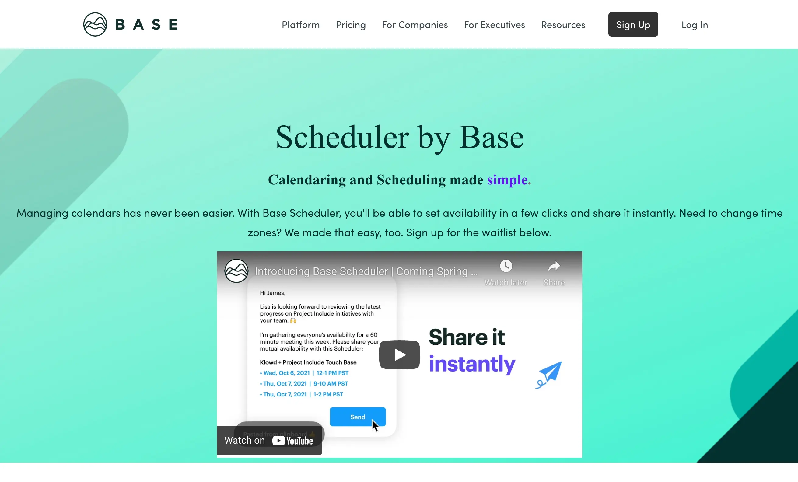

---
tags:
  - case-study
  - partnership
  - consulting
title: Team Up With Basehq Us First Ever Platform Built For Assistants
date: 2021-08-06
description: 
authors: 
menu: memo
type: 
hide_frontmatter: false
---

## In brief
* Base launched in 2019 out of High Alpha Venture Studio, with a $2.6M funding round led by Matchstick Ventures with participation from Revolution's Rise of the Rest Seed Fund, High Alpha Capital, and Slack Fund.
* Base is a software platform built specifically for executive assistants. Focus on smoothing out assistants' daily work. They demand a high integration between different platforms.
* We stepped in to make it happen. Through 2 years straight, they engaged with Dwarves to develop various new modules and features. Our work helped Base to catch up with their release roadmap and ensured product quality.

## Technical Highlight
* Microservices Architecture
* Implement TypeScript on the whole system for app performance
* Write services in Golang for performance and secure
* Write end-user app with ReactJS/NextJS Typescript to scalability
* Custom-library and webhook for EventCatching

## The Context
BaseHQ heads to boost performance for assistants. 

By pulling necessary data into one system, assistants can generate and use data for multiple operational tasks. 

*Their goal is an all-in-one platform for critical data. From calendar, tasks, decision stream, digest builders and scheduler.*

## Engagement Model
Our work with Base contains codebase development and technical consultancy. We help refactor the code while suggesting new architecture for new apps or UI/UX advice

We took over the big legacy code and optimize them to ensure product stability. The architecture contains two main parts: End-user App and Admin Tool. 

**Tech stacks**

* Backend: Go, Node.js
* Frontend: React.js, Next.js, Typescript
* Database: MongoDB, PostgreSQL
* Infras: GCP, k8s
* Monitoring: One Relic, Sentry, Fullstory

**Collaboration**

* Jira: Task management
* Slack: Team discussion
* Zoom: Team meeting
* Git/ Gitflow: Codebase
* Github Action: CI/CD

## Outcome
We keep track of the ongoing progress through weekly changelogs.
Currently, we're in the phase of wrapping Availability Offer - Base's most significant feature to provide users with simplicity in task scheduling. A powerful key feature that combines Calendar Event and poll setup.

Base just rolled out their [101 Demo](https://www.linkedin.com/posts/basehq_base-101-demo-get-back-to-the-base-ics-activity-6800435873860120576-G7ZI) not so long ago, detailedly describe how Base works. 

Base remains as one of our most extended collaborations. We assist them through different milestones. From rolling out their web app to their most significant features.

