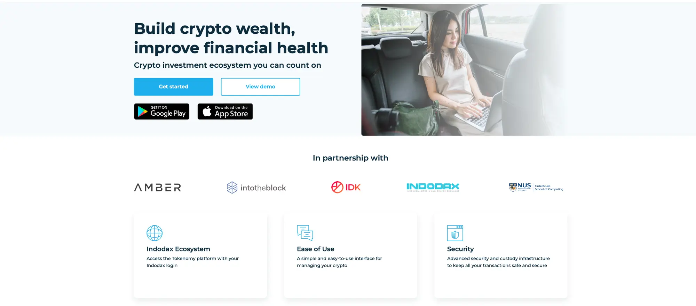
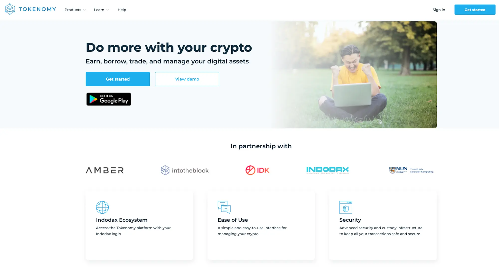
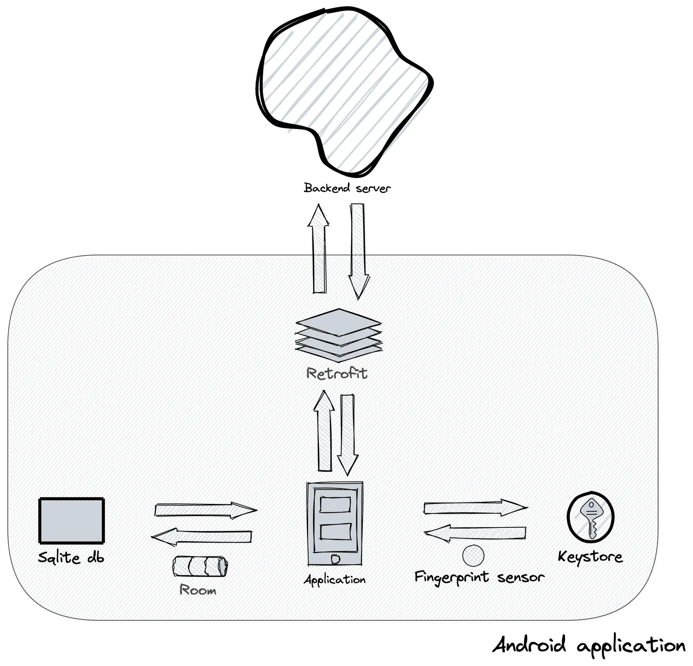
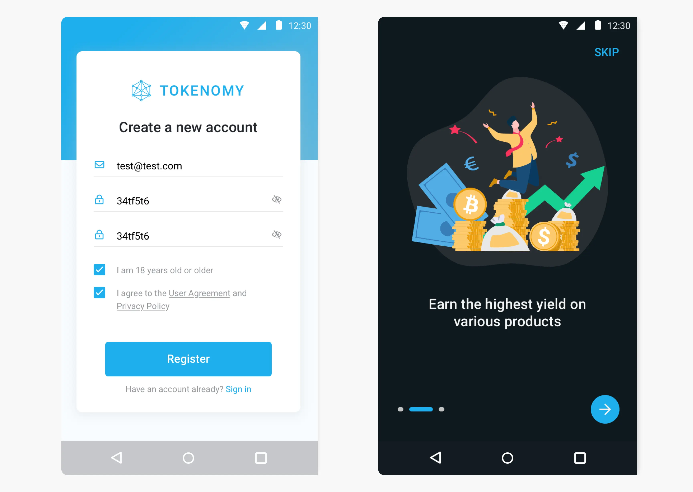
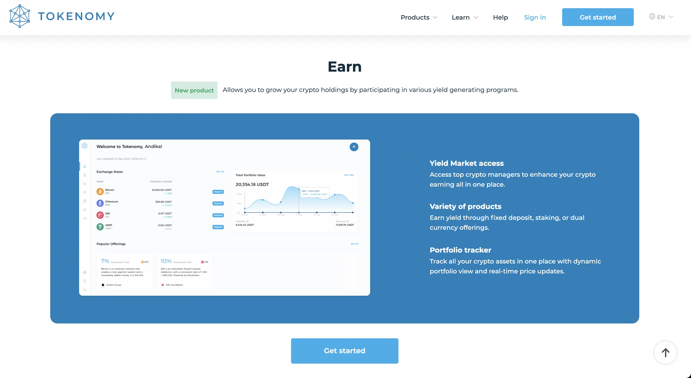

---
tags:
  - case-study
  - consulting
  - blockchain
title: "Tokenomy: Architect Frontend for a crypto investment ecosystem"
date: 2021-08-09
description: Founded in 2017 as an innovation arm of INDODAX, Tokenomy is a crypto investment network through blockchain-enabled tokens. We fully support a team of Senior Frontend Engineer, Android Mobile Engineer, and UX Designer to help them stay on track with the release timeline
authors: 
- han
- nikki
- duy
---

## In brief
- Founded in 2017 as an innovation arm of INDODAX, Tokenomy is a crypto investment network through blockchain-enabled tokens.
- Currently reached the seed round funded by LazyLedger, Tokenomy aims to reach a broader customer segment through web platforms and mobile apps.
- We fully support a team of Senior Frontend Engineer, Android Mobile Engineer, and UX Designer to help them stay on track with the release timeline.

## Technical Highlight
- MVVM for mobile application architecture
- WebSocket for real-time trading support
- Reactivex to bind data and process asynchronous tasks
- Biometric authentication approach for data encryption
- Custom-built Android module to support different APIs
- Weekly product changelog apply for the team synergy

## The Context
They came to us at first to refactor the frontend foundation. The partnership then escalated to create mobile apps and redesign the app UI.

The Android app is expected to release first, followed by applying the new design. The web app needs to be ready for essential functions. Meanwhile, the backend must be equipped with API optimization. 

>
> The Dwarves was able to test out a brand new domain. The work with Tokenomy kicked off our journey into the blockchain industry. With a team of 4, we work along side with them to make sure the progress moves forward. 

## Engagement Model
Tokenomy is our first Android project app for cryptocurrency trading platforms. Our team gains new insight through different work scopes.

We develop the new Premium web app from scratch. We take over the Android mobile app, dive into market research to redesign the app UI.

The app supports dark/light theme switching, data caching, and retrying failed API calls. With the fingerprint approach, the user's password is stored at keystore - the safest system for encrypted critical data. We get to ensure privacy and no memory leak. There are 2 API versions in its backend. Our Android module was built to support both of them.

Every UI and user flow get reviewed before implementation. That's how we give feedback to the product team. We keep everyone on the same page with weekly product changelogs.

### Tech stacks
- Backend: Elixir, Phoenix
- Frontend: React, TailwindCSS, Redux
- Database: Postgres, RESTful API
- Infra: GCP
- Mobile: Kotlin, Reactivex

### Collaboration
- Slack: Team discussion
- Pivotal Tracker/ Jira: Task Management
- Google Hangout: Team meeting
- Design: Sketch, Figma

## Outcome
Huge adjustments in UI and business logic cause challenges. We're glad to strive through with a robust mobile app and stunning new UI.

The architected solid frontend foundation allows their new features to be implemented quickly. The dark/light them app serves a better user's demand. Their product can go strictly according to the roadmap.

