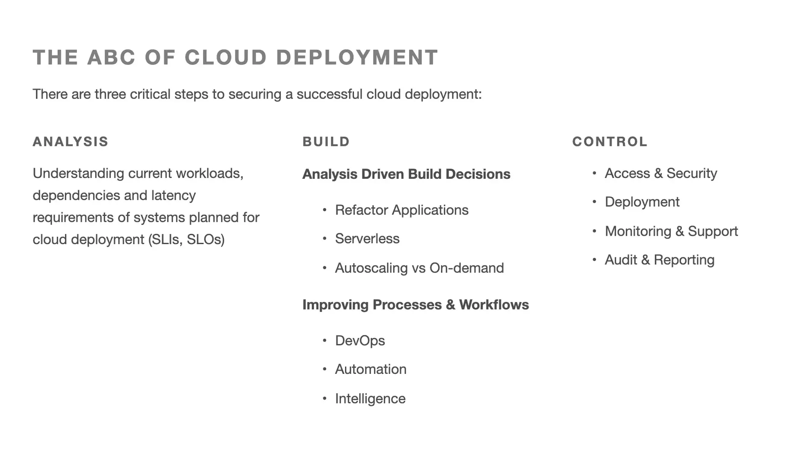

**Industry**\
Cloud services

**Location**\
Global

**Business context**\
Financial data expert needed a simplified cloud deployment solution for their clients

**Solution**\
Built a Platform-as-a-Service (PaaS) that automates complex cloud operations

**Outcome**\
Successfully created a user-friendly platform that reduces deployment time and errors

**Our service**\
Full-stack development / Cloud architecture

## Technical highlights

- **Backend**: Golang for performance and reliability
- **Frontend**: React for building the user interface
- **Infrastructure**: Docker, Kubernetes for containerization
- **Cloud Providers**: Google Cloud Platform, AWS
- **Documentation**: Redux-based document bundle

## What we did with Voconic

CJC has spent 20 years helping financial companies manage their market data. They came to us with a challenge: build a new data system that would make cloud deployment simple for their clients. Together, we created Voconic - a cloud platform that lets users deploy complex solutions with just a few clicks.

Our team started with three engineers during early development and grew to six as the project expanded. We built Voconic as a complete package in partnership with Google, focusing on making cloud operations simpler for financial sector clients.

The platform we created allows CJC's clients to deploy and manage cloud solutions without dealing with the technical complexities typically involved. It works across different cloud providers and environments, making the entire process seamless.

> "We were looking for a team that we could entrust our new Voconic cloud platform to. We found Dwarves among others, well known for industry experience in Go development, cloud platforms, and Kubernetes."
>
> *- Paul Kossowski, Manager at CJC*

## The challenge CJC faced

Financial companies deal with massive amounts of sensitive data that needs reliable, secure processing. Setting up cloud systems for this data traditionally required specialized knowledge and significant manual effort, which was time-consuming and prone to errors.

CJC wanted to create a solution that would give their clients more flexibility and control while reducing the technical burden. They identified several key needs:

- Moving away from expensive, inflexible data systems
- Easily switching between different data sources and technologies
- Maintaining continuous delivery of real-time data
- Simplifying the complexity of cloud deployments

The financial sector has strict requirements for security and reliability, which added another layer of complexity to the challenge.

## How we built it

We approached this project by focusing on automation and user experience to hide the underlying complexity of cloud operations.

### Technical approach

We built Voconic using industry-standard technologies - Docker containers and Kubernetes - to ensure reliability and compatibility. Our solution included several key components:

**Complete development from scratch**: We created the backend, frontend, and command-line tools specifically designed for cloud deployment.

**Golang-powered backend**: We chose Golang for its performance and built deep integrations with Google Cloud Platform that enable one-click deployment.

**Multi-cloud support**: The platform works seamlessly with both Google Cloud and AWS, giving users flexibility in their cloud strategy.

**Intelligent automation**: The system can automatically diagnose and fix issues when containers crash, reducing the need for manual intervention.

**Optimized file handling**: We built a separate service for file uploads that splits large files into smaller chunks with cached data, making the upload process more reliable.

**Command-line interface**: For power users and automation scenarios, we created a CLI that supports complex operations and repetitive tasks.

The platform includes monitoring and alerting systems that keep track of deployed applications and notify users about potential issues before they become problems.

### How we collaborated

Working with CJC's team required clear communication across different time zones. We established a workflow that kept everyone aligned:

- Google Chat for daily discussions and quick questions
- Google Hangout for team meetings and progress updates
- Asana for task tracking and project management

This approach allowed us to work efficiently with CJC's team while maintaining transparency throughout the development process.

## What we achieved

After months of dedicated work, we successfully delivered a working MVP of the Voconic platform with significant benefits for CJC and their clients:

**User-friendly interface**: We created a web interface that makes complex cloud operations accessible to non-technical users.

**Custom deployment definitions**: We developed a YAML format that defines how to create a product, with CLI support for advanced users.

**Reliable testing**: We implemented comprehensive automation testing to ensure the platform works consistently.

**Pre-release validation**: The platform provides an internal working version before releasing to cloud providers, adding an extra layer of error prevention.

The completed Voconic platform has significantly reduced the time and complexity involved in cloud deployments for financial companies. Instead of spending hours or days setting up cloud infrastructure, CJC's clients can now deploy what they need in minutes with fewer errors and less specialized knowledge required.

This allows financial companies to focus on their core business rather than getting caught up in technical details, while still taking advantage of modern cloud capabilities.
