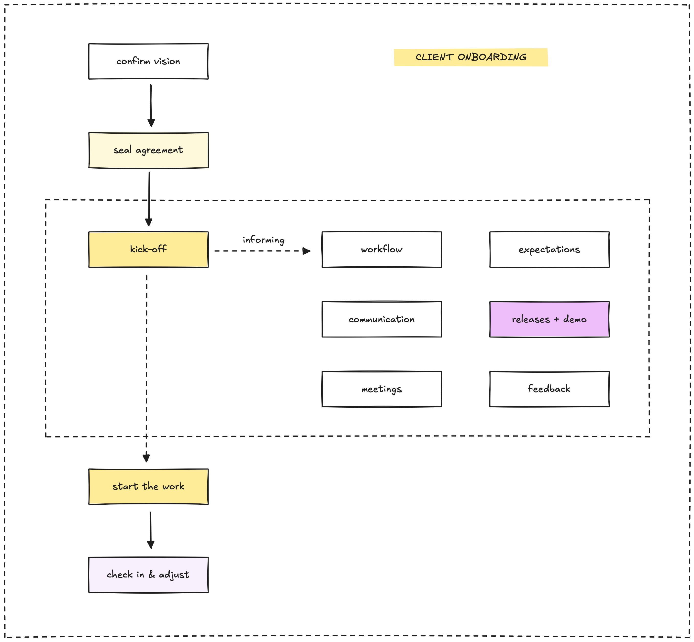

Once the contract is signed, our client onboarding process aligns client and developer teams into a cohesive unit, focused on a shared blueprint. This guide details how we build this foundation to deliver exceptional software. Like a craftsman listening before carving, onboarding ensures a clear process that aligns objectives, prevents misunderstandings, and fosters collaboration, creating a seamless partnership.

## Our onboarding process

Our five-step process starts post-contract, focusing on **informing parties**, uniting teams, and ensuring clarity. The kickoff centralizes process, communication, meetings, deliverables, deadlines, and feedback into a unified narrative.

### Clarify the vision

Reconfirm client objectives to align on engagement model and billing. This brief step, facilitated via calls or shared documents, ensures we focus on the critical outcome.

### Seal the agreement

Formalize the partnership. The contract details engagement model, billing, scope, timeline, team, communication preferences, and key contacts. Precision here, ensuring clarity via e-signature platforms and proposals, prevents disputes.

### Kick off with a walk-through

The kickoff meeting aligns everyone around a shared plan, integrating framework, communication, meetings, deliverables, deadlines, and feedback.

#### **Process**/workflow

Select the best methodology (Scrum, Kanban, etc.) and show the workflow. Explain Agile if needed. Adapt to client's preferred task trackers.

#### **Communication**

Establish communication channels and rules based on client needs (chat, email, video). Define key contacts. Confirm preferred methods to avoid issues.

#### **Meetings**

Schedule regular meetings (demos, stand-ups, check-ins) to maintain momentum. Verify schedules, agree on agendas focusing on progress, feedback, and planning. Use video platforms/calendars.

#### **Expectations**

Review deliverables and define roles/responsibilities to ensure a unified vision. Use documents or visual tools for clarity and confirm alignment.

#### **Deadlines/releases**

Map milestones and define "complete" for deliverables and releases. Note that delays require agreement. Use trackers for visibility, adjusting to client systems.

#### **Collect feedback**

Plan how to collect feedback (surveys, calls) throughout the project. Set boundaries for timely input. Structured feedback ensures focus. Choose tools for ease.

This walk-through forges shared commitment and ensures alignment through clear planning and confirmed schedules.

#### Quick reference: Walk-**through** elements

| Element            | What we do                        | Why it matters                  |
| ------------------ | --------------------------------- | ------------------------------- |
| Process/workflow   | Set Scrum or Kanban, show flow    | Ensures clear progress          |
| Communication      | Select channels, define rules     | Facilitates efficient updates   |
| Meetings           | Schedule demos, stand-ups         | Sustains alignment              |
| Expectations       | Review deliverables, assign roles | Prevents misunderstandings      |
| Deadlines/releases | Map milestones, define “complete” | Sets achievable targets         |
| Collect feedback   | Plan input post-demo, set rules   | Refines work without disruption |

### Start the work

Post-kickoff, start work following the agreed framework, adhering to communication and meeting plans. Clear roles and regular updates (like stand-ups) ensure momentum.

### Check in and adjust

Around two weeks in, review progress, collect feedback, and adjust scope to ensure client satisfaction. Swift adjustments demonstrate commitment.

## Common challenges and solutions

Onboarding can encounter obstacles. Expecting daily calls instead of weekly? Clarify during the kickoff. Tool access issues? Verify compatibility early. Unclear roles? Define responsibilities upfront. Excessive feedback? Limit it to structured intervals.

## Consultant tips

Your guide to mastering onboarding:

- Finalize agreements with precise scope.
- Craft the kickoff as a unified narrative, confirming alignment.
- Initiate work promptly, verifying resources.
- Review progress early, responding to feedback swiftly.
- Validate tools before starting.
- Structure feedback to maintain focus.
- Act as a trusted advisor, listening and simplifying.

## The human element in the AI era

Despite AI advancements, successful partnerships rely on **human connection**: trust, empathy, and understanding. Clients today expect **prompt responses** and professional execution. Meeting these demands requires clear communication and expertise while preserving the personal touch.

Onboarding is crucial for project success, like preparing wood for carving. It showcases our dedication and ensures client priorities guide our efforts. A robust process positions every project for success.

---

> Next: [Project delivery](client-delivery.md)
