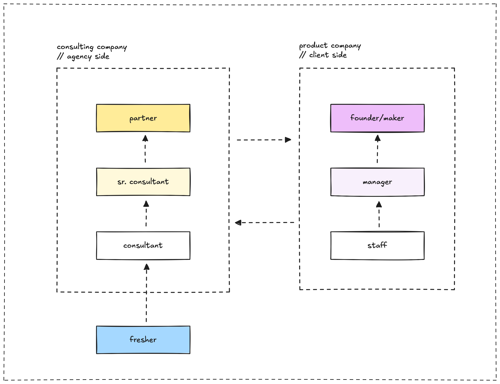

> **tl;dr**
>
> We fix stuff for product companies. Consulting gigs give you variety and growth; product jobs focus on one system. We win clients by spotting issues and delivering, all with a service mindset.

Heard about agency-client stuff in marketing? It’s a big deal in tech too, just with a different vibe. Consulting companies (like us) and product companies (think fintechs or retailers) team up in ways that shape your job and projects. This isn’t about ads, it’s about fixing systems and solving problems. Let’s break it down, answer your questions, and show you how we do things in tech.

## What’s the deal with consulting vs product companies?

We build solutions for clients, tackling all sorts of projects, from speeding up workflows to designing new setups. Our job is to find weak spots, like slow systems or old tools, and make them better. Product companies stick to their main thing, like a banking app or a retail site, polishing it over time.

Picture us as chefs cooking for different folks, whipping up custom dishes. Product companies are like restaurant owners, nailing one menu. We love variety; they go deep on one thing.

### Why’s this not just a marketing thing?

Think this is only for marketing folks? Nope, it’s huge in tech. We’re not making logos, we’re boosting payment systems or streamlining inventory. Knowing this helps you pick a career or pitch a deal.

## Can you jump between consulting and product jobs?

Totally. One day you’re with us, juggling client projects. Next, you’re at a product company, grinding on one system. Consulting teaches you to adapt fast, which product folks love. Product experience gives you deep know-how, making you a killer consultant.

It’s not always smooth. Consulting’s fast and varied; product work’s slower, focused. A junior might dig our pace but feel stuck in a product gig. Figure out if you want breadth or depth.

## What’s our job as a consulting company?

We spot issues product companies miss and fix them with tech smarts. Think of us as detectives, hunting for clunky processes or outdated gear. Clients want quick wins that hit their goals, like faster sales or lower costs. We don’t own their stuff, we just make it shine.

## Why pick consulting?

Consulting’s awesome for variety. You jump from fintech to retail, picking up new skills. A junior might learn cloud stuff one month, pipelines the next. You grow fast, tackling real problems. Plus, multiple clients mean less risk than a product company’s ups and downs.

## How do we score clients?

We listen, ask “What’s holding you back?” and find gaps. Then we pitch fixes that match their needs, like cutting costs. A quick prototype seals the deal. To keep clients, we deliver solid work and stay flexible, with clear updates.

## What’s this service mindset?

Service means putting clients first. It’s not about flexing our tech chops, it’s about solving their headaches in ways that fit. When we speed up a client’s system, we focus on their win, like better sales. This builds trust and keeps us tight with clients.

## Any new challenges?

Tech moves quick, and that’s tough. Product companies might push back, worried about messing up their setup. We show them the payoff, like saving bucks. We’re stretched thin juggling clients, so we use tools to stay sharp. Clear plans keep everyone on the same page.

Knowing consulting vs product companies helps us nail our craft. We solve problems with tech know-how, making clients stronger. Whether you’re with us or a product company next, this shapes how you grow and win.
