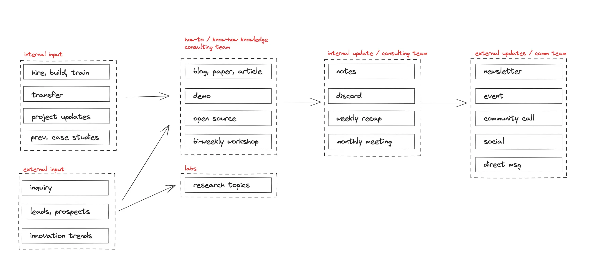

---
tags:
  - dwarves
  - work
  - consulting
title: Consulting - How we work
date: 2023-12-21
description: We believe in collaborative expertise and using our team of specialists to share knowledge with one another, think outside of the box, and transparently communicate, to foster a collaborative environment that promotes trust, clarity, and alignment.
authors:
  - nikki
menu: consulting
type: consulting
hide_frontmatter: false
pinned:
hide_title: false
---

## Our Approach: Collaborative Expertise
- **Team of Specialists**: we favor collective expertise, encouraging knowledge sharing and collaboration, to craft innovative solutions that exceed expectations.
- **Innovative Mindset:** we encourage out-of-the-box thinking, experimentation, and creative problem-solving
- **Transparent Communication**: we lay everything out on the open, fostering a collaborative environment that promotes trust, clarity, and alignment

**Because we function based on real life demands, we recommend at least the following appointments**

- **Weekly note:** written record consists of 3 main components; current project health & issues, potential project / deal, market signal report
- **Monthly report:** wins, losses & lessons learned collected from weekly notes
- **Monthly planning / retro:** conducted by Consulting team to reflect on our performance metrics, planning for the next period
- Monthly demo/showcase: team-wise event to show off what we built / learned
- **Monthly calibration:** a joint appointment between Consulting, Labs and Ops to review individual / team performance

**Information Flow**

