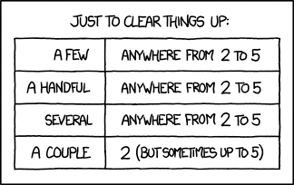
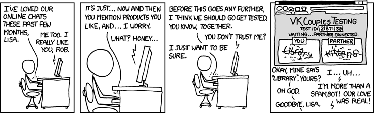

> **tl;dr** Master deal-making by understanding client needs, building trust, crafting tailored pitches, navigating negotiations, and following up for future wins. Guide clients to clarity, address blockers, and secure impactful, lasting partnerships.

Deal making isn't just about signing a contract. It's about kicking off a partnership that delivers value for the client and keeps your firm thriving. Whether you're pitching to a startup or a big enterprise, closing a deal means aligning their needs with your expertise while building trust. After years of sealing deals, we've learned it's the soft skills, listening, guiding, staying sharp, that make it happen. Here's how your consultant and sales team can master deal making, from tackling unclear requirements to securing long-term wins.

## Understand the client's business and pain points

Clients rarely show up with a crystal-clear brief. 90% of the time, their **requirements are fuzzy**, just rough ideas in their heads. If they've written a paragraph or bullet points, that's already a win. It's human nature, we struggle to spell out exactly what we want at first, just like when a coworker tosses you a vague request. Expecting a detailed brief from the get-go is a trap. Your job as a consultant is to guide them through the fog, helping them clarify their needs.

Start by digging into their world. Research their industry, business model, and challenges using public data like company reports or industry news. Are they a small business desperate to cut costs? A startup chasing investor hype? Ask open questions, like what's the biggest hurdle you're facing? or what does success look like? This uncovers their pain points and motivations, like boosting revenue or fixing inefficiencies. Listening closely might reveal a casual mention of a new competitor, shaping your pitch to address unstated needs. This builds trust early and shows you're focused on their goals, not just selling services.

Aim to clarify requirements within 14 days, the honeymoon window, to keep their interest high, as dragging past 30 days can cool their enthusiasm.

## Build trust through relationships

**Trust is the glue** of any deal. Clients won't sign if they don't believe in you, your team, or your ability to deliver. That's why building relationships early is critical. Without trust, you're dead in the water. Get to know the key players, from executives to technical leads. Schedule informal chats, like a quick coffee call, to show you care about their world, not just their wallet. Use empathy: if they're stressed about a tight deadline, acknowledge it and offer ideas.

**Be reliable** from the start. If you promise a follow-up email, send it on time. Transparency is key too. If a client’s ask seems tricky, say so and propose a workaround. This mirrors the client delivery value of maintaining relationships, keeping things professional but warm. During these talks, a throwaway comment about their budget struggles might hint at a hidden concern you can address in your proposal. Strong relationships make clients feel heard, paving the way for a deal.

## Craft a tailored value proposition

Once you understand their pain points, pitch a solution that screams we get you. Your value proposition should tie your services **directly to their goals**, whether it's streamlining operations or driving sales. Avoid generic buzzwords. Show how your work solves their specific problems, like reducing downtime for slow systems. Back it up with data, like how you boosted efficiency for a similar client.

> This is where the **deal interface** comes in: **scope, cost, timeline**, and alignment with their motivations.

**Clearly define the work package**, what you'll code, design, or consult on. Be upfront about costs and how long it'll take to ship. Ensure the solution will still meet their goals when it's done. Clients lose interest if the process drags past the 14-day honeymoon window, so clarify these details fast. If you sense hesitation, like a frown during cost talks, it might signal a budget worry you can address with flexible options, like phased projects. This makes your pitch resonate and build confidence.

## Navigate negotiations with confidence

Negotiations are where deals come together or fall apart. Clients might push back on price, scope, or timelines, and you need to handle it without caving or clashing. Your goal is a win-win: a deal that works for their budget and goals while keeping your firm profitable.

Start by understanding the five reasons deals fail:

- **no need** (they don’t see the problem),
- **no money** (budget issues),
- **no hurry** (no urgency),
- **no desire** (they’re not excited),
- or **no trust** (they doubt your ability).

Spot which one’s in play and tackle it head-on. If they say it’s too expensive, explore their budget constraints and offer phased solutions, like a smaller initial scope with add-ons later. If they’re not in a rush, tie the project to a looming deadline, like a market launch. For trust issues, share case studies or offer a pilot to prove your chops.

Be collaborative, not pushy. **Offer flexible options**, like a smaller initial scope with add-ons later, and clarify trade-offs: a faster timeline might increase costs, but we can prioritize key features. This transparency manages expectations. Listen for subtle cues, like a pause when discussing scope, that might reveal an unstated concern you can resolve.

| Reason for failure | Description                    | Fix strategy                                |
| ------------------ | ------------------------------ | ------------------------------------------- |
| No Need            | Client doesn't see the problem | Reframe as a future headache prevention     |
| No Money           | Budget constraints             | Adjust scope or offer flexible payment      |
| No Hurry           | No urgency                     | Highlight time-sensitive opportunities      |
| No Desire          | Lack of excitement             | Tie to personal goals, like team success    |
| No Trust           | Doubts about capability        | Build credibility with case studies, pilots |

## Close the deal with clarity

Closing a deal means locking in a **clear agreement** that sets everyone up for success. This is where your work on unclear requirements pays off. By now, you've guided the client to a solid brief, nailing down the scope, what you're delivering, cost, what they're paying, and timeline, when it's done. Double-check that the solution still aligns with their motivations, will it deliver the revenue bump or efficiency they want? Lay it all out in a Statement of Work, covering deliverables, timelines, and success metrics.

Get buy-in from all stakeholders to avoid surprises. Before signing, confirm they're on board with a quick recap: we'll deliver X by Y date for Z cost, hitting your goal of A. If you spot hesitation, like a stakeholder dodging questions, it might signal a doubt. Address it gently to seal the deal. This clarity ensures the project starts strong.

## Follow up to secure future opportunities

A signed deal isn't the finish line, it's the start of a relationship. [Follow up after the project](client-delivery.md), especially at 3 and 6 months, to check how things are going. Are they hitting their goals? Any new pain points? This shows you care about their success, not just the paycheck, and keeps you top of mind for future work.

Send a brief email or schedule a call to discuss outcomes. Ask about new challenges to spot insights, like a shift in their market that sparks a new project. These touchpoints can lead to repeat business or referrals. Track your wins, like a feature they loved, as proof of your value if their team changes. Staying engaged positions you as their go-to partner.

## The reasons deals fail and how to fix them

Deals don't always close, and it usually comes down to five issues: no need, no money, no hurry, no desire, or no trust. If they don't see a need, reframe the problem, show how your solution prevents a future headache. No money? Adjust the scope or payment terms, like a subscription model. No hurry? Highlight a time-sensitive opportunity, like beating a competitor. No desire? Spark excitement by tying the project to their personal goals, like making their team shine. No trust? Build credibility with proof, like testimonials or a pilot.

**Spot these blockers early**. A client's vague answers might hint at no desire or trust issues. Ask directly, what's holding you back? to get to the root. This proactive approach turns shaky deals into solid ones.

## On budgeting: Package the right solution

Budgeting is a make-or-break part of deal making. Clients want value, not just a low price. Understand their motivation, cost-cutting or growth?, and tailor your proposal. Offer the right [engagement model](engagement-models.md), like fixed-price for clear projects or time-and-materials for evolving needs. If budget's tight, suggest a lean scope with room to scale later.

Be upfront about costs and avoid underquoting, it'll bite you later. Show how your solution saves money or drives revenue, like cutting operational expenses. This clarity makes the price feel fair. A mention of a recent funding round might signal more budget flexibility than they let on.

More at: [Setting the budget](setting-the-budget.md)

## The wrap

You've got the tools to close impactful deals, now take flight with them. Guide clients to clarity, build unshakable trust, and pitch solutions that hit their goals. Navigate negotiations with confidence, lock in clear agreements, and keep the momentum going with thoughtful follow-ups. Address blockers like budget constraints or doubts head-on, always aiming for a win-win. These soft skills fuel deals that launch successful projects and open doors to future wins.

Keep pushing the boundaries of what's possible. Each deal is a step toward becoming their go-to partner, setting the stage for bigger opportunities.

---

> Next: [Client delivery and soft skills](client-delivery.md)
