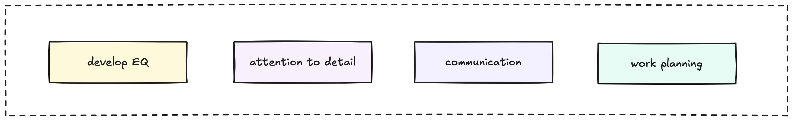
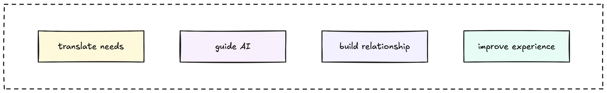

Working well with clients is key. It's about building trust and understanding their needs, not just delivering code. This document covers the essential skills and behaviors you'll need when working with clients, the fundamental tools for successful partnerships.

### Skills we need for client interactions

Here are the key skills for working with clients:

1. **Technical mastery:** Solid technical skills are essential. This includes understanding testing basics (Unit, Integration, System) for reliable software and effective debugging to resolve issues efficiently.
2. **Attention to detail:** Delivering clean, error-free work is critical. Pay close attention from requirements to code and documentation to build client trust.
3. **Clear communication:** Professional communication is mandatory. Strong English (written/verbal, Intermediate to Upper Intermediate level) helps understand needs, explain technical concepts, and avoid misunderstandings.
4. **Problem solving:** Use strong analytical skills and logical thinking to understand complex client challenges and develop effective solutions.
5. **Work planning:** Plan and organize tasks well, manage time, and contribute to project timelines for predictability and meeting deadlines.
6. **Teamwork:** Collaborate effectively with internal teams, share information, and support colleagues. Lack of collaboration impacts project progress and client satisfaction.
7. **Project management basics:** Understand core project principles (scope, timeline, dependencies) to better contribute to planning and execution.
8. **Consistent delivery:** Reliably deliver high-quality work on time and to specifications. Consistency builds trust and demonstrates professionalism.

### Areas we're getting better at

We're focusing on improving in these areas based on observations from client engagements:

* Improve English (verbal/written): Actively work on skills for smoother client chats and fewer misunderstandings.
* Develop EQ: Build self-awareness, empathy, and people skills for sensitive interactions and stronger relationships.
* Sharpen attention to detail: Use personal checks and peer reviews for cleaner, more precise work.
* Strengthen work planning: Utilize tools and methods to improve individual and team planning and adherence to timelines.
* Ensure consistent results: Apply best practices and quality standards for greater consistency in quality and timeliness.
* Elevate teamwork: Proactively communicate and collaborate across teams, particularly in challenging or cross-cultural contexts.

### AI, LLMs, and human skills

AI and LLMs change how we work, automating tasks. But human skills are more critical than ever. With AI, we need engineers who can:

* Translate client needs: Understand the business context and turn complex needs into actionable AI requirements.
* Guide AI use: Define problems, direct AI use, and ensure solutions align with client objectives and ethics.
* Build relationships: Communicate effectively, manage expectations, and build lasting partnerships.
* Adapt and innovate: Think creatively, solve ambiguous problems, and adapt to changes to leverage AI effectively and deliver innovation.

### Aiming for excellence

These skills are core to working well with clients. Alongside AI, our human abilities, clear communication, teamwork, attention to detail, planning, problem-solving, and relationships, define our success and client satisfaction.
