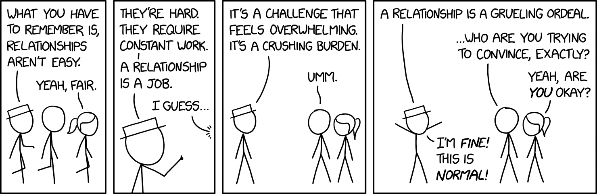

Welcome, consultants (and maybe a few curious clients). In this guide, we’ll cover how we bill and how we engage, with advice to make you a trusted partner.

## How we bill clients

We offer four billing models to fit different projects and budgets.

| Billing model         | Description                                                  | Best for                                                  | Things to watch for                           |
|-----------------------|--------------------------------------------------------------|-----------------------------------------------------------|-----------------------------------------------|
| Per work package      | Fixed price for a clear scope, like an app feature.          | Projects with defined goals, like MVPs or prototypes.     | Scope creep can happen. Lock in deliverables. |
| Per headcount         | Rates based on our team’s time and skills.                   | Flexible or ongoing work, like team augmentation.         | Costs vary with time. Update clients often.   |
| Retainer/subscription | Flat monthly fee for steady services or tools.               | Long-term support, like system maintenance or AI agents.  | Predictable, but keep scope clear.            |
| Hourly consulting     | Pay per hour for fast advice or strategy.                    | Quick guidance, like audits or tech plans.                | Less predictable. Set clear expectations.     |

### Per work package

Imagine quoting a fixed price to build a custom table. That’s per work package. We set a price for a specific scope, like an MVP or a feature, based on what the client needs. It’s perfect for clients who want cost certainty, but we must define deliverables tightly to avoid extra requests. Use this when the project’s goals are clear, and always clarify what’s included.

### Per headcount

This model is like hiring our craftspeople for as long as you need them. We bill based on our team’s time, using a rate card for roles like developers or designers. It suits projects with evolving scopes or clients needing ongoing help. Costs depend on hours, so keep clients in the loop. Choose this for flexible work, like adding developers to a client’s team.

### Retainer/subscription

Think of this as a monthly membership for our expertise. We charge a flat fee for ongoing services, like managing a client’s servers or running a custom AI tool. It’s predictable and builds trust, like a steady partnership. Ensure the scope is clear to avoid overdelivering. Use this for long-term support or innovative solutions that need constant care.

### Hourly consulting

This is our quick, high-value advice model. We bill by the hour for fast strategy sessions or audits, like a one-on-one with a master craftsman. It’s flexible but less predictable, so set expectations upfront. Use this for clients needing a nudge, like a tech roadmap or process tweak.

**My advice**: Start with the client’s budget. Explain each model’s fit, like you’re helping a friend pick the right tool. Clear talk builds confidence and avoids surprises.

## How we engage with clients

Our engagement models are built around client needs, from planning to innovating. We group them into six areas, each blending approaches to deliver well-crafted results. Below, you’ll find each area with advice, examples, and billing options.

### Strategy and planning

We help clients chart their path, like sketching a blueprint before building. This includes advising on big moves (like adopting AI), designing systems (like cloud setups), or crafting prototypes to test ideas (like a blockchain demo). It’s about clarity before action.

**When**: Ideal for clients needing direction, like startups exploring new tech or execs planning a digital shift.
Ask what they’re aiming for. Help them refine their vision, like sharpening a design before carving wood.

- Advising a retailer on AI for customer ads.
- Designing a cloud migration plan for a bank.
- Building an AI prototype to test a new feature.

**Billing options**: Hourly for advice, per work package for designs or prototypes, retainer for ongoing strategy.

### Build and deliver

We craft products from scratch, like building a custom piece of furniture. This includes deploying full teams for end-to-end projects, blending UX with code, bidding on contracts (like RFPs), or delivering within tight budgets by prioritizing key features. For fixed budgets, we adjust scope to maximize value.

**When**: Perfect for clients launching apps, MVPs, or features, like startups or enterprises with big projects.
Define the scope early, especially for fixed budgets. Show progress often, like revealing a polished piece step by step.

- Building a startup’s mobile app with a full team.
- Crafting a fintech platform with great design and secure code.
- Bidding to build a public portal for a city.
- Delivering an e-commerce MVP for $50,000, focusing on core features.

**Billing options**: Per work package for defined or budget-constrained projects, per headcount for flexible builds.

### Augment and scale

We strengthen client teams, like adding skilled hands to a workshop. This includes providing dedicated squads (on our payroll), supplying expert developers, or training staff on modern tech (like DevOps). Sometimes, clients hire our team members (acqui-hire).

**When**: Great for clients growing fast or needing specific skills, like startups scaling or firms short on talent.
Highlight our vetted talent and management. Clients love focusing on results while we handle the details.

- Sending a 10-person squad to boost a fintech’s payment system.
- Providing two React developers for a client’s frontend.
- Training a team on microservices with real projects.

**Billing options**: Per headcount for squads or individuals, retainer for steady teams, per work package for training.

### Optimize and transform

We fix what’s broken or make it shine, like refinishing a worn table. This includes spotting inefficiencies (like slow workflows), rescuing failing projects, or streamlining processes. We often pitch these fixes after auditing a client’s setup.

**When**: Best for clients with outdated tech, slow processes, or projects in trouble.
Look for pain points. Suggest a quick audit to show value, like spotting a crack before it spreads.

- Auditing an old app and switching to microservices.
- Saving a delayed e-commerce launch with a new plan.
- Streamlining a retailer’s supply chain software.

**Billing options**: Per work package for fixes, per headcount for ongoing work, hourly for audits.

### Operate and maintain

We keep systems running or deliver custom tools, like maintaining a workshop or crafting a unique gadget. This includes managing cloud setups, monitoring apps 24/7, or providing subscription-based AI agents (like tailored chatbots).

**When**: Suits clients with live systems or automation needs, like retailers or SaaS firms.
Stress reliability. Clients want to know their systems are safe, like a well-oiled machine.

- Managing a client’s AWS setup with constant support.
- Launching a custom AI chatbot for a retailer, billed by usage.

**Billing options**: Retainer or subscription for ongoing work, per headcount for support, per work package for initial builds.

### Innovate and experiment

We explore new frontiers, like prototyping a bold design. This includes setting up R&D labs for tech like AI or Web3, or building prototypes to test ideas. It’s about keeping clients ahead of the curve.

**When**: Ideal for clients who want to lead, like banks exploring DeFi or retailers testing blockchain.
Show the future. Use prototypes to make big ideas feel real, like sketching a vision in wood.

- Creating an R&D lab for a bank to study decentralized finance.
- Building a blockchain prototype for supply chain tracking.

**Billing options**: Retainer or per headcount for labs, per work package for prototypes.

### Comparing engagement models

Here’s how our engagement models stack up. Use this to pick the right fit for your client.

| Engagement model         | Client need                                      | Key activities                              | Best for                                          | Billing options                             |
|--------------------------|-------------------------------------------------|---------------------------------------------|--------------------------------------------------|---------------------------------------------|
| Strategy and planning    | Define goals or test ideas                      | Advice, system design, prototypes           | Execs, startups exploring tech                   | Hourly, per work package, retainer          |
| Build and deliver        | Create new products or features                 | Full builds, UX/code, RFPs, fixed budgets   | Startups with MVPs, enterprises with projects    | Per work package, per headcount             |
| Augment and scale        | Grow teams or skills                            | Dedicated squads, staff add-ons, training   | Fast-growing clients, skill gaps                 | Per headcount, retainer, per work package   |
| Optimize and transform   | Fix inefficiencies or projects                  | Audits, rescues, process upgrades           | Clients with outdated tech or failing projects   | Per work package, per headcount, hourly     |
| Operate and maintain     | Run systems or deliver custom tools             | Maintenance, DevOps, AI agents              | Clients with live systems or automation needs    | Retainer/subscription, per headcount, per work package |
| Innovate and experiment  | Explore cutting-edge tech                       | R&D labs, prototypes                        | Industry leaders, tech explorers                 | Retainer, per headcount, per work package   |

## When we do outreaching

We don’t just wait for clients to show up. We seek them out, like scouts in the woodland.

- Spot inefficiencies: We audit a client’s tech or processes and [pitch fixes](inefficiency-arbitrage.md), often leading to Optimize and transform work.
- Bid on projects: We [propose our teams](apply-as-a-squad.md) for RFPs, setting up Build and deliver projects.

Stay sharp. Read industry news, connect with people, or check public client data for openings. A note like, “Your app’s load time seems off. Can we talk?” can start something big.

## How to make it work

Here’s your game plan to use these models well:

1. Understand their goal: Ask what they want. Building an app? That’s Build and deliver. Fixing old tech? Optimize and transform.
2. Choose the billing: Pick a model that fits their budget and scope. Clear plan? Per work package. Long-term team? Per headcount or retainer.
3. Show the craft: Use examples to explain how we’ll deliver. Clients love stories of similar successes.
4. Stay nimble: Projects shift. A Dedicated Squad might craft an MVP. Keep clients informed.

To ease the initial commitment and build trust, we also offer a [pilot run](pilot-run.md), a paid trial for clients to experience our services firsthand.

Be their guide, not just a vendor. Listen, simplify options, and show you care about their success. That’s how you build lasting trust.

Keep this guide handy.Use it before client meetings, and talk it over with your team.

Our models are like tools in a craftsman’s kit, each suited to a different job. Whether a client needs a quick prototype or a full team, you’ll know how to deliver. For clients reading this, it’s a look at our approach: your goals are our mission, and we craft solutions with care.

---

> Next: [Client onboarding](client-onboarding.md)
