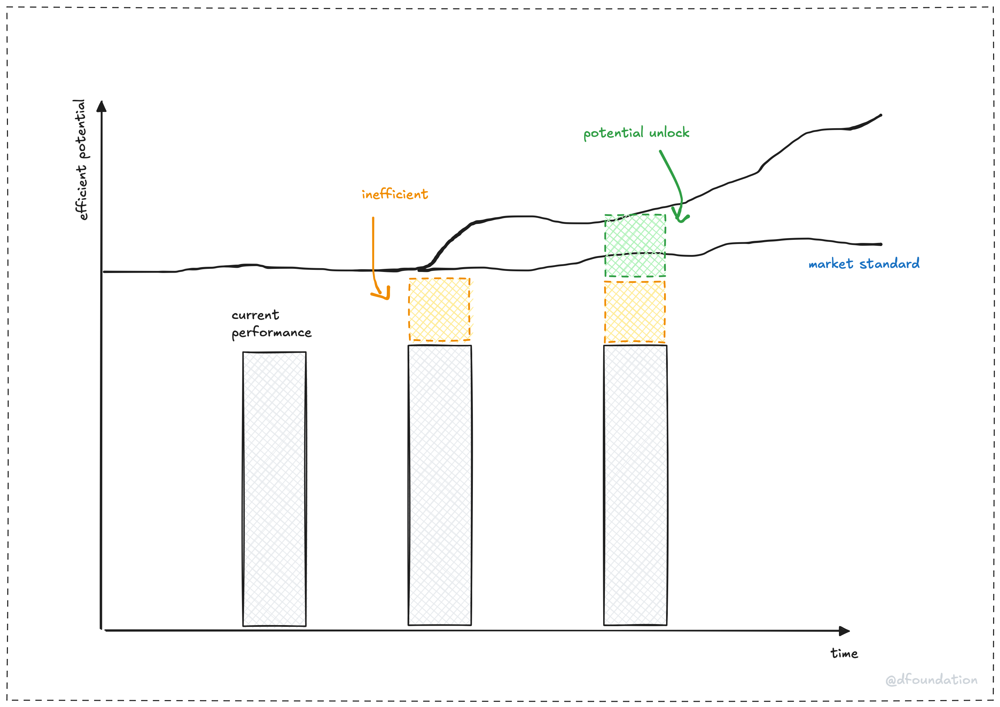

> **tl;dr**
>
> Inefficiency arbitrage means spotting client tech gaps (like outdated systems) and fixing them with expertise. Our consulting model drives growth (upside) and savings (downside), helping us find opportunities and win clients fast.

What’s the trick to turning a client’s tech mess into gold? At Dwarves, we call it **inefficiency arbitrage**, a way to find gaps in a client’s systems or processes and fix them with smart tech solutions.

Originally, arbitrage in trading meant buying low in one market and selling high in another to profit from price differences. In consulting, we spot undervalued opportunities, like slow workflows or outdated tools, and deliver value by optimizing them. This guide answers your questions about inefficiency arbitrage, ties it to our consulting model, shows how to find and secure opportunities, and weighs its upside and downside. Ready to make an impact?

## What is inefficiency arbitrage?

Inefficiency arbitrage is about finding gaps in a client’s tech, processes, or strategy and turning them into value. Think of it as panning for gold in a chaotic river. The client’s business hides potential (gold) in inefficiencies (murky water). You use tech expertise to extract it.

It has two parts:

- **Spot gaps**: Audit tech stacks or workflows to find where clients lose time or money. For example, a retailer’s slow site hurts sales.
- **Fix them**: Use tech like AI or Golang to optimize, creating growth or savings. A faster site could boost conversions by 10%.

In trading, arbitrage exploits price gaps across markets. In consulting, we exploit efficiency gaps, delivering solutions clients can’t achieve alone.

## How does it fit our consulting model?

Our design-build-guide model is built for inefficiency arbitrage. We use tech expertise to solve client problems with precision. For example, we spot a SaaS client’s slow support (inefficiency), build an AI chatbot to cut response times by 40%, and guide their team to use it. Our focus on emerging tech, like AI agents, lets us tackle gaps others miss, delivering results that stick.

## How do we use it to find opportunities?

Inefficiency arbitrage helps us spot consulting opportunities before clients do. Here’s how:

1. **Track trends**: Monitor X or Reddit for industry pain points, like SaaS firms griping about cloud costs.
2. **Audit operations**: Map client workflows to uncover gaps, like a slow dev pipeline ripe for DevOps.
3. **Show quick wins**: Fix small issues, like redundant tools, to build trust for bigger projects.

For example, we saw e-commerce clients on X struggling with AI personalization. We pitched a pilot, optimized recommendations, and boosted sales by 8%, landing a full AI contract.

## How do we firm up opportunities?

To close deals, use arbitrage to prove value fast:

- **Frame the gap**: Say “Your slow site loses sales” instead of “Your tech is outdated.”
- **Prove it**: Build a $5K prototype, like an AI demo, to show impact. We saved a logistics client hours with a delivery prediction pilot, securing a $80K project.
- **Deliver smart**: Combine tech solutions with clear guidance for adoption.

This turns leads into partners. The e-commerce client now relies on us for ongoing AI tweaks.

## What’s the upside and downside value?

Inefficiency arbitrage has two sides: **upside** (consulting) and **downside** (arbitration).

- **Upside: Consulting for growth**
  Consulting drives growth by transforming systems. It’s like adding a turbocharger to a client’s business. We built an AI fraud detection system for a fintech client, saving millions yearly. It needs heavy upfront work (design, pilots) but delivers big wins, like new revenue or market edge.

- **Downside: Arbitration for savings**
  Arbitration cuts costs by optimizing systems. It’s like patching a leaky tire. We saved the fintech client $4K monthly by streamlining APIs. It requires ongoing tweaks but offers quick savings, freeing budget for innovation.

Both matter. Start/with downside wins (cost cuts) to gain trust, then pitch upside projects (AI systems) for impact.

## More questions about inefficiency arbitrage

Got questions about putting arbitrage to work? Here are answers for tech consultants and salespeople.

### How do I pitch arbitrage to a skeptical client?

Frame gaps as opportunities tied to their goals. Instead of “Your cloud is wasteful,” say “We can save 15% on cloud to fund your AI plans.” Prove it with a quick prototype, like a $5K AI demo that lifted a retailer’s sales 8%. Back your pitch with data, like industry benchmarks, and keep it positive. This builds trust fast, turning skeptics into believers.

### How do I balance quick wins with long-term projects?

Use downside arbitrage (quick fixes) to build trust, then pivot to upside consulting (big projects). We optimized a SaaS client’s database queries, saving $2K/month, to fund an AI analytics platform that boosted revenue 12%. Schedule monthly check-ins for quick wins while planning larger projects. This keeps clients happy and opens doors for bigger deals.

## Tips for success

- **Master quick win prototypes**: Offer low-cost demos, like a $5K AI chatbot, to show value fast. Keep reusable templates to build pilots in days. We saved a client $2K/month with a cloud audit, landing a $70K migration project.
- **Use social listening**: Track X or Reddit for pain points, like “AI integration woes.” Set keyword alerts for “cloud costs” to find clients early. We won a $50K contract after spotting cart abandonment gripes online.

Inefficiency arbitrage reflects our craftsmanship. By fixing client gaps with smart tech, we deliver well-crafted solutions that drive growth and savings. It’s how we help clients thrive in a messy tech world.
