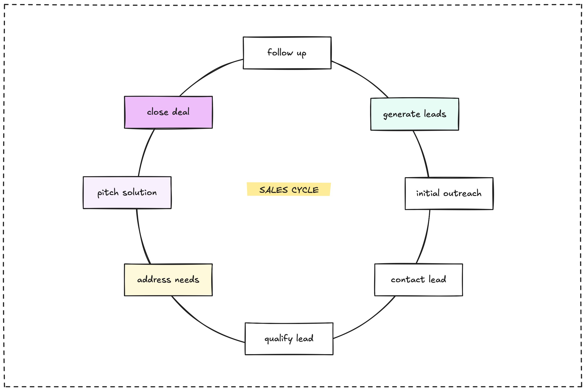

## Kicking off the sales cycle

Finding potential clients, or lead generation, is the crucial first step in our sales cycle. It's where we identify opportunities to help businesses and start building connections. The overall sales journey follows a clear path:

As you can see in the diagram, it begins with generating leads and moves through initial contact, qualification, understanding needs, pitching solutions, closing the deal, and finally, following up. This article focuses on that all-important first step: finding the leads.

## Generating leads: finding opportunities

There are two main ways we find potential clients: inbound and outbound. **Inbound** is about attracting clients to us, often through building our reputation, sharing valuable knowledge, and creating content. We generally prefer inbound leads because the client is already showing interest in what we do.

**Outbound** is when we proactively reach out to potential clients. This requires actively seeking out businesses we believe we can help. We use a few key strategies for this:

* **Spotting inefficiencies:** Like scouts in the woodland, we look for signs that a company might be struggling with outdated tech or slow processes. We then pitch solutions to fix these [inefficiencies](inefficiency-arbitrage.md), which often leads to new projects.
* **Bidding on projects:** We also find leads by responding to requests for proposals (RFPs) or project bids, particularly for [build and deliver](engagement-models.md) type work where our squad approach shines.
* **Smart research:** As mentioned in our approach to [applying as a squad](apply-as-a-squad.md), we actively research job boards and industry trends to spot problems our team can quickly solve.
* **Approaching as a squad:** Our unique structure as a skilled squad is itself a way to generate leads, particularly with small to medium teams who value our agility and synergy.

We also connect lead generation to the idea of [testing the water](navigate/test-the-water.md). By packaging our expertise and seeking early clients for new services, we validate our offerings and generate initial leads simultaneously. This involves tapping into communities, working with partners, and leveraging networks.

## Initial outreach and contact: making the connection

Once we've identified a potential lead, the next step is making that first connection. This initial outreach should be relevant and clearly communicate the potential value we can offer. The goal is to start a conversation and move towards understanding their specific situation.

## Qualifying leads: finding the right fit

Not every lead is the right fit for us, and that's okay. Qualifying a lead means figuring out if their needs, budget, and goals align with our expertise and how we like to work. We focus on clients like **enterprises** who have a clear understanding of their needs and **tech startups** ready for fast growth, as discussed in [market players](market-players.md).

## Beyond generation

After generating and qualifying a lead, the sales cycle continues by diving deeper into their problems, pitching tailored solutions, working towards closing the deal, and building a lasting relationship through follow-up. But it all starts with finding that initial opportunity.

## The foundation for growth

Consistent lead generation is vital for our growth. It's about more than just finding projects; it's about building relationships and leveraging our collective network. Every connection made and opportunity identified strengthens our position and helps us continue to do impactful work.

---

> Next: [Engagement models](engagement-models.md)
