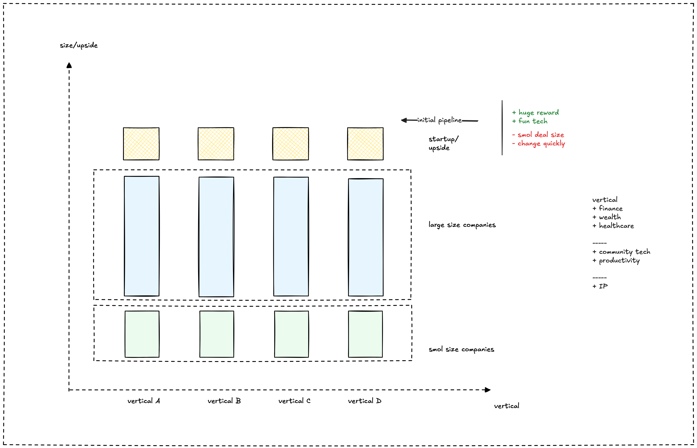

## The consulting world

The consulting industry helps businesses tackle tough problems, improve how they work, and hit their big goals. Think of it as a wide-open space with many different kinds of helpers, from huge firms covering everything to small, expert teams focused on one thing. Knowing who's who helps us understand where we fit and where we can make a real difference.

## Different kinds of consultants

Consulting firms often fall into a few main groups:

* **Strategy folks:** They help leaders figure out the big picture – where to go next, who to team up with, or how to enter new markets. Firms like McKinsey and Bain are big names here.
* **Tech experts:** These teams focus on all things technology – building systems, making things digital, or handling data. Accenture and ThoughtWorks are strong in this area.
* **Operations gurus:** They dive into how a company runs day-to-day, finding ways to make things smoother and more efficient.
* **Niche specialists:** These are teams with deep knowledge in just one area, like AI, healthcare, or specific types of software, much like Palantir with its data solutions.

Top firms in these areas build their success on solid know-how, strong ties with clients, and always delivering results.

## What makes a great consultant team?

We see that the best consulting teams, no matter their size, tend to share a few key traits:

* **Smart problem solvers:** They have clear ways to break down complex issues and find solutions that work.
* **Deep knowledge:** They really know their stuff, whether it's an industry, a business function, or a technology.
* **Good listeners:** They build trust by really understanding their clients and working closely with them.
* **Focus on results:** They aim to deliver real, measurable value that helps clients achieve their goals.
* **Always learning:** They keep their skills sharp, bring in top talent, and share knowledge within the team.
* **Ready for anything:** They can adapt as the market changes and are always looking for new, better ways to do things.

## Where we come in

We take these ideas about what makes great consulting and apply them to our work. Our focus isn't everywhere; we choose where we can have the biggest impact. We mainly work with **enterprises** who know their challenges and **tech startups** ready to grow fast.

This diagram shows the kinds of clients we target across different industries:

We work in areas like **finance, wealth, and healthcare**, plus **community tech** and **productivity**. We help both larger companies and smaller ones in these fields. We particularly like working with **startups** because there's potential for **huge rewards**, we get to play with **fun tech**, and while the **deals might be smaller** and things **change quickly**, it keeps us sharp and innovative.

Our team stands out because we blend solid research with real-world application. We use smart methods like finding and fixing [inefficiencies](inefficiency-arbitrage.md), and we're all about building partnerships that last. Clients choose us because we bring **innovative solutions** (we love tech), we help them get **great value and return on investment** (we're mindful of the financial side), and we're in it for the **long haul**, building relationships that look to the future.

---

> Next: [Inefficiency arbitrage](inefficiency-arbitrage.md)
