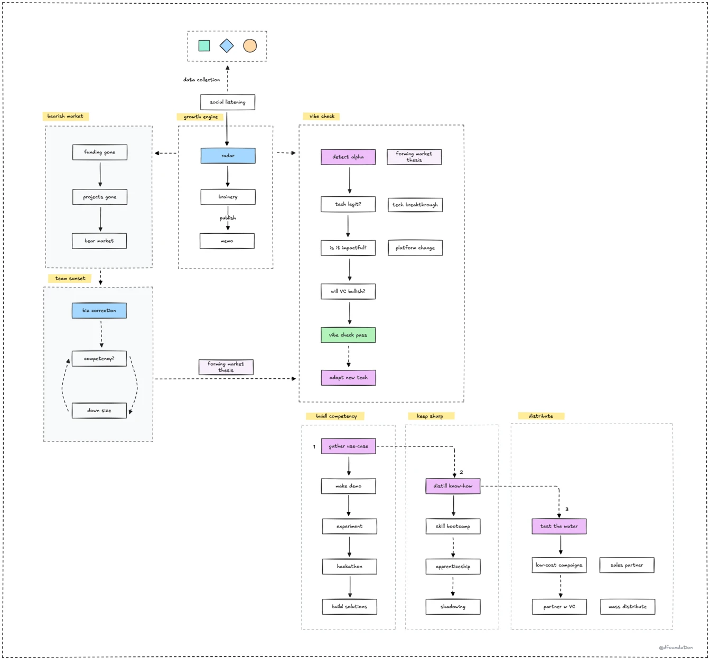

The tech world always moves. Market shifts can feel like you chart a course through new, rough waters. This series is our team's compass. It helps us not just react to changes, but proactively meet them with confidence and skill. We've put our team's wisdom and plans into focused guides that are easy to access and use.

For a quick look at the core ideas, our [condensed guide on how to navigate changes](navigate-changes.md) is a good start.

### The big picture

At its core, navigating market changes as a consulting team boils down to four steps. Here’s how we approach it:

- **Make a bet.** We pick a tech trend we think will take off, like AI agents, and decide to build our consulting expertise around it.  
- **Grind for it.** We dive in, learning the tech, building small projects, and creating case studies to show we know our stuff.  
- **Sell.** We share our expertise with clients, using our knowledge to land projects and help them adopt the new tech.  
- **Repeat.** We learn from each cycle, refine our approach, and pick the next trend to tackle.  

This cycle keeps us moving forward, always ready to lead in the next big thing.

### Key principles for navigating change

- [Consulting model](consulting-model.md): Know the trigger of the model.
- [Cycle](cycle.md): Accept that market will change.
- [Business correction](business-correction.md): Understand when and how to adjust course.
- [Forming market thesis](forming-market-thesis.md): Develop informed perspectives on market direction.
- [Growth engine](growth-engine.md): Do inbound, collect & analyze signals effectively.
- [Keep it sharp](keep-sharp.md): Participate & maintain our competitive edge.
- [Talent pool](talent-pool.md): Grow the talent pool to meet new challenges.
- [Test the water](test-the-water.md): Validate approaches with real-world feedback.

### Our early warning system

Our early warning system, shown above, is a flexible plan to handle market shifts. It starts with the **growth engine** to detect initial signals.

These signals then get a **vibe check**. We look at `tech legit?`, `impactful?`, potential `platform change`, and `VC` interest to confirm how important they are.

If a signal passes, we move to **adaptation and action**: `build competency`, `keep sharp`, and finally, `distribute`.

The system also has a **feedback loop** from all market conditions, like `bearish market` times. This helps us always refine our `forming market thesis` and make our overall approach stronger.

### Let’s get started

These guides are here to help you navigate the tech world’s twists and turns. They’ll show you how to spot opportunities, adapt your approach, and lead as a consulting team. Dive in, and let’s tackle what’s next together.

---

> Next: [Consulting model](consulting-model.md)
