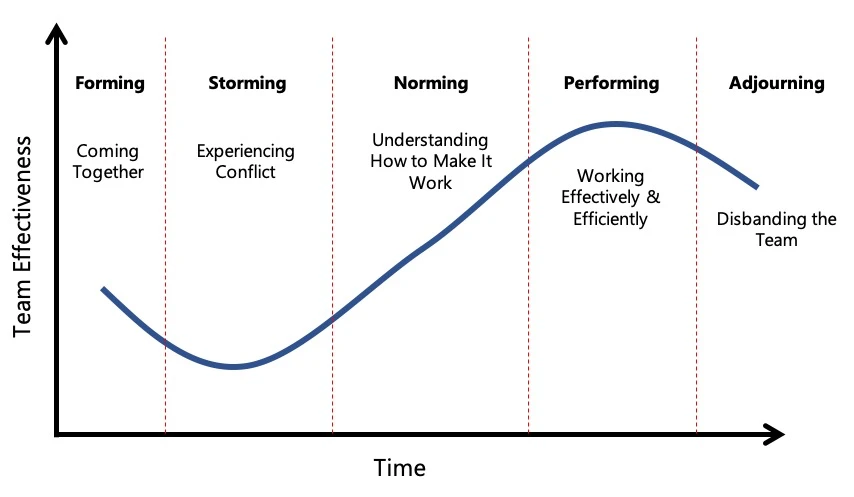

> **tl;dr;**
>
> Business correction helps us adapt to market shifts by recognizing when a team’s goal isn’t valid, assessing skills, and pivoting to new tech. We support our team but downsize if needed, ensuring we stay competitive in consulting.

### Why business correction matters

Business correction is how we adapt when our market thesis changes, demand drops, or a tech trend fades. It’s about recognizing when a team’s goal isn’t valid anymore and making tough but necessary adjustments to stay competitive.

For us, this means ensuring we’re always ready to offer consulting services for the next big tech, whether that’s moving from blockchain to AI agents or something else entirely. This process keeps us sustainable and focused on what clients need now.

### Understanding the team lifecycle

Teams don’t last forever, and that’s okay. They follow a natural cycle, as shown in the diagram below.

The lifecycle has five stages:

- **Forming.** The team comes together with a shared goal, like building a consulting service for blockchain tech.
- **Storming.** Conflicts arise as the team figures out how to work together.
- **Norming.** The team settles into a rhythm, understanding how to make things work.
- **Performing.** The team hits its stride, working effectively and efficiently.
- **Adjourning.** The team disbands when the goal is no longer relevant, like when blockchain demand drops.

Business correction often happens in the adjourning phase, but it can also mean adjusting during earlier stages if the market shifts unexpectedly. As leaders, we need to accept this cycle and not force a team to stick together when the goal no longer fits.

### When to make a correction

You’ll know it’s time for a business correction when the market thesis changes. For example, let’s say we built a consulting service for blockchain tech, but the market cools off. Clients aren’t asking for blockchain solutions anymore, they’re focused on AI agents. If the demand drops, our business unit won’t be as profitable as we hoped. That’s a clear sign we need to pivot.

Here’s what to look for:

- **Demand shifts.** Are clients asking for something new, like AI, instead of what we’re offering?
- **Profitability dips.** Are we spending more to keep the team running than we’re earning?
- **Tech relevance fades.** Is the tech we’re focused on losing traction in the market?

When you see these signs, it’s time to act.

### Check your team’s competency

A changing market means your team needs to adapt, but not everyone will be able to keep up. Team competency depends on the collective skills of its members, so you need to check if your team is still relevant for the new direction.

#### Assess member quality

Look at each member’s ability to learn and adopt new tech. For example, if we’re pivoting to AI consulting, do they have the energy and willingness to dive into AI tools and practices? High-energy members who are eager for a challenge are the ones you want to keep. Those who struggle might need extra support or a different role.

#### Profile the team

Create a simple performance profile for the team. Rate each member on:

- **Tech skills.** Can they learn the new tech quickly?
- **Adaptability.** Are they open to change?
- **Energy.** Do they bring enthusiasm to the table?

For example, if a member excels in blockchain but resists learning AI, they might not fit the new direction. On the other hand, someone who’s curious and ready to jump in is a keeper.

#### Support before downsizing

Before letting anyone go, see if you can help them grow. Offer training, like an AI brainery session, or pair them with a mentor. If they still can’t adapt after support, downsizing might be necessary. This isn’t easy, but it’s about keeping the team sustainable. When downsizing, be transparent and respectful, ensuring the member understands why the change is happening.

### Pivot with purpose

Business correction isn’t just about ending a team, it’s about setting a new direction. Once you’ve assessed your team, decide what’s next. If blockchain consulting is out, maybe AI agents are the future.

Reassign members who can adapt to the new goal, and bring in fresh talent if needed. This keeps the team moving forward, ready to tackle the next market shift.

### Why this keeps us sharp

Business correction ensures we’re always focused on what matters. It’s how we stay relevant, offering consulting services that clients actually need. By accepting the team lifecycle and making smart adjustments, we position ourselves to lead in the next big tech trend. It’s all part of navigating the ever-changing market.

---

> Next: [Forming market thesis](forming-market-thesis.md)
