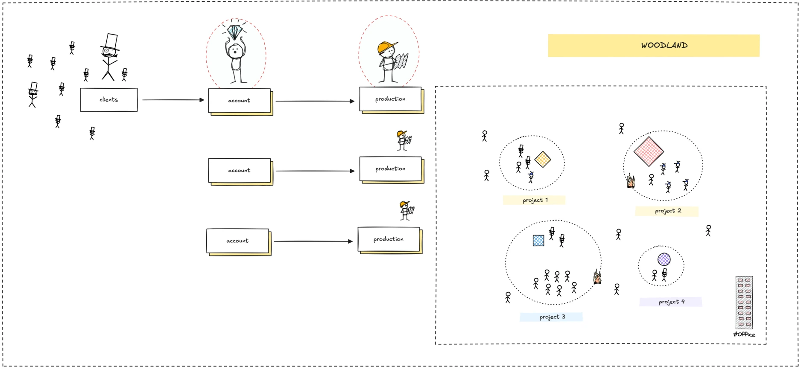
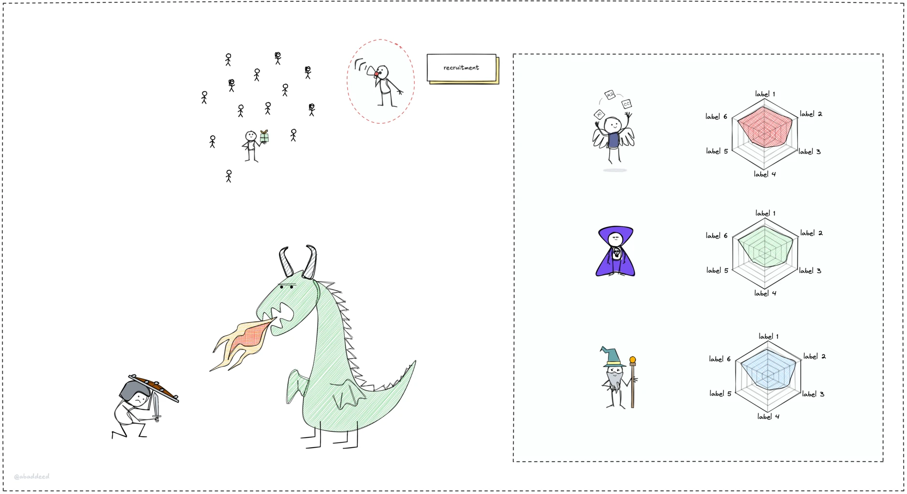

> **tl;dr**
>
> Understand consulting model helps us navigate market shifts, it works by meeting client demands with tech expertise and a human touch. We design, build, and guide solutions, staying proactive by spotting trends early.

Market shifts can change what clients need overnight. One day they’re asking for blockchain solutions, the next they’re all about AI agents. To keep up, we need a consulting model that’s flexible and focused on delivering real value.

Our model is built to spot current market demands and meet them head-on, but we go beyond just delivering projects. We aim to be strategic partners, understanding our clients’ bigger goals so we can help them succeed through any change. This mix of tech know-how and a real commitment to their success is how we make a lasting impact.

### The nature of our consulting model

At its core, our consulting model is about connecting market demand with our team’s expertise. Here’s the basic flow, broken down into two parts: what starts the process, and what we deliver.

#### What kicks things off

- **Funding.** Clients or projects with capital to invest in new tech solutions, like a startup with a fresh Series A round.
- **Owners.** People or teams with an idea they want to bring to life, like a company looking to integrate AI agents into their operations.

#### What we deliver

- **The design.** We create a blueprint for the solution, mapping out how it’ll work.
- **The build.** We develop the solution, turning the design into reality.
- **The manual guides.** We provide the knowledge to use and maintain the solution, ensuring clients can keep it running smoothly.

Our team’s tech skills make this happen. Clients come to us because they trust us to build better, faster, and often cheaper than they could on their own. We’re a people business, sharing our expertise to get things done.

Here’s how the process looks in action:

- **Clients.** It starts with clients who need a tech solution, like a company wanting to automate customer service with AI agents.
- **Account.** We assign an account team to understand their needs and goals, building a relationship based on trust.
- **Production.** Our production team steps in to design, build, and deliver the solution, working closely with the client to make sure it hits the mark.

This workflow keeps us focused on delivering value while staying flexible to market shifts.

### Staying proactive with market demand

Our model isn’t just reactive, it’s proactive too. Current client needs shape what we focus on, but we also look ahead. By actively learning new skills, as we explore in this series, we spot future trends and even shape demand.

For example, if we see AI agents gaining traction, we might build a small project to show clients what’s possible, sparking their interest before they even ask for it. This keeps us ahead of the curve, ready to lead in the next big tech.

### Our consulting model in the age of AI agents

LLMs and AI agents will automate many parts of our usual workflow. This includes advice, system design, and even how we set up and run them. So, what does this mean for a consultant's role?

The key is to understand our enhanced human edge: our ability to **feel**, **create**, **connect**, and **find purpose**. These are qualities AI can't copy. People look more and more for great experiences. That's exactly what we, as consultants, must understand and give. What does a 'great experience' mean for us? It's about proactive talk, deep empathy for client issues, co-create solutions, and build strong trust.

Certainly, our tech know-how and skills will shift. AI will become another powerful layer to get things done faster. As consultants, our role changes. We become the ones who understand how to use these AI tools with a good plan. With AI on more routine tasks, our roles put more stress on complex problem-solve, critical thought, ethics (especially with AI), change management, and how we guide clients to adopt new tech with a plan, not just the tech setup. Our value is to arrange these parts to bring real change.

---

> Next: [Technology run in cycles](cycle.md)
