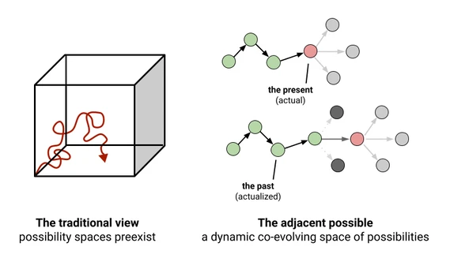
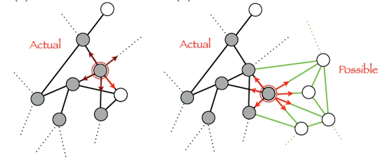
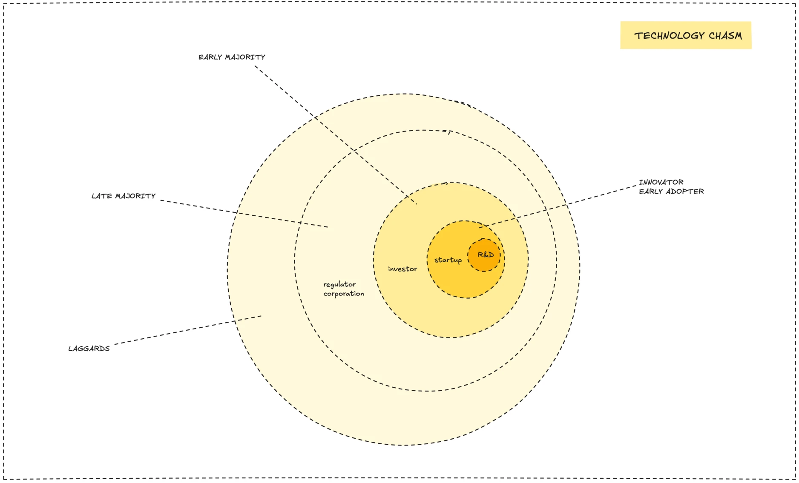
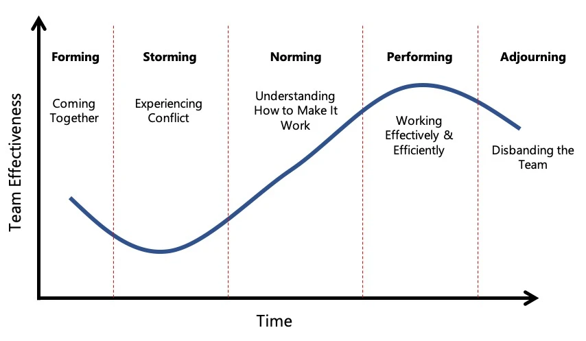

> **tl;dr;**
>
> Tech cycles drive market shifts, with funding and demand rising and falling. We adapt by accepting change, spotting early signs in niche groups, and preparing through R&D and skill-building to guide clients effectively.

Innovation doesn't happen in a vacuum. It often builds on what's already there, an idea sometimes called 'the adjacent possible.' Think of it like you explore the next room in a house of linked rooms; each new find opens doors to more options.

To understand these cycles isn't just for study. It's key to **our consulting strategy**. It shapes how we build our services, advise clients, and keep our edge.

For example:

- Golang emerged as an improvement that used new ideas in program languages and the rise of cloud compute.
- Blockchain built upon progress in network technology and decentralization.
- Large Language Models (LLMs) are a new wave of progress in Artificial Intelligence.
- Spatial computing is a mix of new hardware interfaces and software skills.

### The cyclical nature of technology

Tech breakthroughs often follow a cycle, much like the known innovation adoption curve. When we can spot these patterns, it directly affects our project flow and strategy.

These cycles have a start and an end:

- **Funding flows in** when people see high potential in a new tech.
- **Funding pulls back** when that potential seems used up, or there are fewer new "games to play" or "things to build" with that tech.
Market demand naturally goes up and down with these fund and innovation cycles.

It's also key to recall that while major cycles happen, thousands of smaller "pulses" of activity are always present. There's always old tech that people still work on and brand-new tech that innovators want to explore. It's vital for us to build a culture of proactive tests around these early signals.

### How to adapt to market shifts

To **avoid a surprise** from these shifts, we need a proactive plan.

To understand these cycles is key to both **lower the risk** to become out of date and **grab the chance** to lead in new areas. It's how we make sure we can guide our clients well through their own changes.

#### **Recognize that markets *will* shift**

The first step is to accept that change is constant. One early sign of a big shift can be less news and general 'noise' about tech that is now mainstream or known to us. This quiet can mean the focus moves elsewhere.

#### **Be aware when a market *is* shifting**

This is a key phase. Often, the first signs of a major shift don't appear in mainstream media. Instead, they come from:

- Niche tech groups or early adopters show new tools or solutions.
- Talks on platforms like Reddit, X (formerly Twitter), or GitHub. This early phase, before wide notice, is our window of opportunity. It's when we have the vital time to invest in R&D, prepare our team with new skills, learn new things, and run tests. This investment, guided by tools like our [Growth engine](growth-engine.md) and solid internal knowledge share, lets us learn, adapt, and get ready to advise our clients on new trends.

#### **Understand when a market *has already* shifted**

If we only spot a shift once it's mainstream, we might be too late to get a strong consulting spot. To catch up takes a lot of time and effort. Signs that a market has already shifted include:

- Social media and mainstream news are full of info about the new tech or trend.
- KOLs offer courses and workshops.
- Consumers actively review, talk about tips, and share tricks for the new offers.
- Our team may feel a disconnect. They might find the new ideas not interesting or not relevant to their current skills. This highlights why our ongoing talent plans must align with new market needs.
- We might struggle to build the next type of software the market demands.
- Team size could even be at risk if current skills don't match new market demands. This shows a split in the team cycle.

---

> Next: [The growth engine](growth-engine.md)
