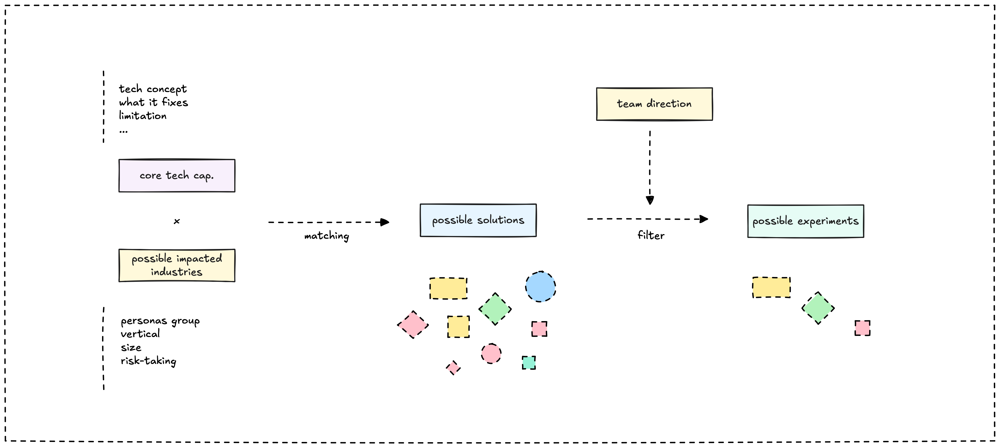
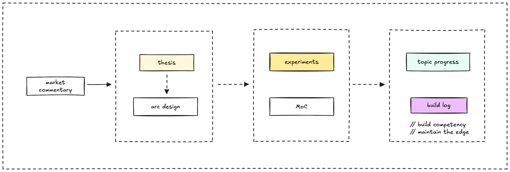
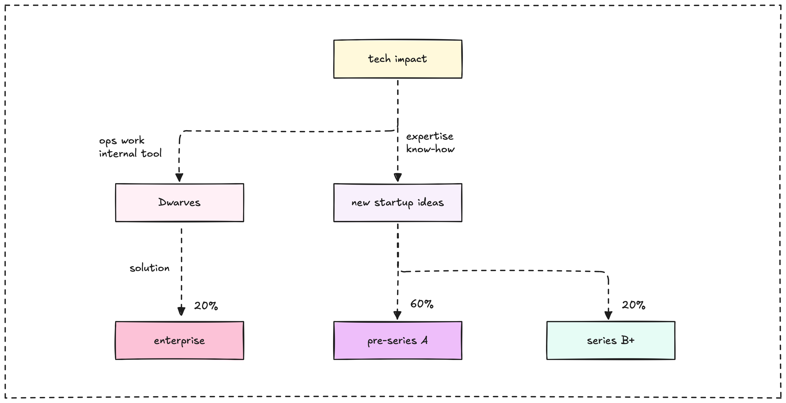

```tldr
Once we've formed a solid market thesis, the next step is choosing what to actually build. We use a simple priority framework: start with internal needs, then expand to startup ecosystem technologies and strategic assets. This keeps us focused and makes every experiment count.
```

You've spotted a promising tech trend. You've done the deep analysis. Your [market thesis](market-thesis-method.md) is solid. Now comes the crucial question: what do we actually build?

This is where good ideas either become real value or get lost in endless possibilities. We've learned that having a clear decision framework matters more than having perfect ideas.



## How experiments fit our workflow

Think of this as step 5+ in our market thesis method. Here's how it flows:

**[News](growth-engine.md)** → **[Arc](/arc)** → **Experiment** → **Build-log** → **[Forward engineering](/forward-engineering)**

- **Arc** is our term for each technology breakthrough we bet on
- **Experiment** is each specific thing we decide to build within that arc
- **Build-log** captures what we discover during the experiment
- **Forward engineering** is how we report progress as a team snapshot

When experiments are specifically designed to transfer knowledge from labs to consulting, we call them "pilots" and use our [tech transfer framework](/research/transfer). Same experiments, different focus: getting research insights to consulting teams fast.

We're not building everything. We're making strategic choices about where to focus.



## Priority check

With limited resources, we need to be strategic. Our priority is building up our edge and expertise to excel in consulting and staffing.

### 1. Serve internal ops (highest priority)

Start with ourselves. Can we use this technology to solve problems we actually have at Dwarves? We become our own first customer, understand the problem deeply, and build real expertise through daily use. This gives us hands-on experience we can leverage when advising clients.

If we can't make it work for ourselves, it's harder to convince others it's worth building.

### 2. Startup ecosystem technologies

Focus on experiments that align with emerging technologies and startup ecosystem needs. This is where 80% of our business comes from: staffing and co-building with tech startups.

We stay ahead of technologies the startup ecosystem is adopting. By building these ourselves, we develop expertise to either staff their teams or co-build solutions alongside them.

### 3. Long-term strategic assets

These experiments focus on assets that can compound or yield more value with the least effort in the long run. They build our four core strengths: productivity, community, funding opportunities, and intellectual property.

Will this asset continue working for us even when we're not actively maintaining it? Can it strengthen our community connections and compound our network effects?

### 4. Spin-off potential

The best experiments can eventually become standalone products or services that grow beyond consulting into their own businesses.

## How we make the call

Our experiments align with our business model: 80% of our revenue comes from staffing and co-building with tech startups at multiple scales. The remaining 10-20% comes from custom builds for traditional businesses.

This means most experiments should build expertise that helps us:

- Staff startup teams with people who know the latest tech
- Co-build innovative solutions alongside startup founders
- Stay ahead of technology trends our startup clients need

When we want to move these experiments quickly to our consulting team, we treat them as pilots and apply our [tech transfer framework](/research/transfer) to accelerate adoption.

We're not just building products. We're building the expertise that makes us valuable partners in the startup ecosystem.



**Example: DeFAI technology**

After our market thesis identified DeFAI as promising, we had several options:

- AI-powered smart contract auditing tool (internal ops)
- Automated treasury management system (strategic asset)
- AI oracle infrastructure (spin-off potential)

We started with the treasury management system because we could use it internally first, it built our DeFi expertise, and it had clear spin-off potential.

**The key insight:** We didn't try to build everything. We picked one experiment that checked multiple boxes and gave us the deepest learning.

## Resource reality check

Each experiment needs to earn its place. We ask:

- Can we build this well with our current team?
- Will it teach us something valuable even if it doesn't succeed?
- Can we complete a meaningful version in 8-12 weeks?

Once we've chosen an experiment:

1. **Define the scope clearly:** What exactly are we building and why?
2. **Set learning goals:** What do we need to prove or discover?
3. **Plan the build-log:** How will we capture what we learn?
4. **Schedule the review:** When will we evaluate success?

The goal isn't just to build something. It's to build expertise and create value that compounds over time.

Each experiment feeds back into our market thesis. What we learn building one thing influences what we choose to build next. The key is staying in motion, building expertise, and making each experiment count toward our larger goals.

---

> Next: [Test the water](test-the-water.md) or explore our [arc series](/arc) to see specific technology bets in action.
