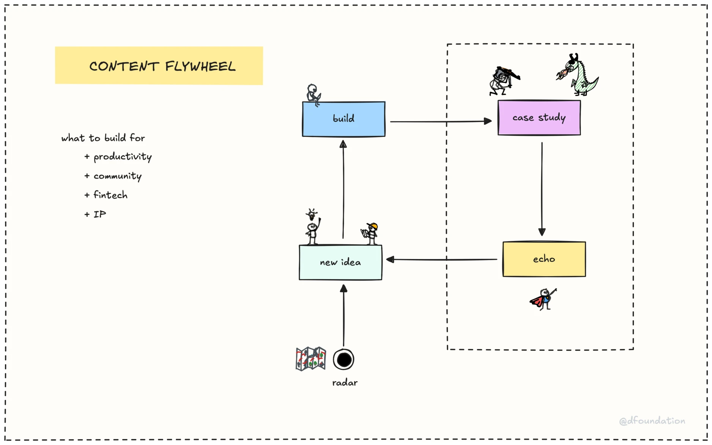

> **tl;dr**
>
> Our growth engine spots tech trends early using a content flywheel: build, document, share, ideate, and track via our tech radar. We monitor signals like funding and KOL buzz to find consulting opportunities.

### Why we need a growth engine

When a new market arrives, it’s often too late to build expertise and win clients. That’s where our growth engine comes in. It’s our way of **spotting emerging tech trends early**, so we can position ourselves as experts and offer consulting services before the market gets crowded. Think of it as a radar that helps us see what’s coming, giving us a head start to learn, adapt, and connect with clients who need our help.

### How the growth engine works

Our growth engine is built to detect signals of new tech trends and turn them into consulting opportunities. It’s an inbound system, meaning we attract clients by staying visible and relevant in the tech space. Here’s the core of how it works, broken down into a process we call the `Content flywheel`.

#### The content flywheel

The content flywheel is our workflow for spotting trends and building our consulting pipeline. It has five steps:

- **Build.** We create small projects or experiments around new tech, like a prototype for an AI agent or a blockchain solution. This helps us learn the tech hands-on.
- **Case study.** We document what we built, sharing our process and results. This shows potential clients we know our stuff.
- **Echo.** We share the case study through our channels, like blog posts or community talks, to get feedback and spark interest.
- **New idea.** Feedback from the echo step gives us fresh ideas to explore, keeping the cycle going.
- **Radar.** We feed all this into our tech radar, a tool that tracks emerging trends and helps us decide where to focus next.

This flywheel keeps us active in four key areas:

- productivity (building useful tools),
- community (engaging with tech folks),
- fintech (exploring financial tech trends),
- and IP (creating unique solutions).

It’s how we stay ahead.

#### Key components

The growth engine runs on a few key pieces that work together:

- **Social listening.** We monitor sources like X posts, tech blogs, hiring trends, funding announcements, and hackathons to spot early signals of new tech. For example, if a startup raises a big Series A for an AI agent platform, that’s a signal.
- **Tech radar.** This is our signal tracker. It layers data, like KOL buzz or new fundraises, to show which tech is gaining traction. You can check the radar on our Discord server.
- **Memo and brainery.** We document insights in memos and share deeper learnings through brainery sessions, where the team dives into a tech topic together.
- **Publication.** We share what we learn through blog posts, talks, or newsletters. This builds our reputation as experts and attracts clients.
- **Improvement workflows.** We keep refining our process based on what works, making sure we’re always getting better.

As a team member, you can tap into this by subscribing to signals on Discord, joining brainery sessions, or reading our publications.

### What signals we look for

The growth engine is all about spotting the right signals. Here are some we track:

- Funding rounds. A new Series A in a tech space often means it’s gaining traction.
- Hackathon activity. If developers are building with a new tech at hackathons, it’s a sign of growing interest.
- KOL buzz. When key opinion leaders on X or blogs start talking about a tech, it’s worth noticing.
- Hiring trends. If companies are hiring for skills in a specific tech, like AI agents, demand is likely rising.

These signals help us decide where to focus our consulting efforts. For example, if we see AI agents trending, we might start building expertise in that area and reach out to clients who could benefit from it.

---

> Next:
>
> - [Forming market thesis](forming-market-thesis.md)
> - [Business correction](business-correction.md)
