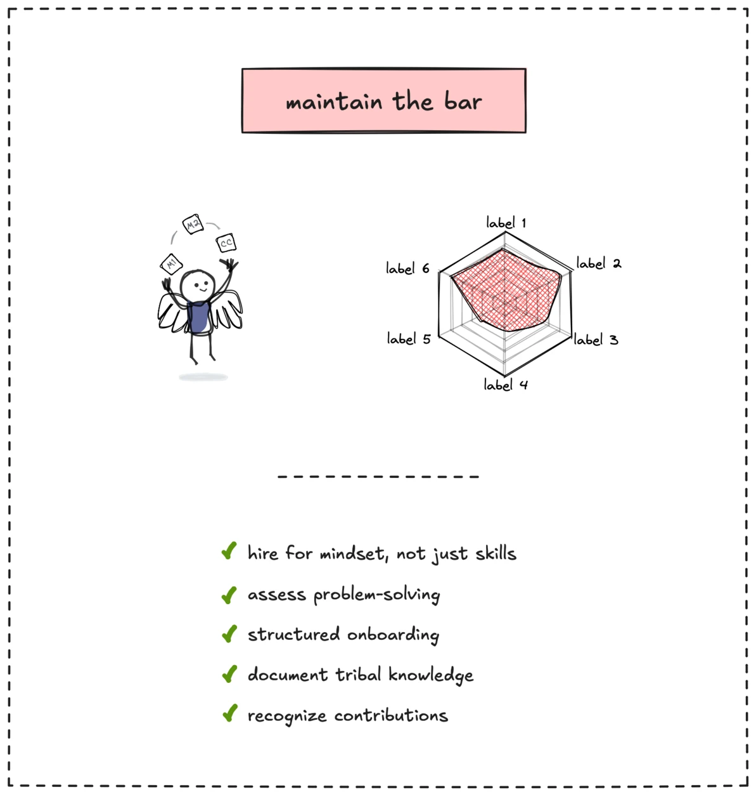
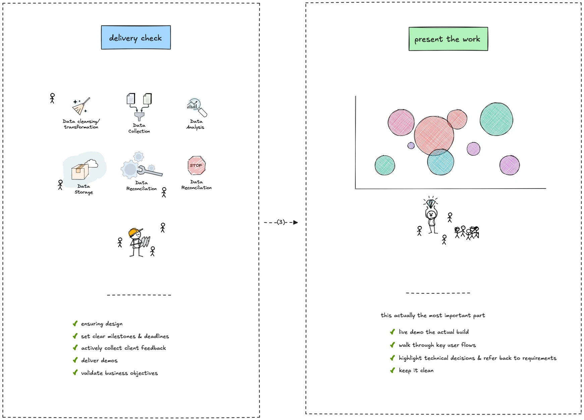

> tl;dr
>
> To stay sharp, we build our tech edge by distilling know-how from experiments, setting clear goals, and participating in hands-on projects like hackathons. We reflect on what we learn, improve our workflows, and share knowledge through shadowing, ensuring our team delivers top-quality consulting services for new tech.

---

<strong>Table of contents</strong>

<!-- Begin ToC -->

- [Distill know-how](#distill-know-how)
- [Act on signals to build your edge](#act-on-signals-to-build-your-edge)
  - [Set the goal](#set-the-goal)
  - [Participate and experiment](#participate-and-experiment)
  - [Reflect and improve](#reflect-and-improve)
- [Share knowledge through shadowing](#share-knowledge-through-shadowing)

<!-- End ToC -->

---

After forming our market thesis to predict trends, staying sharp keeps our consulting team ahead. When markets shift, like from blockchain to AI agents, we need the latest tech know-how and high-quality delivery to offer top-notch services, keeping clients happy and our team competitive.

### Distill know-how

The first step to staying sharp is capturing what we learn. Distilling know-how means turning our experiences into knowledge the whole team can use.

After a project, like building an AI agent prototype, we share insights through memos or brainery sessions. For example, if we find a new AI tool that speeds up system design, we’ll create a workflow to use it in future client projects. This keeps our tech expertise fresh, ensuring we deliver better solutions every time.

### Act on signals to build your edge

Once we spot a new trend through our growth engine, like a rise in AI agent demand, we take action to build our edge. Here’s how we do it, step by step.

#### Set the goal

First, figure out what makes this trend a game-changer for our consulting work.

Ask yourself: Is it the tech know-how, like mastering AI agents? Will it boost our productivity, maybe by automating workflows? What impact will it have, like helping clients scale faster?

Map this back to our consulting model, where we design, build, and guide. For example, if AI agents are the focus, our goal might be to become the go-to team for AI agent integration, delivering solutions that save clients time and money.

#### Participate and experiment

Next, dive in and get hands-on experience to build use cases we can share with clients. Here’s how:

- **Build with others.** Join open-source projects or hackathons to collaborate and learn, like contributing to an AI agent framework or building a prototype.
- **Run your own experiment.** Create a small project, like an AI chatbot for a mock client, often at low cost to reduce risk while earning reputation for the team.

For example, joining a hackathon to build an AI agent prototype gives us experience we can showcase to clients, proving we know the tech inside out.

#### Reflect and improve

After experimenting, reflect on what you learned to keep our edge sharp. Here’s the cycle we follow, as shown below:

- **Experiment.** Try out the tech, like building that AI agent prototype.
- **Reflect.** Look at what worked and what didn’t. Maybe the AI agent was great at answering questions but struggled with complex requests.
- **Improve.** Create new tools or workflows based on your insights, like a checklist for testing AI agents before deployment.
- **Repeat.** Keep this cycle going to stay ahead.

This process turns experiments into practical tools and insights, boosting our consulting quality for the whole team.

### Share knowledge through shadowing

Building our edge isn’t just about learning, it’s about sharing what we know. Training sessions are great, but people learn best by doing. That’s where shadowing comes in.

Shadowing means pairing a newbie with someone skilled in the new tech. For example, if you’ve mastered AI agents during a hackathon, pair up with a teammate who’s new to the tech. Let them shadow you on a client project, working hands-on to see how it’s done. Here’s how it looks:

- **Pair up.** The experienced team member leads, while the newbie observes and helps.
- **Work together.** They tackle a task, like designing an AI agent for a client, with the newbie learning by doing.
- **Spread knowledge.** Over time, the newbie gains confidence and can handle similar tasks on their own.

This hands-on approach ensures our team’s delivery quality stays high. Everyone gets up to speed faster, and we maintain a consistent level of expertise across projects.

---

> Next: [Grow our talent pool](talent-pool.md)
