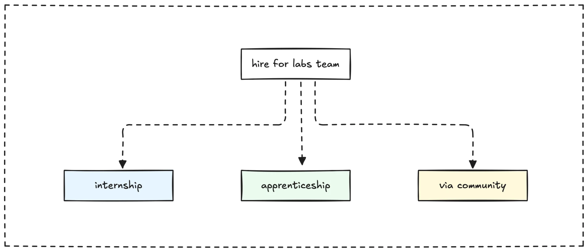

```tldr
We grow our talent pool by hiring passionate doers through internships, apprenticeships, and communities, focusing on labs team roles. Talent recognition via clear paths, feedback, and appreciation keeps our team motivated.
```

Sometimes, regular training and shadowing might not be enough, or the economics just don't work out. When that happens, we should also look for people outside our usual cycle. These are often folks who love to join in on new tech because they genuinely want to learn it.

It's key not to mix up people who just "want to be" with actual "doers." Aim for people with true passion; that's hard to fake. With over ten years of experience to hire and work with tech people on projects and in communities, it's pretty easy to tell if someone is driven by money or by curiosity.

Our insights from how we [form a market thesis](forming-market-thesis.md) directly guide the skills and profiles we prioritize for our talent pool. This ensures we're ready for what's next. Alongside external hires, we always aim to support current team members who show passion for new tech, and offer them paths to learn and shift roles.

Here are three main ways we can find people:

- **Internships**: For fresh talent from universities.
- **Apprenticeships**: For experienced people who want to try new tech.
- **Direct hires via community**: Find people through our networks and communities.



To hire the right people for the team is essential. We should aim to bring them into our labs team. Our labs team acts as a test bed for new tech. It helps develop best practices and pilot solutions that can then scale to the wider team. For the labs team, look for qualities like curiosity, good writing skills, and system-level thought. This helps them explore and share practices across the team.

If we find we're late to adopt a new technology, we can catch up. One way is to directly hire someone with that knowledge into the labs team and then grow the team from that base.

### Talent recognition: Value our people

An important part of talent growth is to design how team vision and talent vision connect. When people feel seen and valued, they're more likely to invest their energy and grow with us. Our approach to this should reflect our company culture, which values learning, innovation, and craftsmanship. We should think about:

- **A clear way to recognize contributions**: This goes beyond just project delivery. It includes how people share knowledge, mentor others, innovate, or take initiative. Recognition can be public (like shout-outs in team meetings) or private, but it should be timely and specific.
- **A perk and benefit package that reflects value**: While not solely about money, pay and perks should align with contribution and market value. Think about benefits that support learning and growth, like training budgets or conference attendance.
- **Pathways for growth and development**: People need to see a future for themselves here. This means clear paths for advancement, chances to take on new challenges, and support for skill growth that aligns with both their hopes and the company's needs.
- **Regular, constructive feedback**: Honest and regular feedback is a form of recognition. It shows we care about their growth. This should be a two-way street, where team members also feel free to share their thoughts.
- **Foster a culture of appreciation**: Encourage peer-to-peer recognition. Small gestures of thanks and appreciation can build a strong, supportive team culture where everyone feels valued.

By a strong focus on talent recognition, we create an environment where people are motivated to learn, contribute, and grow with the company as we navigate new markets.

---
> Next: [Business correction](business-correction.md)
