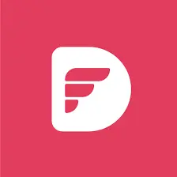
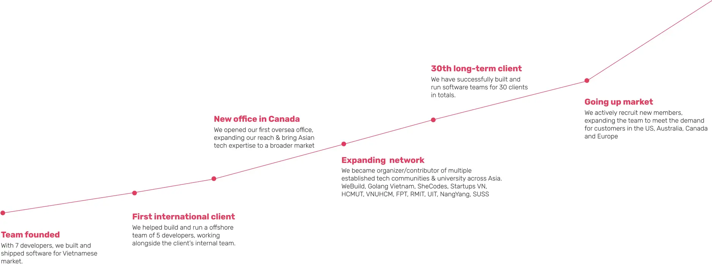
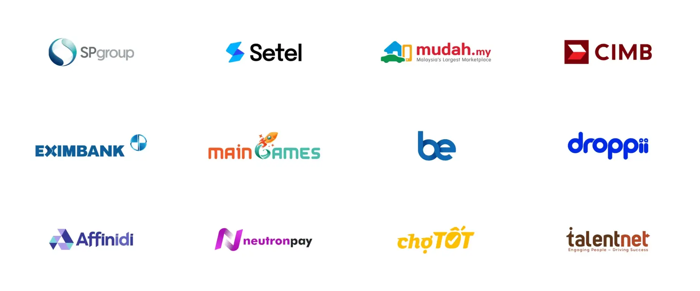

We seek for Partners, individuals and companies likewise, to develop a co-creation system driven by mutual purposes and interests.

With our average deal size at $30,000, a partner can generate at least $2,400 per project. Commission is paid from project start, every month until project end.

## Partner perks

**Partnering with Dwarves is not just a collaboration, it's a strategic investment in trust, network and business growth. Being our partners mean sharing opportunities, resources, connections and scaling up together.**

### Flexible **commission rate**

Our commission structure is designed to maximize rewards for partners. The more involved you are in a project, the greater the rewards. We are also flexible when structuring a deal, to make sure it's a win-win for everyone.

### Innovative solutions, endless possibilities

Partners can leverage Dwarves' expertise to offer state-of-the-art software solutions that answer to industry standards.

Our commitment to innovation ensures you can confidently provide your clients with the tools they need to stay ahead.

### Full access to resources

Partners who are building their own products can employ Dwarves' staff at a rebate rate. With our current network, we can also help with:

- Recruiting and hiring
- Fractional leadership
- Connecting to investors, mentors & founders
- Organizing events & meetups

### Marketing collaboration

Leverage our marketing collateral, case studies, and success stories to strengthen your pitch and build trust with your clients.

We believe in collaborative marketing efforts, and our team is ready to work with you to create impactful campaigns that drive results.

### Continuous support

Partners benefit from our robust training programs, covering product details, effective sales techniques, and market insights.

Our adept team of business development, sales, engineering and technical experts will support you all the way.

---

## Join us

### Who should join us

We are looking for techies who are passionate about technology and hungry for new opportunities. From our experience, our partners are most likely:

**Left Column:**

- Tech consultants
- PMP/PMI
- Startup founders
- CTO & Head of engineering

**Right Column:**

- IT service companies
- Universities
- Incubator and Venture Executives
- Tech Event Organizers

### Joining our Partners Program is simple

1. **Apply:** email [nikki@d.foundation](mailto:nikki@d.foundation) to introduce yourself and express your interest in becoming our partner
2. **Review:** Our team will review your application and reach out to discuss the potential collaboration
3. **Onboarding:** Once accepted, we'll provide you with necessary onboarding materials and training to kickstart your partnership journey
4. **Start Selling:** Armed with the support of our team, you can start offering our services to your clients and network

---

## Dwarves profile

### Dwarves build and ship top-notch software

We're a team of design and development experts working closely with clients to craft software, build tech teams, and invest in people who create world's next favorite things.

We prioritize creating the right product that brings tangible business values, rather than simply building features. Working with us, you'll be working with a dedicated team focusing solely on your needs and goals.

**We make it possible by:**

- Providing solutions first, before any hard coding.
- Work, deliver and take responsibility as a team.
- Fulfilling our team with highly skillful and efficient people.
- Implementing frictionless management and collaboration processes.

---

## Facts & figures

**Left Column:**

- 80+ developers with 3 - 9 years of experience
- 4 designers
- 30+ clients worldwide

**Right Column:**

- 70+ projects delivered
- 20 strategic partnerships with tech communities and universities
- Offices in Vietnam, Canada, Germany

---

## Our services

Our services are tailored to blend into the nature of each client we work with. Depends on the your unique needs, project scope, requirements and expectations, we provide different types of services and are capable of customizing them for you.

## Staff augmentation

**Scale up the development team quickly to meet product roadmap and get to market faster.**
Our in-house talents are selected through a strict interviewing process, with proper training before they get to work on client's projects.

We only deploy engineers who meet your requirements and tech stack.

**Left Column:**

- Frontend Engineer
- Backend Engineer
- Fullstack Engineer
- Blockchain Engineer
- QAQC
- DevOps

**Right Column:**

- Tech Lead
- Product Owner
- Project Manager
- Product Manager
- Product Designer
- Graphic Designer

## Product consulting & development

### Solution

**Identify and solve critical software challenges.**

- Strategy & Architecture
- Digital Transformation
- Business Process Reengineering
- Enterprise Service Management
- Systems Integration & Application Management Services

### Design

**Design product based on business requirements.**

- Market & User Research
- Product Strategy
- UI/UX
- Brand Identity & Application

### Development

**Build and ship in small, continuous releases.**

- Web Development
- Mobile Development
- Tooling Development
- API Development
- Managed Services
- MVP Development

---

## Web3 services

### [Console Labs](https://console.so) is a Dwarves' subsidiary focusing on web 3.0 R&D and services

- **Blockchain Integration:** Build a layer to manage and manipulate data between current system and public blockchain network.
- **Architecture Design:** A right architecture planning for a novel blockchain system can save tons of time developing.
- **Indexing Node:** Indexing node helps pull data and organize blockchain data into offchain node for further use and query.
- **Vesting Contract:** For IDO etc, we implement a smart contract that allows you to deposit tokens that are unlocked to a specified public key at a certain block height/slot.
- **Smart Contract:** Any other smart contracts and logic you want to implement on EVM compatible chains.
- **DeFi:** Development of any blockchain based financial solutions, e.g assets tokenization platforms, p2p lending, neobanks.
- **Contract Audit:** We conduct manual code review and automatic code analysis to identify any possible compilation, security, and reentrancy issues.
- **NFT Launch:** Build contract and tools to support NFT collection launching.

### Portfolio

**Left Column:**

- [**Neutronpay**](https://neutronpay.com): Payment platform on Bitcoin's Lightning Network
- [**Mochi**](https://mochi.gg): Web3.0 tooling / infra
- [**Eklipse**](https://eklipse.gg/): Video-based NFT tooling for game streamers
- [**Staery**](https://staery.io): Cross-chain decentralized staking
- [**iCrosschain**](https://icrosschain.io): Cross-chain swap
- [**MStation**](https://icrosschain.io): On-chain RGP game
- [**Attrace**](https://icrosschain.io): Blockchain referral layer
- [**Tokenomy**](http://tokenomy.com): Mobile app for crypto investment platform
- [**Legend of Fantasy War**](http://legendfantasywar.com): Blockchain integration for NFT game

**Right Column:**

- [**Pod Town**](https://pod.town/): Defi and NFT-based metaverse
- [**Pod Auction**](https://pod.town/auction): in-house auction platform
- [**Pod Together**](https://pod.town/together): DeFi saving and lottery game
- [**Pod Marketplace**](https://console.so/#): marketplace platform
- [**Pod Prediction**](https://console.so/#): simple price prediction game
- [**Pod Vault**](https://console.so/#): home-baked compounder
- [**Pod Wallet**](https://console.so/#): manage and track portfolio cross-chain

---

## Portfolio

> 🤝 Our clients are any organization that puts tech at great importance for their growth; ranging from funded startups looking to get their MVP to market fast, to enterprises looking for a tech partner to scale their products.

---

## Tech stack

**Left Column:**

- Backend: Go, Elixir, Rust, Nodejs
- Frontend: Typescript, React/Redux/Redux Saga
- Mobile: Objective-C, Swift, Kotlin, React Native
- Architecture: Clean, N-Tiers

**Right Column:**

- Cloud: GCP, AWS, Azure
- Cloud Tool: Docker, K8s, Terraform, Ansible, Vault
- Design: Figma, Sketch
- No-code: Framer, Webflow
