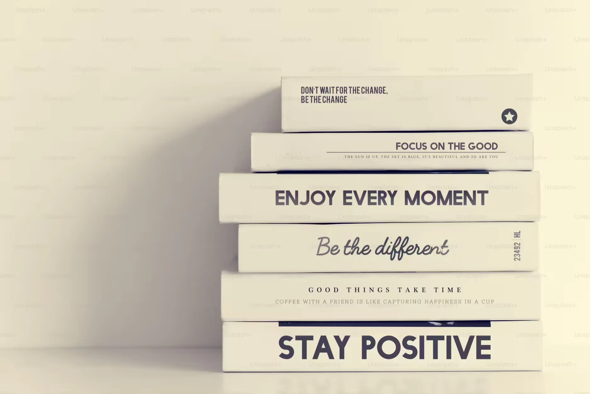

Picture building a Lego tower every day. People love your towers, but they talk about the last one you made. If it’s sturdy, they’re thrilled. If it wobbles, that’s what they notice. This article is about that idea: **your last work matters most right now**. Everyone has off days, maybe from burnout or routine. It’s not just about feeling down; it’s about noticing and getting back to work you’re proud of. In software, where every update shapes user trust, this keeps a team sharp. **What makes you want to build your best tower?**

## What this means

The idea is simple. The latest work you do leaves the biggest impression. Past wins are great, but if your newest effort misses the mark, that’s what people focus on. A salesperson might have landed huge deals, but if their last pitch fell flat, that’s what lingers. A software developer could have built a sleek app, but if their last update crashes, users notice the glitch first. It’s not unfair; it’s just how work flows.

Every task is a fresh chance to shine. **No one’s stuck in a bad moment.** A new project, even a small fix, lets you show what you can do. In software, where a single line of code can make or break a feature, this mindset keeps the focus on delivering something reliable. It’s not about perfection but creating work that counts. This approach drives progress and keeps teams moving forward.

## When things slip

Everyone hits a rough patch. Work feels like a grind, and the effort isn’t there. Projects stall, energy fades, or a feature ships late. This happens to all of us. It might stem from coasting on old successes, hitting a wall after endless debugging sprints, or feeling drained by feature deadlines. Burnout is real too, when the constant grind leaves you empty. **Have you ever felt stuck in a rut?**

The challenge isn’t just the low mood; it’s not noticing or letting it linger. Awareness is everything. Spotting when motivation dips, whether from burnout or boredom, is the first step to bouncing back. It’s not about failing. It’s about seeing the slump for what it is and choosing to get back on your feet with work that feels meaningful.

## Getting back on track

Every job offers a shot to deliver something worthwhile. When motivation slips, a few steps can spark it again. Picture a developer stuck on a tricky bug. Breaking it into small pieces, like isolating one error, builds momentum. Completing that step feels rewarding. Chatting with a teammate can unlock a new angle—maybe they’ve tackled a similar issue. Reframing a task to see its impact, like how clean code helps users, makes it matter more.

Exploring a new challenge, like diving into a fresh coding problem, keeps things engaging. Pair-programming with someone energized can lift the mood; their drive is contagious. Places like ours offer open conversations to get unstuck. A coder once felt burned out but refocused by tackling a small feature. Their next release won users over, proving it’s possible. **The goal is staying aware and making each job count**, one step at a time.

## Keep work strong

**Your last work shapes what others see.** If it’s shaky, the next one can rebuild trust. In software, a single update can win users back or lose them. A strong team shares ideas and stays driven, creating work that lasts. A coder once struggled but paired with a teammate and delivered a feature users loved. That’s the power of awareness and effort. **What gets you fired up to work again?** Bring one idea to the next team huddle or chat to keep motivation high. Keep this handy for when work feels heavy. Every job shapes what we stand for. Let’s commit to work that reflects our best, lifting each other up to stay steady and strong. **What will your next work say about you?**

