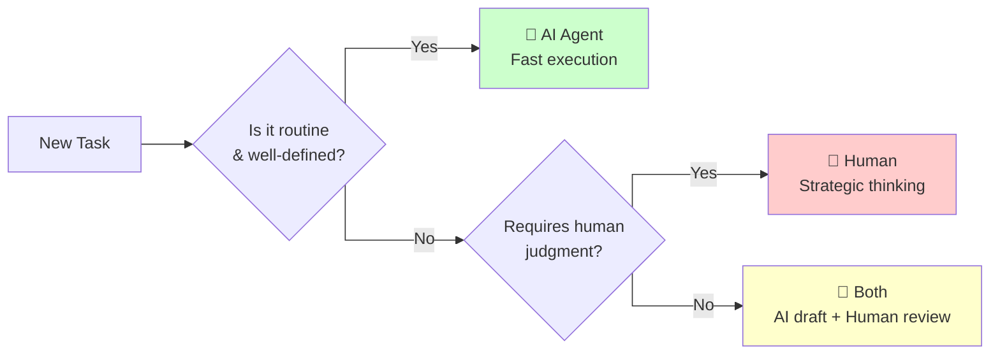

How much time do you spend explaining tasks versus the time spent executing them? When did you last spend 30 minutes briefing a 10-minute task, only to receive work that missed the mark?

This reveals a growing reality: **communication overhead often exceeds task execution time.** As AI agents handle routine work with minimal explanation, the inefficiency of human delegation becomes stark. Sometimes, the cost of communicating with humans outweighs their cognitive advantages.

## The delegation math is clear

**AI agents complete routine tasks 3-5x faster than human delegation cycles.** The time breakdown reveals the true cost of communication overhead:

| Phase | Human Delegation | AI Delegation |
|-------|------------------|---------------|
| **Setup** | 20-40 min explaining | 5-10 min prompting |
| **Execution** | 2-4 hours work | 10-30 min execution |
| **Review** | 30-60 min clarification | 15-30 min refinement |
| **Rework** | 1-3 hours iterations | Minimal rework |
| **Total** | **3-4+ hours** | **45-70 minutes** |

This pattern spans functions. Marketing teams spend hours briefing copywriters for social posts that AI generates in minutes. Operations managers explain day-long data analysis that AI completes in under an hour.

## Why human delegation creates friction

**Explanation overhead exceeds execution time.** A marketing manager explaining competitor analysis spends 45 minutes covering context and methodology. The analysis takes 2 hours. An AI agent produces comparable analysis in 20 minutes.

**Question anxiety produces wrong outputs.** Employees hesitate to ask clarifying questions due to time pressure or fear of appearing incompetent. They make assumptions instead, creating blog posts for wrong audiences or using outdated methodologies.

**Context switching breaks momentum.** Humans juggle multiple priorities and need 15-30 minutes to refocus on tasks. AI agents don't context-switch or have competing priorities.

## Where AI agents dominate

**Content creation and analysis** see dramatic improvements. Writing job descriptions, analyzing survey data, or generating customer support responses happen faster with AI than with human writers who need extensive briefing.

**Data processing and research** benefit from AI's speed. Analyzing spreadsheets, researching market trends, or compiling competitive intelligence happen in minutes rather than hours.

**Process documentation** works well with AI delegation. Agents quickly create procedures, update policies, or generate compliance reports that humans then review.

## When humans remain essential

**Strategic and relationship work requires human judgment.** Client negotiations, team conflict resolution, and business strategy need emotional intelligence that AI agents lack. Senior managers and salespeople create value that justifies communication time.

**Complex problem-solving benefits from human experience.** Debugging operational issues, resolving complaints, or diagnosing supply chain problems require intuition and institutional knowledge AI can't access.

**Quality assurance stays human-centered.** AI outputs need human review for accuracy, tone, and alignment with company standards.

## Building a hybrid approach

**Audit your delegation patterns.** Categorize tasks into AI-suitable
(repeatable work with clear criteria), human-suitable (strategic or
relationship-focused), and hybrid (AI generation plus human
refinement).

Use this simple decision framework to categorize any task:

**Develop prompt engineering skills.** Instead of "analyze competitors," use "compare our pricing, features, and positioning against [specific competitors] for [target market] using [framework]."

**Create quality gates.** Use checklists, templates, and automated checks to validate AI work efficiently.

**Redefine human roles.** Position team members as AI-augmented experts focused on strategy, relationships, and quality assurance.

## The bottom line

**Communication overhead often exceeds the value of human intelligence for routine tasks.** This doesn't mean replacing people, but rather optimizing how you allocate human creativity and AI efficiency.

The organizations adapting fastest recognize delegation as a strategic choice. They match tasks to the most efficient executor and build processes that maximize both speed and quality. Master these skills, and communication overhead transforms from a bottleneck into a competitive advantage.
