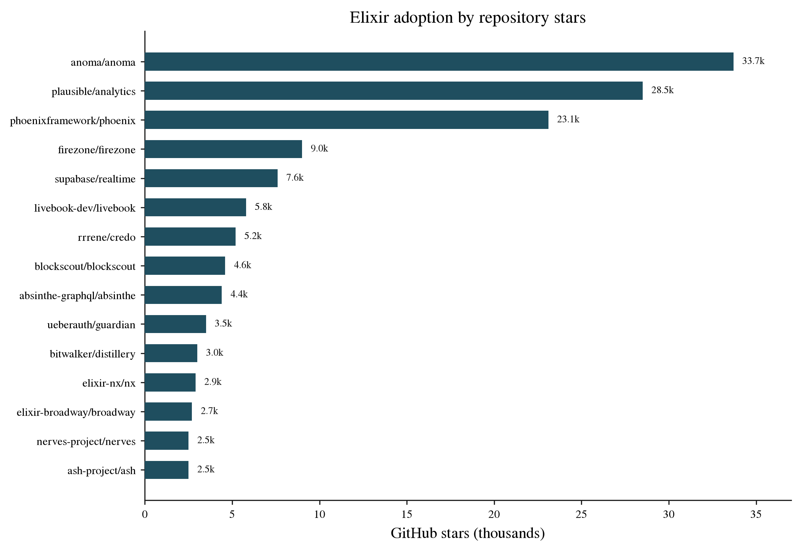

# Elixir's second act: types, then production agents

In 2026 Elixir crossed two lines at once. The language graduated to a gradually typed language. The runtime became a default home for production AI agents. Both shifts took years, and both landed within months of each other. This is the snapshot I gathered in August, with the numbers, as of 2026-08-15.

The evidence is the release record, the Hex registry, and the adoption data, not a market projection. I wrote the argument the way I would read an ecosystem report, so it can be checked.

## The stack at a glance

| Component | Current | Released | Note |
|---|---|---|---|
| Elixir | 1.20.3 | 2026-08-04 | Gradual typing since 1.20.0 (2026-06-03) |
| Erlang/OTP | 28.x | 2025 | Base requirement; regex moved from struct defaults |
| Phoenix | 1.8.x | 2025-08 | Adopts LiveView 1.2 |
| LiveView | 1.2.9 | 2026-06 | Colocated CSS, the 1.2 headline |
| Ecto | current | ongoing | The data underlay Ash builds on |
| Ash | 3.31.3 | 2026-08-12 | Two security patches this month |
| Oban | 2.23.1 | 2026-08-03 | Default for background jobs |
| Nx / Axon | 0.8.x | 2026 | Bumblebee models on Nx |
| Livebook | current | ongoing | Distributed Python cells |
| Hologram | 0.11 | 2026-08 | Pure-Elixir apps in the browser |

The dates in the table are release dates from the maintainers. Patch levels move fast. Treat the table as a point-in-time slice.

## The type system went live

The type work shipped in June with v1.20. The compiler infers a set-theoretic type for every program, with no annotations required. It reports two kinds of signal. Verified bugs are typing violations that fail at runtime. Dead code is reachable-only-in-the-phase code the checker can prove unused. The team reports a low false positive rate, and many users drop Dialyzer.

The chain is visible across releases. v1.19 checked protocols and anonymous functions in October 2025 and cut compile time by up to four times on large codebases, using lazy module loading and parallel OS-process compilation of dependencies. v1.20 drew the whole language into inference. v1.21, targeted for November 2026, adds recursive and parametric types, then user-facing type signatures.

The risk is the one every gradual type system faces in production. False positives must stay low at scale, or teams stop trusting the checker. The signatures do not exist yet. That is the open item to watch.

## The web core held

Phoenix and LiveView remain the center of gravity. LiveView 1.2 shipped in June with colocated CSS, styles that live next to the component that uses them and are extracted at compile time for the bundler. It rounds out the colocation story that 1.1 started with hooks and JavaScript. The 1.2 patches that followed were mostly security and navigation work, including redirect scheme fixes and navigation cancellation. The pace is mature, not frantic.

## Data and durability

Ash keeps a sprint cadence. Three point releases landed this month, two of them security patches on keyset handling. It positions itself as declarative and agent friendly, with generated manifests to call across BEAM nodes.

Background jobs gained a contender. Belay runs durable jobs as memoized step sequences, so a crash mid-flight resumes without re-running finished work or paid API calls. It is at 1.0-rc. Oban remains the default and stays close, with AshOban bridging resource actions to Oban.

## The BEAM became the agent runtime

Here is the thing that changed the argument for Elixir this year. OpenAI open-sourced Symphony, a reference implementation for orchestrating autonomous coding agents. It polls issue trackers, spawns isolated agent runs, and runs multi-turn work to pull requests. Its reference implementation is about 96 percent Elixir and OTP.

The choice was not ceremonial. The BEAM supervises concurrent long-running processes, isolates failures, and hot-reloads code. Those are exactly the primitives agent orchestrators need.

The rest of the ecosystem moved to meet the moment. Livebook runs full Python cells with zero-copy Arrow transfers and distributes Python over Erlang distribution. The numerical stack, Nx, Axon, Bumblebee, and Explorer, keeps maturing. Voyager, a new Observer replacement, exposes live BEAM nodes to assistants over MCP. WeaveScope traces agent runs natively on the BEAM. The connector appears everywhere.

## Adoption snapshot

The adoption data draws a clear picture. Figure 1 shows the fifteen largest Elixir-language repositories by stars, from the GitHub topic index on 2026-08-15.

**Fig. 1.** Leading Elixir-language repositories by GitHub stars, August 2026. The web, realtime, and analytics core dominates the head; the breadth below is the long tail. Data from GitHub topic search, 2026-08-15.

The head is not the whole story. The mid-tail carries the platform bets. Livebook carries the notebooks, Nx the numerics, Nerves the embedded work, and Ash the data layer. Tooling like Credo sits beside the frameworks that built the ecosystem.

## Embedded and local-first

Elixir did not stop at the web. Nerves keeps shipping embedded Elixir. AtomVM keeps the tiny VM alive. The VM hobbyists are active. PON-BEAM re-architects the runtime on a notification-oriented paradigm, and LING runs Erlang with no operating system at all. Neither is product-ready, and both are a live proof of how much room the runtime still has.

Local-first has a real champion. Hologram runs pure Elixir in the browser, and its latest release runs Elixir regexes on the client with server-matching semantics. It is at 0.11 and carrying its first production apps. Aura, announced in August, is an experimental Elixir variant that compiles to native binaries, a separate direction with no BEAM and no release.

## Security and supply chain

The supply chain hardened twice over. HexDocs moved to per-package subdomains after a security audit. Elixir has shipped attested software bills of materials since 1.19, in CycloneDX and SPDX formats.

The community warns about a new failure mode. AI-generated SEO posts label critical Elixir remote code execution as safe. On any vulnerability claim, read the primary source. The patch cadence across Phoenix, LiveView, and Ash through August shows the maintainers are responsive.

## What to watch next

1. Typing adoption in production. Watch false positives and the v1.21 signatures.
2. Agent orchestration on the BEAM. OpenAI's choice plus distributed Python plus MCP integration.
3. Local-first with Hologram and native-compile Elixir with Aura.
4. Supply chain hardening through 2027.
5. The jobs and durability race, Belay against Oban Pro.

## Where the argument leaks

Three claims need a check. First, verified bugs with low false positives is a promise; the production record is young, and the signatures do not exist. Second, the agent story is orchestration and operations, not Elixir becoming a better model layer. Third, the security noise means trust is earned per advisory, not inherited.

The shape is coherent. The language got a type system. The runtime became an operational model for agents. The base, web, realtime, and fault tolerance, never stopped shipping. That is a rare position for a language to hold at once.

Related: [On agentic AI](on-agent.md), and the [arc series](README.md).
