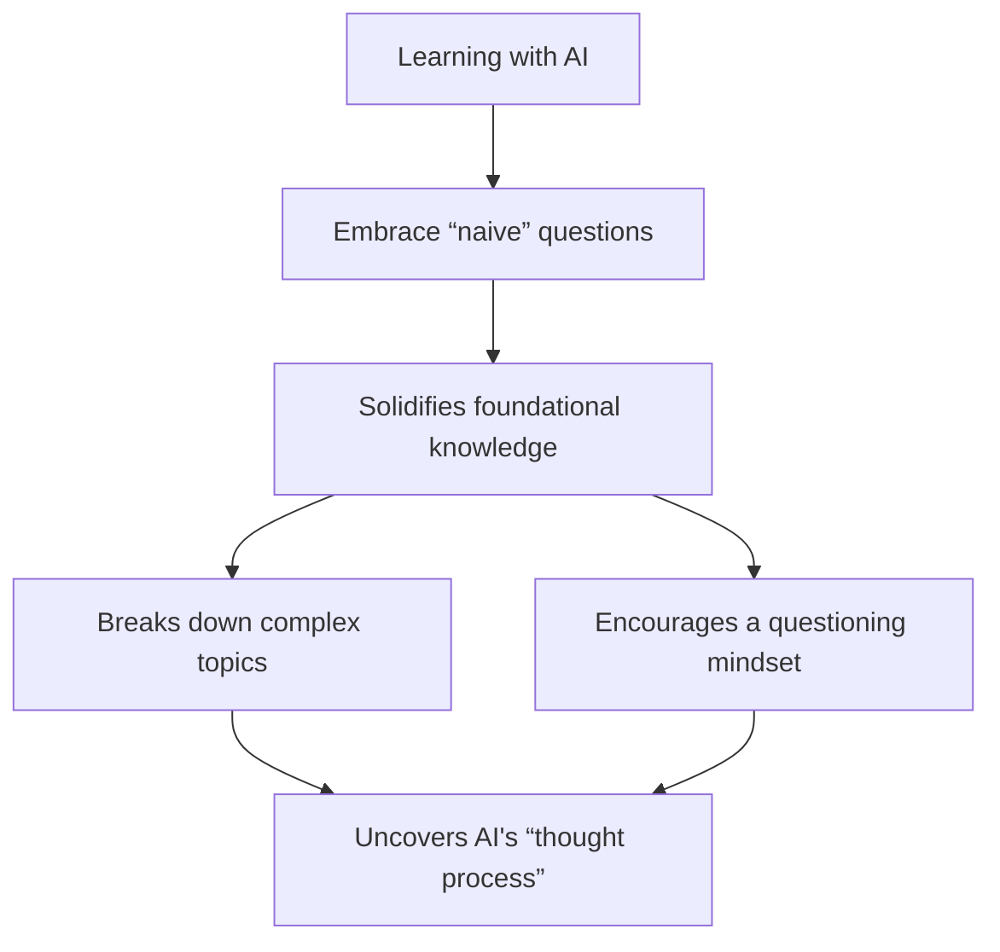

## The power of innocent questions in an AI world

In our rush to leverage the immense power of artificial intelligence, it's easy to feel a strange pressure. A pressure to ask only "smart" questions, to already know the basics, or to avoid looking like we don't grasp complex topics. But this is a trap! One of the most potent ways to truly learn and to build a proactive, questioning mindset is to embrace the power of **being naively socratic with AI**.

What does this mean? It means not being afraid to ask the AI the "dumb" questions. The questions you think you *should* already know the answer to. Questions like:

*   "What exactly does prometheus do?"
*   "Can you explain what a kubernetes pod is, but like I'm five?"
*   "Why is python considered a 'slow' language for some tasks?"

These aren't signs of ignorance; they are the very **building blocks of understanding**.

## Why embracing naive questions is crucial

Engaging with AI, especially sophisticated models, is like having an infinitely patient expert on nearly any topic at your fingertips. Wasting this opportunity by pretending to know more than you do is a disservice to your own growth.

1.  **Solidifies foundational knowledge:** Even if you have a vague idea about a concept, asking the AI for a simple explanation can clarify misunderstandings and fill in crucial gaps. It's like checking the foundations of a skyscraper. You wouldn't want them to be shaky, would you?
2.  **Breaks down complex topics:** AI can often break down incredibly complex subjects into digestible pieces. By starting with naive questions, you allow the AI to guide you up the ladder of complexity at your own pace. You can't understand quantum entanglement if you're fuzzy on what an atom is.
3.  **Encourages a questioning mindset:** The act of asking simple questions, and getting clear answers, builds momentum. It makes you more comfortable asking more questions, more nuanced questions. This transforms you from a passive recipient of information into an active, probing learner. This is the essence of a **proactive mindset**.
4.  **Uncovers AI's "thought process" (and limitations):** Sometimes, asking a very basic question and observing how the AI answers it can give you insights into how the model "thinks" or, more accurately, how it processes and structures information. It can also highlight areas where the AI might be oversimplifying or even getting things slightly wrong, which is valuable information in itself.

## Mastering the lexicon: the socratic duty of definition in AI dialogues

Beyond asking "simple" questions about broad concepts, the truly effective socratic approach with AI extends to a rigorous examination of the **lexicon** itself. When an AI starts deploying technical terms, it's not just your right, but your intellectual duty, to stop and demand clarity. This isn't about being pedantic; it's about ensuring mutual understanding and building solutions on solid ground, not on a swamp of ambiguous jargon.

Consider the flow: the AI presents a complex system. You, the human, then ask:
*   "Okay, when you say 'instrumentation' here, what precisely does that entail for a Next.js app versus an Elixir backend?"
*   "You've mentioned 'telemetry metrics.' Are these distinct from standard logs, and if so, how in this specific architecture?"
*   "If I rephrase your explanation of 'synthetic monitoring' as a 'proactive health check system that simulates user interaction to verify endpoint and resource availability,' am I capturing your meaning correctly?"

This insistence on **lexical precision** serves several crucial purposes:

1.  **Deconstructs jargon:** AI models can sometimes use terms loosely or in ways that might have specific nuances in one context but not another. Pressing for definitions forces the AI to be explicit and often reveals a deeper layer of its "understanding" (or lack thereof).
2.  **Ensures true alignment:** You can't build effectively if your "schema" for a word differs wildly from the AI's. Confirming definitions, rephrasing, and asking "is that what you mean?" is vital for ensuring you're both actually talking about the same thing. This was evident in the CEO's exchange, constantly verifying understanding of terms like "synthetic approach."
3.  **Builds your expert vocabulary:** Each time you rigorously define a term with the AI, you're not just clarifying for the current conversation; you're building your own precise technical vocabulary, making you a more effective communicator and thinker in that domain.
4.  **Exposes assumptions:** Sometimes, demanding a definition uncovers underlying assumptions the AI is making. "When you say 'scalability,' are we talking about load-based instance scaling, geographic distribution, or data sharding, or all of the above?"

Being naively socratic, in this advanced context, means you don't let any term slide if you're not 100% confident in its meaning *within the current discussion*. It means treating the AI's vocabulary with the same critical inquiry you'd apply to its proposed solutions. This is how you move from being a passive recipient of AI output to an active, engaged partner in a high-stakes intellectual exchange. It's about owning the language to own the solution.

## It's not about being dumb, it's about being smart enough to learn

Being naively socratic isn't about feigning ignorance. It's about having the intellectual honesty and humility to admit what you don't fully grasp and the intellectual curiosity to seek clarity. In the context of AI, this approach is particularly powerful. The AI doesn't judge. It doesn't get impatient. It's there to explain.

So, the next time you're chatting with an AI, resist the urge to only ask "advanced" questions. Throw in some of those basic, "innocent" queries. "What does that acronym stand for?" "Can you give me a real-world example of that?" "Why is that important?"

These simple inquiries are not detours; they are the most direct path to deeper understanding and a truly proactive, questioning approach to learning. They are necessary steps for anyone looking to genuinely augment their intelligence with AI, rather than just using it as a fancy search engine. 

---

> Next: [Skillmaxing](skillmaxing.md)
