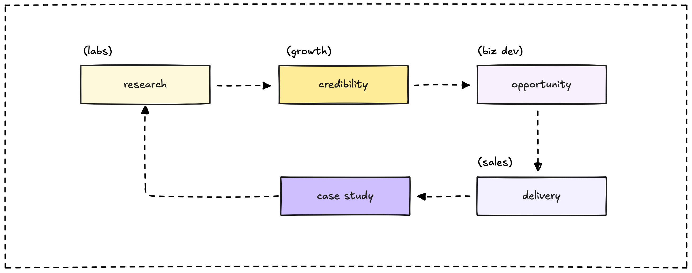

## The inflection point

We're at a unique moment. The AI revolution is here, companies need guidance navigating this shift, and we're positioning ourselves as the research-first consulting firm that leads them through it.

Traditional consulting firms chase deals. We build credibility first, then opportunities follow naturally. Our role strategy creates a complete pipeline that scales this approach.

## The strategic framework

### Research-first growth philosophy

This requires a different kind of team - one that can:

- **Generate authentic thought leadership** through real research and experimentation
- **Convert technical expertise into business opportunities** using inefficiency arbitrage  
- **Deliver at the highest technical standards** while maintaining research velocity



## The virtuous cycle

This role strategy creates a self-reinforcing growth wheel where each role enables the next step:

```
Research → Credibility → Opportunities → Delivery → Case studies → More research
```

Each cycle strengthens the next:

- **Community labs** generate research insights and expand our capacity
- **Growth lead** builds technical credibility that attracts the right opportunities
- **Business dev** converts this credibility into partnerships and strategic relationships
- **Sales manager** closes deals faster because of our reputation  
- **Software engineers** deliver solutions that showcase our technical depth
- **Platform engineers** enable both internal tools and client infrastructure
- **Comic artist** makes technical concepts memorable, amplifying our content reach

The magic happens in the compounding: each turn of the wheel makes the next turn easier and more valuable.

## What we're really building

### Credibility as competitive advantage

When potential clients research AI consulting, they should find our research, our tools, our community discussions, and our thought leadership dominating the conversation.

### Inefficiency arbitrage at scale

Business dev systematically spots market gaps. Software engineers deliver solutions that showcase our technical depth. This creates a reputation for solving problems others can't.

## Interview calibration philosophy

### Universal characteristics we seek

**Research mindset**: Comfortable with ambiguity, driven by curiosity, documents learning  
**Technical depth**: Real experience building things that work in production  
**Community orientation**: Enjoys teaching others, contributes to shared knowledge  
**Business awareness**: Understands how technical decisions impact business outcomes  
**Growth trajectory**: Evidence of continuous learning and skill development

### Cultural alignment indicators

- **Excited about AI/emerging tech**: Everyone needs understanding of our focus areas
- **Evidence of knowledge sharing**: Research-first culture requires contributors, not just consumers  
- **Long-term thinking**: We're building brand credibility, not churning projects
- **Can explain complex concepts simply**: If you can't teach it, you don't really understand it
- **Attracted to our research approach**: Cultural alignment prevents friction

## Success metrics that matter

**Research velocity**: How quickly we explore and document new technologies  
**Credibility indicators**: Industry recognition, conference invitations, content engagement  
**Opportunity quality**: Deal size, client caliber, strategic partnership value  
**Delivery excellence**: Client satisfaction, system reliability, technical innovation  
**Community health**: Engagement levels, contribution quality, talent pipeline strength

## Why this approach works

**Scalable differentiation**: Content and community scale better than individual relationships. Research credibility compounds over time while sales efforts reset with each deal.

**Higher margins**: Inbound leads have higher close rates and accept premium pricing because they're pre-sold on our expertise.

**Talent magnet**: The best people want to work on interesting problems with smart teams. Our research approach attracts exactly these people.

**Market positioning**: When clients think "AI consulting," we want them to think of us first. This strategy makes that inevitable.

This isn't just hiring for immediate needs - it's building the foundation for becoming the definitive AI consulting firm that companies trust with their most important technical transformations.
