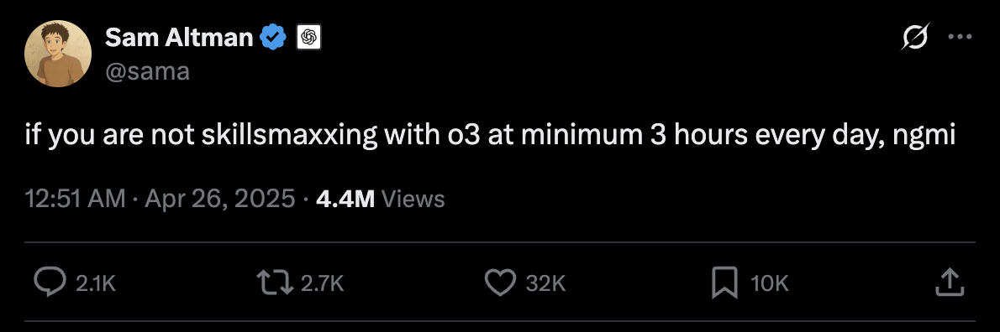

## The art of skillmaxing in the AI era

The engineering game has changed. It's no longer just about your raw coding talent. It's about your **synergy with artificial intelligence**. Forget just *using* AI.

Below is your battle plan for **skillmaxing**, a deliberate cultivation of habits, mindsets, and skills to transform yourself into a force of nature. Stop trying to keep up. Start aiming to become a **force multiplier**, an engineer who leverages AI to hit new peaks of creativity, efficiency, and sheer impact.

## 1. Cultivating genuine AI-assisted development: it's not about the prompt

First things first. If you want to **skillmax**, you gotta ditch the idea that AI is just a fancy code generator. The goal is to weave AI so deeply into your workflow that it becomes a literal extension of your own brain, letting you smash through your previous limits. Anyone can get Copilot to puke out some boilerplate. You're aiming higher. You need to use AI to produce code that’s not just functional, but cleaner, more performant, and more robust than what you, or any other code monkey *with* AI, could bang out solo. This is about **intelligent leverage**.

Think of AI as the ultimate power-up for your existing expertise. You handle the big-picture **architectural decisions** and the truly gnarly **complex problem-solving**. Let the AI sweat the small stuff. The magic happens in the **symbiotic integration**. To become this **intelligent leverager**, you must:

1.  **Critically evaluate AI output.** Never blindly accept AI suggestions. Develop a razor-sharp eye for suboptimal code, sneaky bugs, or just plain inefficient patterns in AI-generated slop. Your real value is in your judgment, your ability to refine, to sculpt.
2.  **Master prompt engineering (and beyond).** Learn to craft prompts that elicit high-quality responses. But more importantly, understand how to iterate on those prompts, guide the AI, and even know when to discard its suggestions and rely on your own expertise. Always be able to articulate *why* you made specific choices, including precisely how AI contributed or where you had to overrule its dumb ideas.
3.  **Focus on your intellectual contribution.** Constantly ask yourself: what value am I adding beyond what the AI can generate? Your goal is to be the **chief architect** of the solution. The AI is your apprentice, a very fast, sometimes surprisingly smart, but ultimately subservient apprentice.

## 2. Evolving into an AI sparring partner: from Q&A to a proper intellectual cage match

To truly **skillmax**, your AI interactions need to evolve from a timid Q&A into a full-blown **dialectical process**. Think of it as an intellectual cage match where you push the AI, and it pushes you, to forge genuinely novel insights and kick-ass solutions. Don't just *ask* the AI questions. A top-tier intellect, the kind we're talking about here, doesn't just hunt for answers. It formulates hypotheses. It critiques information with brutal honesty. It synthesizes disparate concepts into something new and powerful. Your AI sessions should look like *that*.

> An example spar with our CEO and Grok on monitoring: https://x.com/i/grok/share/uyOqakKG4QjrSjZqpovrYvtax

If an AI is spitting out "PhD level" insights, you better be its sharpest, most demanding research advisor. Your job is to guide its exploration, to relentlessly challenge its assumptions, and to steer it away from the plausible-sounding nonsense that AIs are so good at generating. To truly be the AI's **research advisor**:

1.  **Ask incisive, layered questions.** Move beyond those shallow, surface-level prompts. Develop the skill of asking questions that force the AI to dig deeper, to reveal its underlying logic (or lack thereof), and to cough up those non-obvious, game-changing lines of thought.
2.  **Identify and mitigate AI biases.** Actively hunt for **biases and limitations** in the AI's responses. Every AI has them. Your skill is in spotting them and then either working around them or guiding the AI toward a more objective take.
3.  **Synthesize and generate new knowledge.** Use the AI as a collaborator to dissect those really ambiguous, multifaceted problems. Your true genius shines when you synthesize the AI's output with your own deep knowledge to create something genuinely new, making the AI look brilliant primarily because *you* were the one pulling the strings.

## 3. Mastering AI-driven experimentation: discovery on steroids

**Skillmaxing** in the age of AI means you become a maestro of rapid, **AI-driven experimentation**. This is about leveraging AI to absolutely obliterate old timelines, explore vast oceans of possibilities, and snag breakthroughs faster than anyone thought possible. But here's the catch: AI is a phenomenal tool for experimentation, but only if you're wielding it with a clear, methodical, and creative strategy. No throwing spaghetti at the wall and hoping something sticks. Define your hypotheses with precision. Then, design experiments where AI can go wild generating variations, simulating whacky conditions, or analyzing mountains of results at a scale that would make a manual approach weep.

Your primary goal here is to maximize the **velocity of iteration and learning**. It’s not just about running more experiments; it’s about learning from them at lightning speed. To achieve this:

1.  **Formulate clear hypotheses for AI exploration.** Before you even let the AI sniff your problem, know exactly what question you're trying to answer. This laser focus will guide your **AI-driven exploration**.
2.  **Design AI-powered experimental loops.** Think hard about how AI can be plugged into every single stage of your experimental loop. From brainstorming wild ideas and creating rapid-fire prototypes to simulating complex outcomes and dissecting intricate result sets.
3.  **Cultivate AI-driven exploration strategies.** Don't just randomly prompt the AI. Develop an intelligent, almost predatory strategy for using AI to navigate uncertainty, to efficiently chart the **possibility space**, and to unearth those optimal paths or genuine breakthrough solutions, not just piddly incremental tweaks. We're hunting big game here!

## 4. Embracing proactive tool exploration: be the AI vanguard, not the AI caboose

The truly **skillmaxed** individuals, the ones operating on a different plane, don't wait for a memo or a manager to tell them what tools to use. They are the **tool scouts**, the pioneers. They're constantly seeking out, evaluating, and often breaking and then mastering emerging AI technologies. This **proactive curiosity** isn't just a nice-to-have; it's the absolute bedrock of innovation and staying ahead of the curve. When a new AI model, technique, or bizarre new tool pops up on some obscure research paper or a late-night tech blog, their immediate instinct isn't "meh." It's "I need to get my hands on that. Now. How does it work? What are its limits? What completely unexpected, mind-bending applications can I twist it to?" This **self-initiated tinkering** is what separates the leaders from the followers.

The AI landscape isn't just evolving; it's exploding at a pace that's frankly terrifying if you're not prepared. Your ability to not just survive, but to thrive and dominate, hinges on your **intrinsic motivation for continuous upgrading**. To foster this:

1.  **Dedicate time for self-initiated learning.** Actively seek out new AI tools and techniques from research papers, tech blogs, chaotic open-source communities, even those weirdly specific YouTube deep-dives. Don't wait for a formal training session; that’s for dinosaurs.
2.  **Engage in lateral thinking with new tools.** When you do explore a new AI tool, don't just look at its stated purpose. That's the boring part. Think creatively about how its core architecture, its fundamental capabilities, be hijacked to solve completely different problems, maybe even ones outside your current domain.
3.  **Build your personal AI arsenal.** Continuously experiment, evaluate, and curate your own preferred set of AI tech that specifically supercharges *your* skills and *your* workflows. Be ready to defend your choices, to articulate with conviction why you choose certain tools over others. This is about becoming an AI vanguard, not a follower anxiously waiting for instructions.

---

## Stop waiting, start building

Becoming a **proven, AI-augmented talent** isn't some passive participation trophy you get for showing up. It demands deliberate, relentless effort. It requires an unbreakable commitment to continuous learning and a fundamental, possibly painful, shift in how you attack problems and develop your skills. Embrace these principles of **skillmaxing** like your career depends on it (it does). Do that, and you won't just adapt to the AI era. You'll be one of the anarchists defining it. Now get to work.
