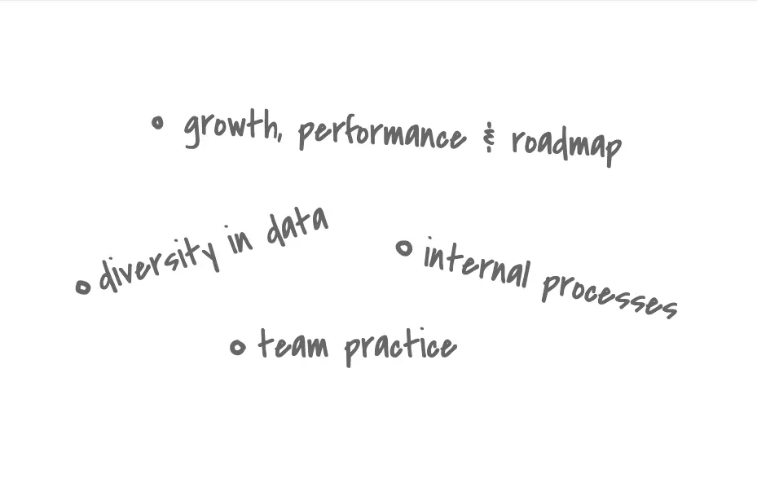

**How much do you know about this woodland?**

→ Is the question we all get during the first interview. Sure, if you're lucky enough to nail the final offer; you're likely to get a better chance on gradually discovering the company's essential information.

But then what?

- You step on the project.
- You get swiped away in work.
- You check up the daily to-do.

And you have no idea what's happening in other places. Teammate. Departments. Or even the company. And this is why information transparency is a real thing.

It's the process of being upfront about various company operations, on the ups & downs. We choose to be straightforward in every issue, as it's everyone's mission to keep the team moving forward.

## Validate the possibility

Publishing our ideas & work progress through Automatic Check-Ins gives others a chance to verify the feasibility of your work, when we open yourself up to more feedback. Say, once a new idea is incubated, sharing it out loud and receive their comment is way better than asking them directly, one ping at a time.

It keeps you away from pursuing things that don't align with the team vision. But if it does, let's just say you might have some pairs of hand to use.

## Open-source the news

Other than keeping things posted, being transparent on what you're applying for the work and life can also benefit others. Trying out a new time-management trick (or a new work-from-home outfit). Adopting a language (or a dog); Discovering a new knowledge hub (or a destination for traveling).

Before you even notice, this whole thing became a mini R&D unit for the latest trend, in many ways.

## Avoid the roadblocks

Continually communicating with other teams about your plan, when and how it will affect their daily work, prevent the roadblocks and keep people sane.

## Toward achievements

Being transparent about your success doesn't make you seem cocky. In fact, it drives a contagious sense of "_create something works_". Put it in, your challenge, your stress and how you managed to conquer it.

In smaller layers, information transparency reveals

- A higher level of trust in management
- Open and honest communication between teammates
- A rationale behind the decision from the board
- A comfortability to voice opinions and ask questions, which could yield valuable input

When we believe our ideas matters, despite which level we are; it's easier to feel obligated, and inspired, and immerse ourselves in the bigger picture. It happens by performing closer as a whole company, and no one stays outside of the loop.

Because we know how and what we do to impact that success.
