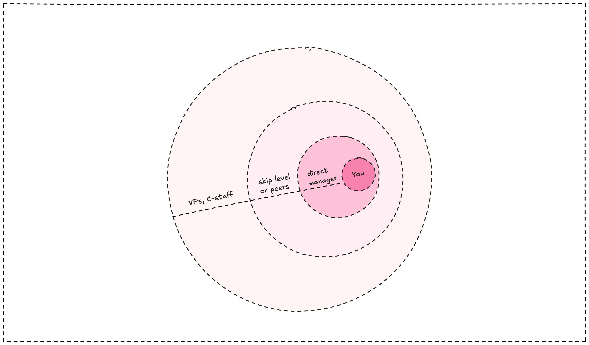

Trust opens doors to the work that matters most. The challenging projects, the strategic initiatives, the stuff that actually moves the needle. But trust isn't something you can demand or negotiate for. It's earned through consistency, competence, and the right kind of conversations.

## How trust builds in layers

Trust doesn't happen all at once. It grows in concentric circles, starting small and expanding outward based on your track record.

**Your team circle**
This is where it starts. Be reliable, ship quality work, and help your teammates succeed. When your manager needs someone for a critical task, they think of you first. Simple as that.

**Your organization circle**
Other managers start noticing your work. Maybe through cross-team projects, maybe because your manager mentions you in leadership meetings. Directors and VPs learn your name. You get invited to planning sessions and strategy discussions.

**The company circle**
You become one of the go-to engineers across the entire organization. Senior leadership pulls you into high-stakes projects. You're considered a key resource, someone they trust to execute on the company's most important bets.

At Dwarves, this inner circle of trusted engineers becomes part of what we call [the inner circle](the-inner-circle.md) - the people who step up during crises and help steer the company through challenges.

Each level requires the previous one. You can't skip steps. Your VP only trusts you because your director does, and your director only trusts you because your manager vouched for you first.

## Why trust is fragile at senior levels

The higher you go, the more delicate these relationships become. Senior leaders have enormous institutional power but depend entirely on engineers to get technical work done. They can mobilize hundreds of people toward a goal, but they need your help to understand what's actually possible.

This creates an unusual dynamic. These are powerful people who genuinely need your expertise, but they have limited technical context to evaluate your advice. They're making decisions worth millions of dollars based on your input. That's why trust matters so much, and why breaking it has serious consequences.

## Maintaining trust with leadership

**Keep things confidential**
When senior leaders share information with you, they're trusting you with company secrets. Don't immediately broadcast "as I discussed with the CEO yesterday" in Slack. Show that you understand the difference between public and private information.

**Speak their language**
Your CTO doesn't care about your SLOs when they ask if a feature is working well. They're probably responding to customer feedback or board questions. Figure out what they actually need to know before diving into technical details.

**Get the technical stuff right**
If you say something is impossible and it turns out to be doable, or if you promise something works when it doesn't, the trust evaporates immediately. Senior leaders can't verify technical details themselves, so they're watching closely for signs that your judgment is sound.

**Stay in your management chain**
It's tempting to help managers from other organizations who reach out directly. Don't do it. These relationships rarely benefit you during promotion discussions, and they can create tension with your actual manager. If someone outside your org wants your time, involve your manager in the conversation.

## Trust in remote teams

Building trust in distributed teams requires extra intentionality. Without face-to-face interactions, you need to be more deliberate about demonstrating reliability and competence.

**Over-communicate your progress**
In remote settings, visibility becomes trust. Share updates proactively, document your decisions, and make your work visible to others. When leadership can't see you in the office, they need other signals that you're delivering value.

**Be reliable across time zones**
Show up consistently for meetings, respond to messages within reasonable timeframes, and deliver on commitments even when working asynchronously. Your reliability becomes more noticeable when coordination is harder.

**Build relationships intentionally**
Trust develops through repeated positive interactions. In remote settings, you need to create these opportunities. Contribute meaningfully in video calls, help teammates in Slack, and engage in cross-team discussions that showcase your judgment and expertise.

## When trust breaks

Breaking trust with senior leadership isn't catastrophic for your career, but it does close certain doors. You won't get those direct questions anymore, won't be included in early planning discussions, and won't be top-of-mind for high-visibility projects. The relationship just quietly ends.

This isn't personal vindictiveness. It's practical risk management. If leadership can't rely on your judgment, they'll find someone they can trust instead.

## Building trust starts with craft

Everything else builds on this foundation: be genuinely good at your job. Write clean code, ship on time, help your teammates succeed, and solve problems that matter to the business.

Trust isn't about politics or networking. It's about demonstrating competence consistently over time. Do excellent work, and the rest follows naturally.

The most important projects go to engineers who have proven they can handle them. Focus on earning that reputation through your craft, and the opportunities will find you.

---

*Trust is the bridge between individual excellence and organizational impact. Build it carefully, maintain it thoughtfully, and use it wisely.*

---

> Next: [The inner circle](the-inner-circle.md)
