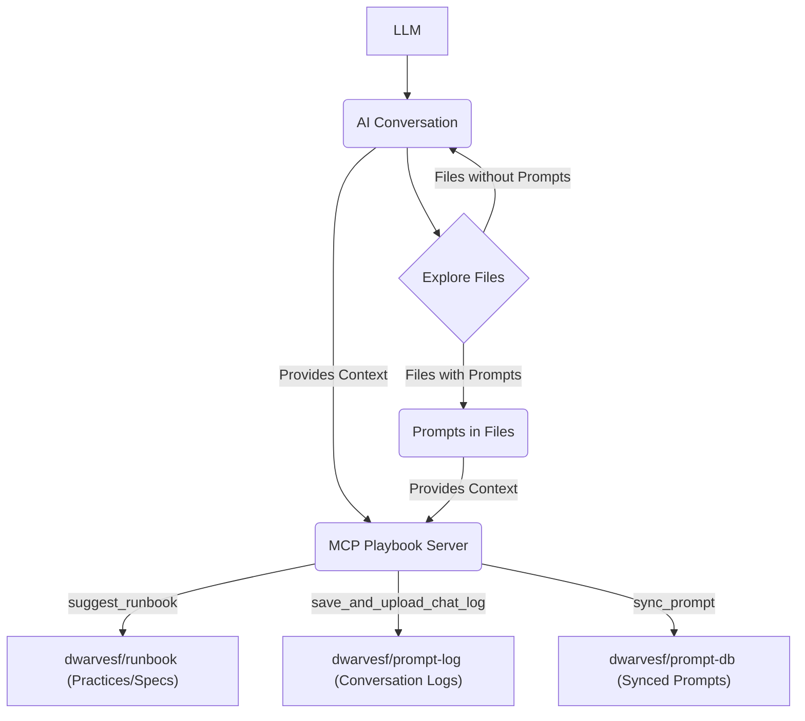
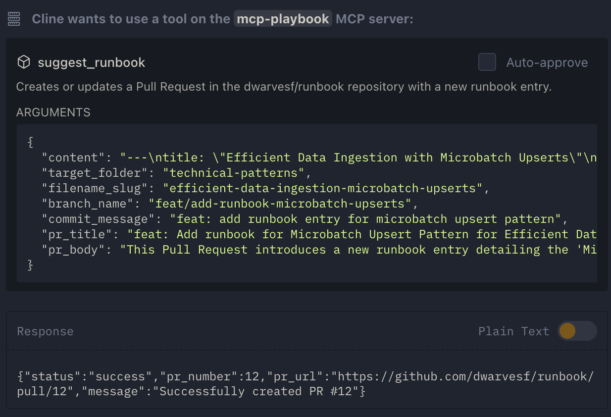
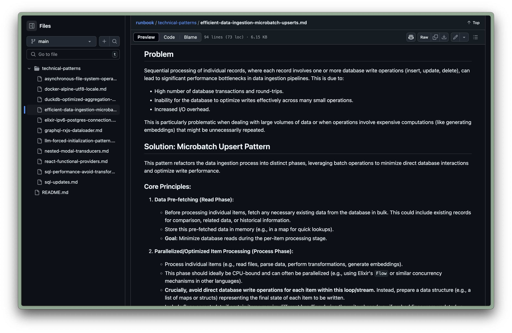

At Dwarves, we’re all about building smarter workflows with cutting-edge tools. This month, we’re diving into the [MCP playbook](https://github.com/dwarvesf/mcp-playbook)—a powerful server designed to automate knowledge sharing and best practices through AI-powered interactions. We need YOUR expertise to help us maximize its potential! Whether it’s crafting runbook entries, syncing prompts, or creating specs, share your ideas and earn up to _15 icy_ for every approved contribution.

## Here's how it works



- **What we're looking for**: Innovative ways to use the MCP Playbook to streamline documentation, automate processes, or enhance our runbook. Think creating specs with `create_spec`, suggesting runbook entries via `suggest_runbook`, syncing prompts with `sync_prompt`, or saving chat logs for future reference. (Check out an example below!)
- **Accepted content**:
  - Write an RFC or spec using MCP tools like `create_spec` or `create_adr`.
  - Build a supporting tool or script to enhance MCP Playbook usage.
  - Suggest a runbook entry for best practices using `suggest_runbook`.
- **How to submit**: Share your contribution or idea via [submission link/form/channel] with a brief explanation of how it leverages the MCP Playbook. Include a workflow, steps, or prompt logs if applicable. No contribution is too small!
- **Reward**: Earn _5 icy_ per approved submission integrated into our MCP-powered ecosystem. Exceptional contributions could net up to _15 icy_!
- **Review process**: Our team reviews submissions weekly and will notify you if your idea or content is selected.
- **What's next**: Winning contributions get implemented in our MCP Playbook workflows, and you’ll be credited across the community!

## Getting started

> Note: a GitHub PAT Token is required when setting up the MCP playbook with your editor.

Add this config to your Cursor/Windsurf/Cline MCP configuration file:

```json
{
  "mcpServers": {
    "mcp-playbook": {
      "command": "docker",
      "args": [
        "run",
        "-i",
        "--rm",
        "--pull=always",
        "-e",
        "GITHUB_PERSONAL_ACCESS_TOKEN",
        "ghcr.io/dwarvesf/mcp-playbook:latest"
      ],
      "env": {
        "GITHUB_PERSONAL_ACCESS_TOKEN": "your_github_token_here"
      }
    }
  }
}
```

And finally add this rule to your `.windsurfrules` file or `cursor/rules/` or `.clinerules/`

```
ALWAYS run the `init_playbook` tool before starting to get instructions on how things should be done and documented.
```

## Why join in?

- Earn _icy_ tokens to [use in community perks, trade, etc., add token value context].
- Help us automate knowledge sharing and build a stronger, AI-driven runbook.
- Open to everyone—bring your MCP mastery to the table!

### Example usage for submission:
> "Distill what we've done; the motivation behind this was to avoid sequential processing of each row in DuckDB in favor of amortizing it with microbatch upserts instead. Take what we've known for using micro batch upserts here and suggest this practice it into our runbook."




