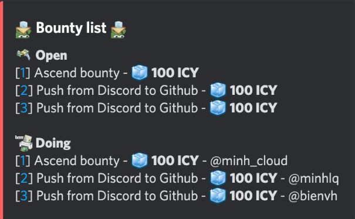

To utilize the **Fortress** bot to display a list of the 15 most recent [bounties of Dwarves Foundation](https://memo.d.foundation/earn) that are either open or in progress. By using specific commands, users can effortlessly track and manage bounties, ensuring they are always aware of current tasks and their corresponding rewards. 

##### Bot Name: **Fortress**

##### Command: `?earn` or `?earn list`

##### Functionality
The command `?earn` or `?earn list` allows users to view the 15 most recent bounties that are not yet closed.

##### User Interface Details
Open Bounties
-	Display: The UI will list all bounties that are currently open.
-	Information Shown: Each open bounty will show the bounty name and the corresponding ICY reward.

Ongoing Bounties
- Display: The UI will list all bounties that are currently being worked on.
- Information Shown: Each ongoing bounty will show the bounty name, the ICY reward for that bounty, and the person currently in charge of it.

##### User Interface Mockup: [View here](https://share.discohook.app/go/h78hfx6q)

