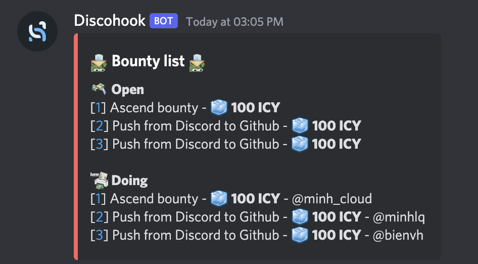

- Bot: Fortress
- Command: `?earn` or `?earn list`
- Function: Show 15 recent not closed bounty
- UI contains: Open and Doing bounty 
    - Open Bounty: show the bounty name and ICY reaward for that bounty
    - Doing Bounty: show the bounty name, ICY reaward for that bounty, and person in charge 

- UI mockup: [here](https://share.discohook.app/go/h78hfx6q)

