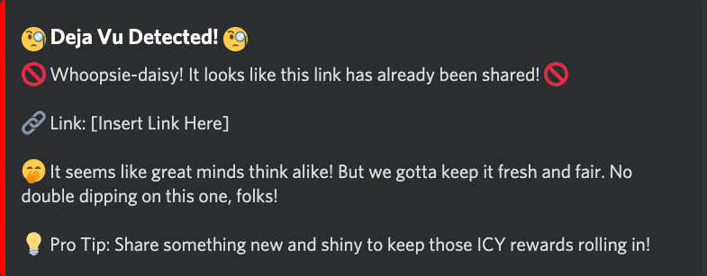

In the Dwarves Foundation Discord Server, we are now applying the share gift mechanism by using [Tono Bot](). Once a member shares a link in some specific channels such as [#til](https://discord.com/channels/462663954813157376/1001883339046797342), [#ux](https://discord.com/channels/462663954813157376/1241262109577449472) or [#tech](https://discord.com/channels/462663954813157376/810481888619135046), a small amount of ICY will be sent to user [Mochi Wallet](https://mochi.gg/) as an incentive for sharing and learning. 

#### Issue
Currently, every link is gifted no matter if it is duplicated. It creates a gap between dedication and reward, making this mechanism unfair. So we need to fix this by a one-time check for each sharing link. In this way, we can distribute ICY to worthy people.

#### Requirement 
- Implement a one-time check to ignore gifting for the same link multiple time
- Once a message contains a link that is share, the bot will reply to this message to announce to people that it had shared in the past.

#### Reply message mockup [View here](https://share.discohook.app/go/21tqsr7x)

