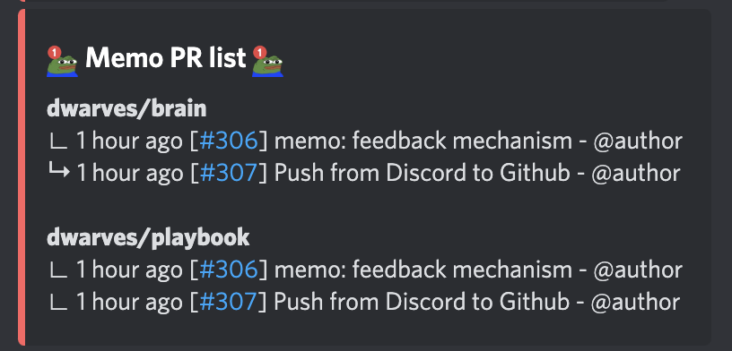

- Bot: Fortress
- Command: `?memo pr` 
- Function: 
    - Show the most recent PR on Dwarves memo.d.foundation repository
    - Show maximum 15
- UI contains: 
    - Repo name
    - Relative time of the PR
    - ID of the PR
    - PR name 
- UI mockup: [here](https://share.discohook.app/go/h78hfx6q)

