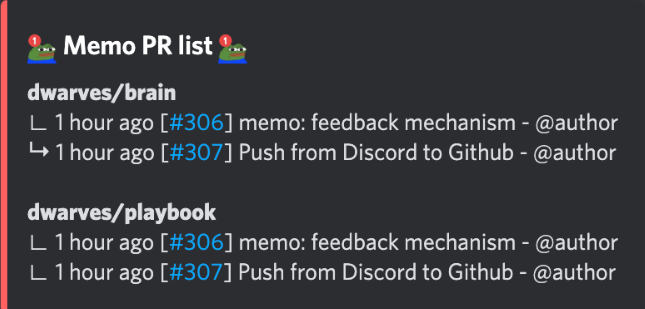

To utilize the **Fortress** bot to display a list of the 15 most recent pull requests (PRs) from the Dwarves [memo.d.foundation](https://memo.d.foundation/) repository and its submodules. By using specific commands, users can effortlessly track recent PR activities, ensuring they are always aware of the latest changes and updates.

##### Bot Name: Fortress

##### Command: ?memo pr

##### Functionality

The command `?memo pr` allows users to view the most recent PRs on the Dwarves [memo.d.foundation](https://memo.d.foundation/) repository and it submodules, with a maximum of 15 PRs displayed.

##### User Interface Details
Display: The UI will list the most recent PRs for each memo related repositories.

Information Shown:
- Repository name
- List PRs 
    - Relative time of the PR
    - ID of the PR
    - PR name
    - Author

##### User Interface Mockup: [View here](https://share.discohook.app/go/h78hfx6q)

