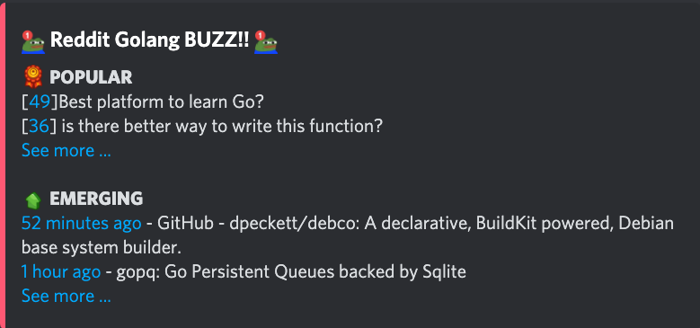

To utilize the **Fortress Bot** to display a list of news from whitelisted social platforms. By using specific commands, users can effortlessly track what happening over the world, ensuring they are always aware of the latest information from approved sources.

##### Bot Name: **Fortress**

##### Command
```
?news <platform> <topic - if it is support>
Ex: 
  ?news reddit golang
  ?news reddit rust,
```
##### Functionality
The command `?news <platform> <topic - if it is support>` allows users to view the most recent news updates from whitelisted social platforms.

##### User Interface Details
List popular news
- Display: List about 10 the most popular news in the given platform
- Information shown: Each news will show the link, title and its popularity depends on platform such as amount of comment when it is Reddit.

List emerging news
- Display: List about 10 the most new news in the given platform sorted by publishing time
- Information shown: Each news contains the link, title and time it is created

##### User Interface Mockup: [View here](https://share.discohook.app/go/lvb3qvbx)

