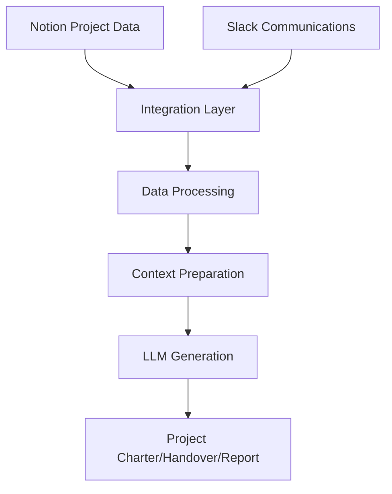

This bounty focuses on creating an integrated system that combines data from Notion and Slack to enhance our project reporting capabilities, specifically improving our Dify workflows for Project Charter and Project Handover documents. The integration aims to streamline data collection and reporting processes, ensuring that project documentation is both comprehensive and accurate.

### Core Requirements

The integration system will coordinate data collection from Notion and Slack, ensuring data freshness and handling dependencies between different data sources. This will involve orchestrating data flows to maintain a consistent and up-to-date dataset. Unified storage will be implemented to ensure a consistent data format across sources, enabling efficient querying and version control for all data.

#### Dify Workflow Enhancement

The integration will enhance Dify workflows by automating initial data population for Project Charters and providing real-time updates from communication channels. This will include integration with project templates to streamline the creation of Project Charters. For Project Handover, the system will optimize milestone tracking, compile communication history, and analyze resource utilization to facilitate smooth transitions.

### Technical Specifications

The integration features will include data synchronization with real-time updates where possible, scheduled batch processing, and conflict resolution. The processing pipeline will focus on data cleaning, standardization, entity matching across sources, and relationship mapping to ensure data integrity and usability.

#### LLM Integration

The system will prepare context for LLMs by selecting relevant data, optimizing formats for LLM input, and managing context windows. Response generation will be template-based, with fact-checking against source data and citation tracking to ensure accuracy and reliability.

### Implementation Details

The data flow architecture will leverage existing Notion and Slack collectors, implementing change detection and handling incremental updates. The processing layer will focus on entity resolution, timeline reconstruction, and metric calculation. The serving layer will provide API endpoints for Dify, implement a caching strategy, and format responses for seamless integration.

#### Reporting Enhancements

For Project Charter generation, the system will automate stakeholder identification, track resource allocation, and perform risk assessment. Project Handover documentation will facilitate knowledge transfer, track decision history, and plan resource transitions, ensuring comprehensive and accurate reporting.

### Deliverables

1. **Integration System**: A data orchestration pipeline, unified storage implementation, and API documentation will be delivered to ensure seamless integration and data management.

2. **Dify Workflow Improvements**: Enhanced workflows for Project Charter and Project Handover, along with custom prompts and templates, will be provided to streamline reporting processes.

3. **Monitoring & Analytics**: A data quality dashboard, usage analytics, and performance metrics will be implemented to monitor and optimize system performance.

4. **Documentation**: Comprehensive documentation covering system architecture, integration patterns, and operational procedures will be provided to support implementation and maintenance.

### Success Metrics

The success of the project will be measured by technical metrics such as data freshness within 5 minutes, 99.9% data accuracy, and API response times under 100ms. Business metrics will include a 50% reduction in manual reporting, 90% automated data population, and improved report consistency.

### Implementation Suggestions

The technology stack will include Modal for orchestration, DuckDB for data processing, a vector store for LLM context, and S3 for storage. Development will be phased, starting with data integration, followed by Dify workflow enhancement, LLM optimization, and concluding with documentation and training.

### Integration

The following diagram illustrates the integration process:

### Additional Considerations

The system will be designed for extensibility, supporting additional data sources as needed. Privacy measures will be maintained to protect data, and performance will be optimized for handling large data volumes. Usability will be prioritized to ensure intuitive interfaces for Dify users.

This bounty aims to create a seamless integration between our data collection systems and reporting workflows, leveraging LLMs to generate more comprehensive and accurate project documentation. The system should enhance our existing Dify workflows while maintaining high standards for data privacy and quality.

### Expected Improvements

1. **Project Charter**: The system will automate stakeholder identification, provide real-time resource tracking, perform intelligent risk assessment, and analyze communication patterns to enhance project planning and execution.

2. **Project Handover**: Comprehensive knowledge capture, automated documentation, clear transition planning, and historical context preservation will be achieved, reducing manual effort and improving documentation quality.

3. **Project Report**: The integration will enable dynamic report generation, providing real-time insights into project progress, resource allocation, and communication trends.

The successful implementation will significantly reduce manual effort in project reporting while improving the quality and consistency of our documentation.
