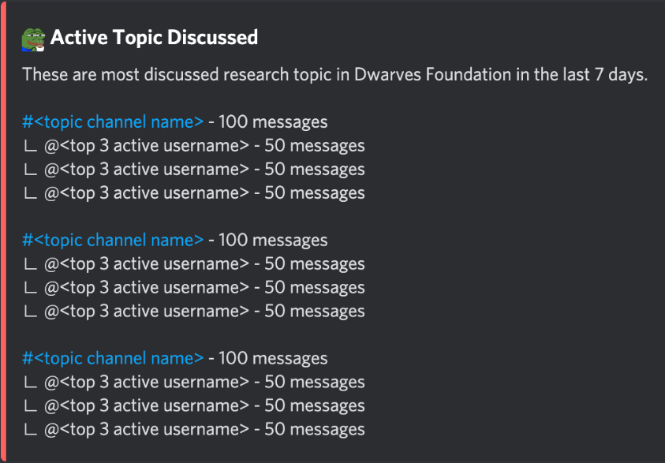

To utilize the **Fortress** bot to display a list of the most recent discussion topics from the [Discord server of Dwarves Foundation](https://discord.gg/aze7Adce). By using specific commands, users can effortlessly track and manage the most popular topics, ensuring they are always aware of current discussions and their details.

##### Bot Name: Fortress

##### Command: ?topic

##### Functionality

The command `?topic` allows users to view the most recent discussion topics on the [Discord server of Dwarves Foundation](https://discord.gg/aze7Adce). Each page displays a maximum of 5 topics. If the number of discussed topics in a week exceeds 5, pagination will be used to navigate through the topics.

##### User Interface Details
Display: The UI will list the most recent discussion topics.

Information Shown:
- Topic channel and the link to that topic
- The total number of messages in that channel
- Top 3 active users and their number of messages each

##### User Interface Mockup: [View here](https://share.discohook.app/go/h78hfx6q)

