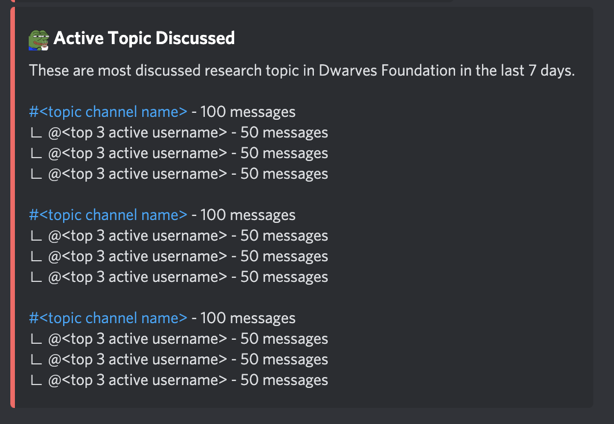

- Bot: Fortress
- Command: `?topic ` 
- Function: 
    - Show the most recent PR on Dwarves memo.d.foundation repository
    - Each page contains only 5 topics. If the number discussed topic in that week is higher that 5, then use pagination. 
- UI contains: 
    - Topic channel and the link to that topic
    - The total message in that channel
    - Top 3 active user and their number of message each 
- UI mockup: [here](https://share.discohook.app/go/h78hfx6q)

