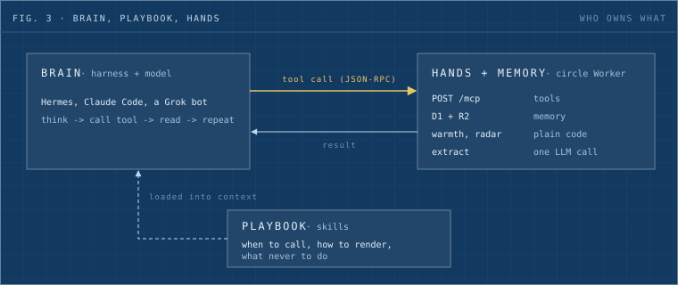
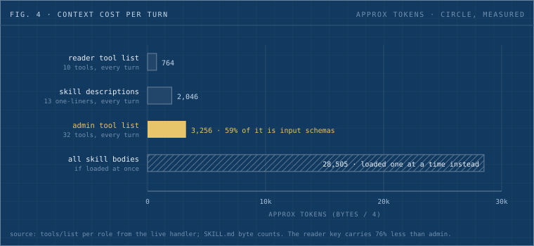

## TL;DR

We built circle, a relationship tracker on Cloudflare, and wired it into Hermes over MCP. Then I asked the obvious next question: if I want better tool calls and better context management, do I have to rebuild the agent? The answer is no. The harness already runs the loop and manages the window. What you control sits in five layers outside it, and the two cheapest ones (your MCP tools and your skills) move quality the most. This post maps those layers, defines the vocabulary that kept tripping me up, and shows what each layer costs in real tokens on a system we run.


_Fig. 1: the five layers you can tune, cheapest at the top. Layers 1 and 2 live in your own code, so start there._

## The question

circle stores one record per person across every channel: notes, meetings, promises, a warmth score that decays with silence. It runs as a Cloudflare Worker with D1 and R2. Collectors feed it, and a Hermes desk reads it so I can type "brief me on An" in chat and get one screen back.

The design looked like a normal software system: a database, a REST API, some cron jobs. That made me uneasy. Where is the "agentic" part? If I later want a Grok bot to read circle too, do I hook it through MCP, through a skill, or both? And what do people mean by a "long-running agent", given that nobody defines it the same way twice?

Those three questions have short answers once the vocabulary is straight, so I'll start there.

## The vocabulary, in one loop

Figure 2 walks one real ask through the system. Read it left to right, then watch the window on the right fill up.


_Fig. 2: one "brief me" request. Every step appends to the context window, and the model sees nothing outside it._

Each term maps to one piece of that picture:

| Term               | What it means                                                                                                                      | In the figure    |
| ------------------ | ---------------------------------------------------------------------------------------------------------------------------------- | ---------------- |
| Tool call          | The model writes a JSON request. Your code runs it and returns the result. The model executes nothing itself.                      | steps 2 and 5    |
| Agent loop         | Tool calls repeated until the task is done. An agent is a model plus tools plus a loop.                                            | steps 1 to 6     |
| Harness            | The program that runs the loop, holds the tools, and enforces limits.                                                              | Hermes           |
| Context window     | The only text the model sees on a turn. It has a hard size limit.                                                                  | the right column |
| Context management | Deciding what goes into the window and what comes out: which skill loads, how big a tool result is, when old turns get summarized. | the block sizes  |
| Memory             | State kept outside the window that the agent reads back on demand.                                                                 | circle's D1      |

Once I saw it this way, "context management" stopped being abstract. It is a budget. Every tool description, every skill, every result, and every old turn spends from the same fixed pot.

## Where AI sits inside circle

circle uses a model in exactly three places, and each one gets a different amount of freedom:

| Spot                             | Pattern                                                                      | Freedom                                                       |
| -------------------------------- | ---------------------------------------------------------------------------- | ------------------------------------------------------------- |
| Fact extraction from notes       | One model call with structured output. A workflow step, not an agent.        | None. Facts land as `proposed` until I confirm.               |
| Investigate (public-web dossier) | A real agent loop with web search, web fetch, and one `submit_dossier` tool. | Bounded. It reads untrusted pages, so it gets no write tools. |
| Chat through Hermes              | The full agent loop, owned by Hermes, steered by circle skills.              | It proposes, I confirm.                                       |

Everything else is plain code. Warmth, the daily radar, and the stage rules are computed on every read. I'd hold that line for any system like this: a model should never compute a score that has to give the same answer tomorrow.

The more interesting decision is what circle does not have: its own agent loop. I was tempted to build one inside the Worker. That would have meant writing prompt assembly, tool dispatch, retries, and compaction from scratch, all of which Hermes already does. circle's job is to be a good tool. The loop belongs to whoever is calling.

## MCP or skills? both, for different jobs



_Fig. 3: the harness is the brain, skills are the playbook, and circle supplies the hands and the memory._

This was my second question, and the split turned out to be clean.

**MCP is the hands.** It defines what an agent can do: tool names, input schemas, and auth. circle serves a stateless Streamable HTTP endpoint at `POST /mcp`. Each tool call becomes an internal request to the matching REST route with the caller's Bearer key, so the MCP layer never touches the database directly. Any agent that speaks MCP can connect with a URL and a key.

**A skill is the playbook.** It tells the agent when to call which tool, how to show the answer, and what it must never do. Our `circle-brief` skill says: call `circle_brief`; if the result carries `candidates`, ask which person instead of guessing; render one screen; never draft a message or change a stage from here. None of that belongs in a tool schema.

So the answer for Grok is both, and there are two ways in. The cheapest is to make Grok the model inside Hermes. One of our Hermes instances already has a Grok profile, and switching to it changes nothing about tools or skills, because the loop, MCP connection, and skills all belong to the harness. The other way is a separate bot. A bot built on the xAI API can register a remote MCP server as a tool source, so it reaches circle the same way Hermes does. It won't read our `SKILL.md` format, though, so the skill's rules go into its system prompt by hand. The consumer Grok inside X can't attach a custom tool server at all; you need your own bot on the API. Whichever bot you build, give it its own reader-role key. You can revoke one bot alone, and the audit trail shows which bot wrote what.

## The five layers

Now the actual question. I wanted to get better at tool calls and context management, and my first instinct was that this meant opening up Hermes. It doesn't. Here is the stack from cheapest to most expensive.

### Layer 1: MCP tools

The model reads every tool definition on every turn, before the user has typed a word. Tool design is context management from the server side.

I measured ours by calling circle's real `tools/list` handler once per role. An admin key sees 32 tools, and the list costs about 3,300 tokens on every turn. A reader key sees 10 tools for about 760. Least privilege turns out to be a context saving too: the reader list is 76% smaller.



_Fig. 4: what circle puts in the window before the user types. Tool definitions stay resident; skill bodies load one at a time._

The breakdown surprised me. Descriptions, the part I'd been polishing, are only 27% of the admin list. Input schemas are 59%. The three largest tools (`circle_profile_add`, `circle_update`, `circle_media_update`) are all schema-heavy update tools with many optional fields. If I wanted to cut the list, I'd split those into narrower tools or move rarely used fields out, before I touched a single description.

The second half of this layer is result size. A `circle_brief` that returns one compact screen keeps the window small. Returning the whole person row, every note, and every fact would flood it on the first call. When a tool result is large, the fix is almost always a narrower tool or a summary field.

### Layer 2: skills

A skill loads only when its trigger matches, so the window carries the playbook for the task at hand and nothing else. The harness keeps just the one-line description of every skill in context, then pulls the full body on demand.

circle ships 13 skills, about 114 KB of markdown or roughly 28,500 tokens if they all loaded at once. The descriptions that stay resident come to about 2,000 tokens. On-demand loading is doing real work here: it keeps a 28k-token playbook down to a 2k-token index. One skill, `circle-due`, is 19% of the whole set on its own, which makes it the first candidate for a split.

This layer has the sharpest edge I've hit. Hermes bakes the list of available skills into a session's system prompt when the session starts, and never rebuilds it on resume. When we retired an MCP integration across our Dwarves desks, 17 chat sessions across 4 desks kept the old roster. The model kept reaching for a capability that no longer existed and burned its whole iteration budget before it gave up. Restarting the daemon did nothing, because the stale prompt lived in the session store. Deleting those sessions fixed it. A skill change is a context change, and a context change only reaches new sessions.

### Layer 3: harness config

This is where the dials for "context management" in the textbook sense live. Our Dwarves Hermes config sets them like this:

```yaml
compression:
  enabled: true
  threshold: 0.5        # compact when the window is half full
  target_ratio: 0.2     # squeeze old turns to about a fifth
  protect_last_n: 20    # never compact the newest 20 messages
```

The same file carries `tool_loop_guardrails`. It warns after 3 failures of the same tool or 2 calls that make no progress, and it would hard-stop at 8 and 5. Reading the file for this post, I found `hard_stop_enabled: false`, so in practice the guard only warns. That's a decision we should make on purpose rather than discover. Our other Hermes instances carry the same compression values but no loop guard at all.

Model choice, enabled toolsets, and the MCP server list live here too, and compaction can run on a cheaper model than the main loop (ours does). None of it needs a rebuild, only a redeploy, and per the layer 2 lesson, a fresh session.

### Layer 4: engine patch

When the config key you need doesn't exist, you change the loop code. We keep a small patch stack against upstream Hermes for exactly this: Discord mention handling, dispatch dedup, treating kanban reads as untrusted input. Each patch has to survive every upstream upgrade, which is real ongoing cost. Reach for this layer only after layers 1 to 3 have run out.

### Layer 5: your own harness

A bare agent loop on a model SDK is about a hundred lines: send messages, get a tool-use block back, run the tool, append the result, repeat. Writing one is the fastest way to understand what a harness does for you. Running production on it means re-solving compaction, retries, approval flows, and session storage. I'd build one to learn and keep it out of the serving path.

## So what is a "long-running agent"?

The term is fuzzy because two different ideas share it. One is task length: an agent that works for hours or days across many steps. The other is durability: an agent that survives its context window filling up and its process restarting. People tend to say "long-horizon" for the first and "durable" for the second.

The test I now use is blunt. If a crash mid-task loses the work, the agent isn't long-running yet; it's a long chat. A long-running agent keeps its real state outside the window, in a database or files, and reloads it after every compaction or restart. Compaction alone doesn't get you there. In Fig. 2 the window crosses the 0.5 threshold on a short task, and whatever the summary drops is gone from the model for good unless it lives somewhere the agent can read back.

By that test, circle is the durable memory a long-running agent would lean on, with no agent of its own. If we build one, the natural shape is a weekly steward that reads the radar, drafts proposals and openers, leaves them for review, and sends nothing.

## A checklist you can run

Copy this against your own agent integration before you touch the harness:

```
[ ] Count the tokens your tool definitions cost per role. Trim the biggest description first.
[ ] Check your largest tool result. Can a narrower tool or a summary field replace it?
[ ] Every write tool returns a proposal, or a human confirms it.
[ ] Untrusted-input agents (web readers) get no write tools.
[ ] Each external bot has its own least-privilege key.
[ ] Each skill description names when it should not fire as well as when it should.
[ ] After a skill or toolset deploy, start fresh sessions; resumed ones keep the old prompt.
[ ] Read your harness's compression and loop-guard settings before you assume you need a patch.
[ ] Durable state lives outside the window, so a restart loses nothing.
```

## Limitations

circle is internal, not public, so you can't run it; the patterns transfer, the code doesn't. Token figures are measured on our tool table on the date above and will drift as tools change. The Grok paths reflect the xAI API as I understand it; check their current docs for the exact MCP field. And everything here assumes a harness like Hermes or Claude Code that already does compaction well. On a thin harness, layer 3 may not exist, and you'll hit layer 4 sooner.
