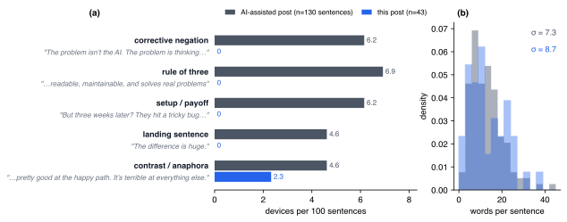

A friend sent me a writing checklist last week. One line of instruction came with it: use this when you make the post, so it doesn't sound so load bearing.

Load bearing. I knew what he meant before I opened the file. AI prose has a stressed, over-engineered quality, like every sentence was asked to hold up the paragraph above it. You feel the strain before you can name the pattern.

We had been through one round of this already. A few weeks back I adopted a writing discipline based on Simplified Technical English, the controlled language that aviation maintenance manuals use: sentences under twenty words, active voice, no nominalization, a banned-word list (leverage, robust, seamless, delve). It helped. The sentences got cleaner. The posts still read like a model wrote them, and for a while I couldn't say why.

The checklist answered it. Word-level rules catch word-level defects, and the thing that gives AI writing away now lives a level up, in structure.

## The shapes

Some examples, so this stays concrete.

- **Corrective negation.** "The problem isn't the AI. The problem is thinking better tools lead to better outcomes." The not-this-but-that pivot, deployed as a reveal.
- **The rule of three.** "Readable, maintainable, and solves real problems." Three parallel items, the third stretched a little for rhythm.
- **Setup and payoff.** A short question, then the answer delivered as a punchline. "But three weeks later? They hit a tricky bug and were completely stuck."
- **The landing sentence.** A paragraph that ends on a tidy epigram, built to be quoted. "The difference is huge."
- **Uniform rhythm.** Every sentence between twelve and eighteen words, forever.

Every example above comes from a post published on this site under my name. I went back and reread my own writing after the checklist arrived, and it was uncomfortable. The drafts I had run through AI tooling carried these shapes in nearly every paragraph.

None of these shapes is wrong on its own. Good essayists use all of them, and they saturate the writing models were trained on because they work: a well-placed triad satisfies, a landing sentence gives a paragraph a click of closure. The tell is density. A human writer spends these effects maybe once a page. A model reaches for one every few sentences, because each one scored well in training and nothing ever taught it to budget them. The result reads like a speech that never stops building toward an applause line.

I counted, because the claim felt checkable. Across the older post's 130 prose sentences I tallied 37 of these devices, about 28 per 100 sentences. This post carries one. I also measured sentence lengths, expecting uniform rhythm to be the giveaway, and that one washed out: both posts vary about the same.

_Five device families, hand-counted across the two posts, each with a specimen quoted from the older post; beside them, the sentence-length distributions that failed to separate the texts. Prose sentences only; quoted specimens excluded from the counts._

## What we changed

The fix was unglamorous. I turned the checklist into a banned-pattern list and put it beside the word-level rules in the instructions my coding agent loads on every session. It went into the always-on layer deliberately: a style rule sitting in a file the agent may or may not open holds for exactly one session.

One existing rule needed surgery. The STE discipline capped sentences at twenty words, and the cap had quietly become a meter. Everything came out the same length, which is its own tell. The cap stays, as a ceiling. Under it, sentence length is supposed to wander. Short. Then something longer that takes its time getting where it's going, because that variation is what a human hand sounds like on the page.

There is a caveat taped to all of this. The ruleset fixes form. Whether the post has anything to say is a separate problem, and no checklist catches an empty idea dressed in varied sentence lengths.

This post went through the list before publishing. The draft tripped twice, once on a corrective negation and once on a landing sentence, both in the section you just read. I rewrote them, and the paragraph lost nothing.
