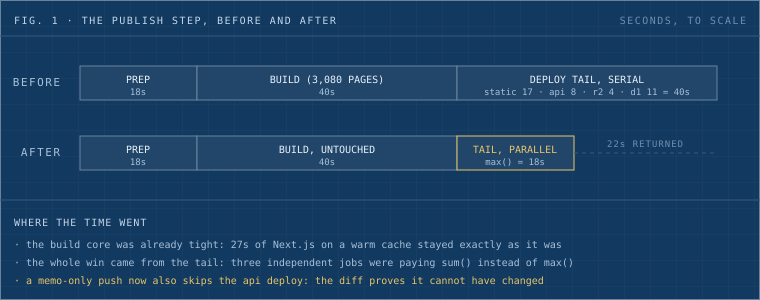
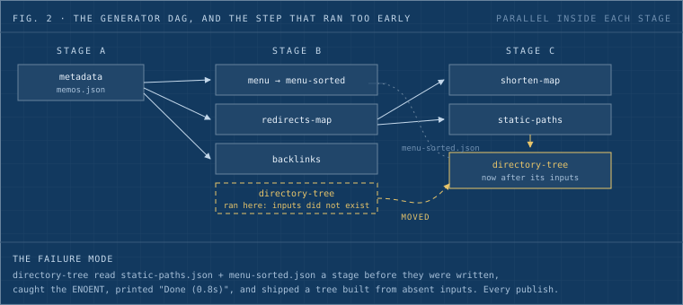
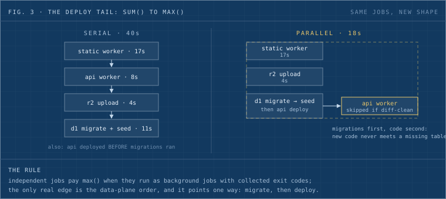
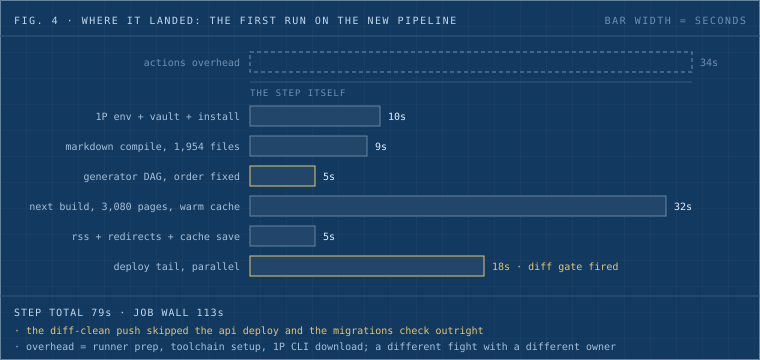

The site you're reading publishes itself on every push. A merged post kicks off CI, which compiles about 2,000 markdown files, builds 3,080 static pages, and deploys three Cloudflare surfaces: a static Worker, an API Worker, and a D1 search index. That step showed 1m50s under a green checkmark. We spent a morning reading its raw log line by line. The step now runs in 78 seconds, and the time was the least valuable thing we found.

## Read the log as a timeline

A CI step hides a dozen phases behind one duration number. The raw log has a timestamp on every line, so the first move is to index it: mark where each phase starts, subtract, and write down the table.

| Phase | Time |
| ----- | ---- |
| Vault fetch + install | 9s |
| Markdown compile (1,954 files) | 9s |
| Metadata generators | 4s |
| Next.js build (3,080 pages, warm cache) | 27s |
| RSS, redirects, lint bundle | 9s |
| Deploy static Worker | 17s |
| Deploy API Worker | 8s |
| R2 upload | 4s |
| D1 seed | 11s |

Two things jump out of a table like this that never jump out of a checkmark. The build core was already tight: 27 seconds for 3,080 pages with a warm compiler cache is fine, and we didn't touch it. The tail was the problem: 40 seconds of deploys and uploads running one after another, none of which depended on each other. Figure 1 shows the same numbers to scale, before and after.

_Fig. 1: the publish step to scale. The build core stayed untouched; the entire win came from the tail's shape._

## The green checkmark was hiding three bugs

Reading that closely also surfaced errors that had been shipping for weeks, because a step that exits 0 gets no scrutiny.

The generator DAG ran one step a stage too early (fig. 2). `generate-directory-tree` reads two JSON files that another generator writes, and it ran in the stage before the one that writes them. It logged an ENOENT stack trace, caught it, and printed "Done (0.8s)". Every publish shipped a directory tree built from files that didn't exist yet. The fix is one line in the stage list, plus the habit the bug taught us: write the dependency reason as a comment next to the stage, so the next person who reorders it has to argue with the comment.

_Fig. 2: the generator DAG. The dashed box is where directory-tree used to run; its two inputs are written by the stage it now follows._

The API Worker deployed before its database migrations ran. Nothing had blown up yet because no recent migration was load-bearing at deploy time. The day one is, the new code hits production a few seconds before the table it needs. Expand/contract is the boring, correct order: migrate first, deploy second.

The cleanup job was failing silently on most runs. Our PR-preview reaper runs under `set -euo pipefail`, and its target list came from a `grep` in a pipeline. On any PR with no worker changes, `grep` matches nothing, exits 1, and pipefail kills the step before it can print "nothing to reap". Six red runs in a row, all from the guard clause. `{ grep ... || true; }` is the whole fix.

## The formula

Here's the order we now hold every pipeline to, general first:

1. Path-filter the trigger. A run that starts is the most expensive no-op.
2. Guard before work: check env vars, read secrets capture-first, fail in seconds instead of after the build.
3. Diff the push range per deployable. Our most common push is a memo post; it now skips the API deploy entirely, because the diff proves the API didn't change. Every uncertain answer falls back to deploying, so the skip can only ever be a correct no-op.
4. Run generators as a staged DAG, parallel inside each stage, with the dependency reason written next to the stage.
5. Keep caches on the runner. A persistent local dir for the compiler cache beats a 400MB cloud-cache tarball round trip by about 40 seconds.
6. Run the deploy tail in parallel. Independent jobs cost max() instead of sum(). Ours went from 40 seconds to 18 (fig. 3).
7. Migrations before code, always.
8. Write deltas. Our D1 seeder hash-gates rows ("0 changed of 1,611"), and Wrangler's asset manifest uploads only changed files: one file of 10,921 on a typical post.
9. Retry idempotent network calls three times. Never retry a step whose repeat changes state.
10. Sweep hazards by property. Oversized files get dropped by a size test; a filename list rots on the next addition.

_Fig. 3: the deploy tail restructured. Same four jobs; the only ordering that matters survives inside the data-plane lane, and a diff-clean push skips the api deploy outright._

The memo-specific parts stay memo-specific: the vault submodule advance, the redirect-map dance around Cloudflare's 2,000-rule cap, the search-index seeds. A formula that claims those would be lying about its portability.

## Where it landed

The first run on the new pipeline, phase by phase, straight from the log (fig. 4):

_Fig. 4: the landed shape. The step reads 79 seconds; the job wall clock reads ~113, because 34 seconds of Actions overhead (runner prep, toolchain setup, a 1Password CLI download) sits outside the step we measured._

## The habit underneath

The pipeline was "working" the whole time. Pages published, checks were green, nobody was paged. The 110-second version and the 78-second version look identical from the outside, and the outside is where CI dashboards live. The log with timestamps is the only honest surface a pipeline has. Read it top to bottom once a quarter, or the first time a step's duration makes you frown. Budget an hour. Ours paid for itself before lunch.
