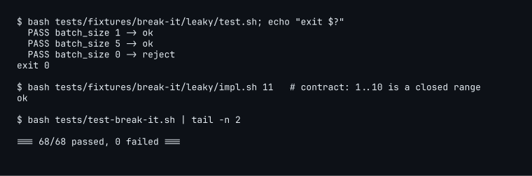
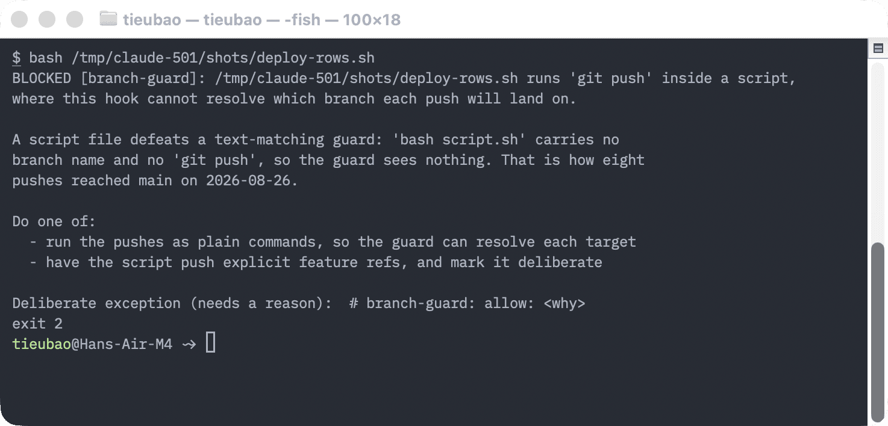
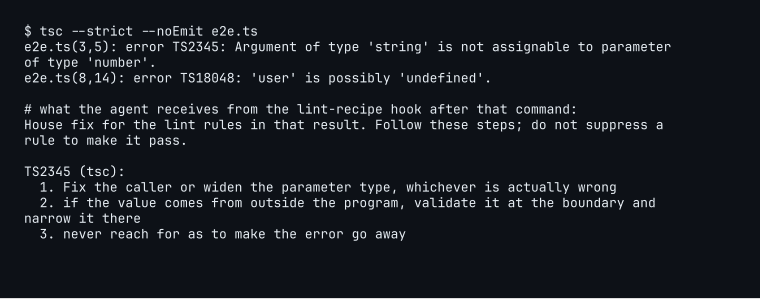
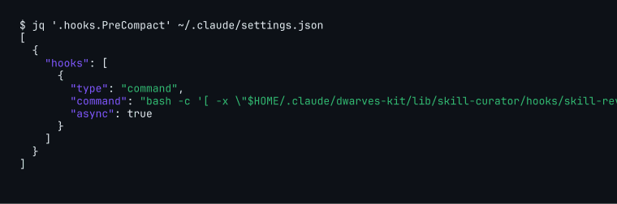
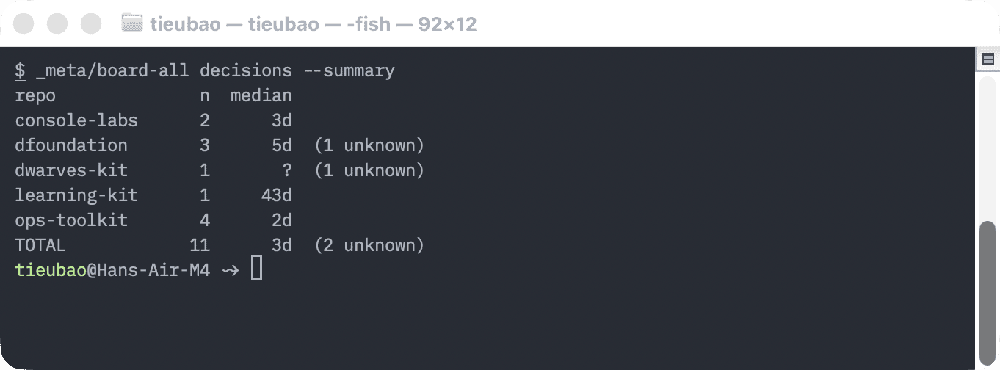
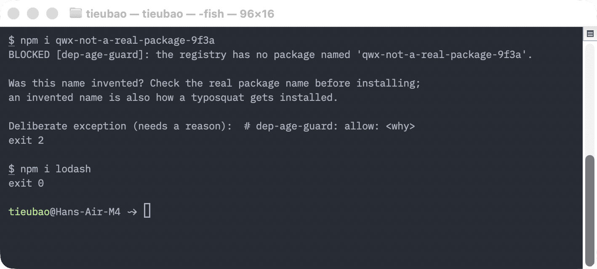

There's a new report out from Thoughtworks. In June, they and Martin Fowler put forty CTOs and senior engineers in a room in Engelberg, Switzerland, for three days and let them argue about what software engineering is turning into, then wrote it down: [The Future of Software Engineering, Europe 2026](https://www.thoughtworks.com/content/dam/thoughtworks/documents/report/tw_future_of_software_engineering_europe_2026.pdf). Sixteen pages. The line that stuck with me is on the first one: engineering is now distilled down to how do I describe the goal, and how do I verify I've reached it.

I read it twice, and the second time with a different feeling. Most of what that room converged on is what we've been learning, the hard way, over the past year of building with agents at Dwarves. Some of it we'd already written into how we work. Some of it we were halfway to. A couple of things we thought we had and, when I went and looked, we didn't. So I did the useful thing with a report like this: I listed every practice it names, twenty-three of them, checked each one against what we actually have on paper, and spent the week after closing the gaps that could be closed.

This post is that walk-through. For each idea: what it is, in plain words, and the scene where it shows up at the foundation. Then what we learned, and what's next.


_Fig. 1: The whole thing in one grid. Each row is something the report says. The columns are what we already had, what was missing on the day I looked, and what changed in the week after. Amber means it shipped, an amber ring means it's named and next._

## 1. Checking is the bottleneck now, not writing

**What it is.** The report's first and loudest point. Agents write code, tests, and infrastructure faster than anyone can read it, so the hard part moved from "can we produce the thing" to "can we trust the thing we produced". And checking has an order. First you measure coverage, which lines your tests touch. Then you have an agent actively try to break the code without breaking any test, because the input your tests forgot is the one that matters. Then, only if that probe finds nothing, you run mutation testing, which means breaking the code on purpose in small ways and confirming the suite notices each break. If it doesn't notice, your tests aren't testing. The room also admitted nobody there could cite data on how many defects manual code review actually catches. They called it a status quo illusion.


_Fig. 2: The order the report gives, page 11. We had rungs one and three. Rung two is the one we added. Only if it finds nothing does mutation testing run._

**The scene at the foundation.** Every repo that adopts our kit pushes through a proof-of-done gate: no push without a recorded green run and a negative control, which is a test that the check fails when it should fail, so you know the green isn't fake. The Workers monorepo runs a mutation ratchet. Our code review rubric says, in its own words, that agent-produced pull requests get reviewed against the same rubric, agents don't get relaxed standards. So rungs one and three were already ours.

Rung two we added this week: a lens in the review battery called break-it, whose job is to take a diff and its tests and find the input the tests forgot. On its first live run it embarrassed us a little. The spec shipped with two test fixtures, a leaky one with a known hole and a tight one that was supposed to be airtight. The prober looked at the tight one and reported that `impl.sh abc` printed `ok`. It accepted a non-integer, because both numeric checks exited with code 2 on bad input, the redirect hid the error, and control fell through to success. The fixture we wrote to be perfect had a hole. Fixed and pinned. I'd call that the tool proving itself.

This is what a finding from it looks like, from the run against the leaky fixture, whose contract says 1 to 10 is a closed range:

```
probe:            bash impl.sh 11
expected:         "reject" (CONTRACT, impl.sh:2-4, 1..10 is a closed range)
observed:         "ok" (also "ok" for 100)
unconstrained-by: test.sh:21
severity:         HIGH
```

And the hole itself, live from the repo: the leaky fixture's own suite passes, then the input the suite never asks about gets an `ok`, then the lens's test suite.



The lens is public: [agents/break-it.md](https://github.com/dwarvesf/dwarves-kit/blob/master/agents/break-it.md?plain=1) in the kit, wired into [the battery command](https://github.com/dwarvesf/dwarves-kit/blob/master/commands/battery.md?plain=1) as rung two, with the spec at [SPEC-247](https://github.com/dwarvesf/dwarves-kit/blob/master/docs/specs/SPEC-247-break-it-prober-lens.md?plain=1) and the change in [dwarves-kit #504](https://github.com/dwarvesf/dwarves-kit/pull/504).

The scene I keep coming back to is from two weeks before the report landed. A monitoring alert on a money path had been green since August 1. The source it watched had been retired on August 1. It was reading zero audit entries and calling that fine, and its proof-of-done had a negative control that only proved the alert reacted to a fault in a source that no longer produced anything. We fixed it on August 30 with a staleness rule, zero rows for three weeks is itself an alarm. A check you never check is just a second place to be wrong.

Rung four is where we're still in the room the report describes. Our own rubric says: sample 5 to 10 merged PRs per month for retrospective review, did the review catch what should have been caught? We have never recorded one of those samples. That's next.

## 2. The harness matters more than the model

**What it is.** "Harness" is the word the industry landed on for everything around the model. The rules it loads when a session starts, the checks that run before and after each thing it does, which tools it's allowed to call, which model handles which job. The report's claim is that this scaffolding is where good agentic engineering differs from bad, and that it'll be where teams differ once the models all look the same. Their numbers, each from one organization so hold them loosely: a four-times cut in AI cost from a better harness; a smaller model with a good harness beating a larger model with a weak one; and the cheapest win anyone reported, turning a linter's complaint into instructions, so the agent sees "extract the loop body into a named function, then..." instead of "this function is too long". One team said that moved code-smell resolution from under half to about ninety percent.

**The scene at the foundation.** This is the camp we live in. My own coding-agent setup runs about forty checks, and every one exists because something went wrong first. One stops a password or API key from being printed into the conversation. One stops a push to the main branch, and it's there because eight pushes once reached main from inside a script the guard couldn't see into. One refuses a "done" message when the agent ran nothing. The routing idea, a strong model doing the planning and reviewing with cheaper models doing the routine work, we measured ourselves earlier at about three times cheaper for the same result.

Here's the push guard talking, fed a script that pushes from inside itself. The incident it names is real:



The lint-to-instructions trick we didn't have, and now do. A check runs after every shell command the agent executes; when the output carries eslint, ruff, golangci-lint, tsc, or clippy diagnostics, it looks up each rule id in a table of sixteen house fixes and hands the agent the steps. Unknown rule, nothing happens. It logs which rules it explained and which were gone on the next run, so in two weeks we'll know whether that ninety percent number holds here or was one team's good day.

A row from the table, the one for TypeScript's "argument not assignable" error:

```
tsc  TS2345  Fix the caller or widen the parameter type, whichever is actually
             wrong; if the value comes from outside the program, validate it at
             the boundary and narrow it there; never reach for `as` to make the
             error go away
```

And what the agent sees after a `tsc --strict` run that produced TS2345 and TS18048. One row matched; the other has no row and injected nothing:



## 3. The harness should improve itself

**What it is.** The best teams in the report don't hand-write their harness rules. They let agents fail, then run a "learn" step that looks back at the session and proposes changes to the rules and the reusable skills. The human's job becomes pruning those proposals, not writing them. Gardening, not authoring. There's a warning attached: shared skills and rule files decay like any unowned code unless someone owns them and tests whether they still help as models improve.

**The scene at the foundation.** Mildly embarrassing. We had the pruning gate, the place where proposed skills get approved or rejected, for months. What we didn't have was anything feeding it. My settings file, the one that decides what runs around the model every session, read `"PreCompact": []` and `"SessionEnd": []`. Those two events are where the session-end review is supposed to fire. Empty. Nothing had ever reached the gate. Shears, no garden.


_Fig. 3: The loop the report describes. The gate on the right existed for months. The dashed amber arrow is the one that was missing._

It's wired now, with a guard so a missing script can't break a session. The whole fix is one entry, and the guard is the `[ -x ... ] && exec ... || exit 0` shape, which is there because the last time a hook pointed at a script that had been removed, every session died with exit 127:



Proposals land in a folder and wait for a human. If one matches something you hit, approve it; if it's noise, reject it and say why. That's the gardening. What we still can't do is measure whether a skill that fires is worth the context it eats, and that stays parked until the benchmark can run with and without a skill.

## 4. The two clocks

**What it is.** The sharpest idea in the report, and it's about time rather than code. Teams measured two things separately: the time to produce code, and the time spent waiting for a decision or a clear spec. Code time collapsed. Total delivery time didn't move. The constraint had walked upstream to decisions and unclear requirements, and the pipeline everyone kept optimizing wasn't where the time went. If throughput is up and cycle time isn't, fix the decision process, not the pipeline.

**The scene at the foundation.** We couldn't read either clock. Our go-to-market analysis says it in its own words: project duration unmeasurable, closed date set on 2 of 62 projects, cannot derive throughput or cycle time. And my own task boards had rows marked "Han's call" with no view of how long they'd been sitting there.

The second clock exists as of this week. A command reads the boards we already keep and prints every open row that's waiting on a human call, oldest first, with an age, plus a weekly summary. The review battery caught a bug in it before it shipped: it charged a date that came after the marker with the marker's whole length, so a fourteen-day wait printed as 257 days. Fixed. Here's the first real run, unedited:

```
$ _meta/board-all decisions --summary
repo              n  median
console-labs      2      3d
dfoundation       1       ?  (1 unknown)
dwarves-kit       1       ?  (1 unknown)
learning-kit      1     43d
ops-toolkit       4      2d
TOTAL             9      3d  (2 unknown)
```

And the same command a day later, captured while writing this. Two more rows arrived on the dfoundation board in between, which is the point of having the number:




_Fig. 4: The same run as a chart. That 43-day bar is one row on the learning board that has waited on me since July. I know._

Nine things waiting on me, median three days. I checked three rows by hand: two were real waits, one had already been decided and only its execution was pending, so read the number as a ceiling. If you're blocked on a decision, write it on the board with the words "waits on" and a date. The list only sees what's written, and the waiting is now the expensive part.

## 5. Apprenticeship

**What it is.** Six separate sessions at the retreat raised the same fear. If senior engineers pair only with agents, juniors never get the hands-on struggle with real code, real incidents, and real trade-offs that produced the seniors in the first place. The countermeasures are concrete: a design quorum, where the senior leads the design conversation out loud while the junior drives the agent; explicit checkpoints where someone works through a change with no model in the room and explains their reasoning; and a watch on engineers with seven to ten years of experience, the group whose decade of skill a model now often matches, and who are usually the delivery leads.

**The scene at the foundation.** Our junior contractor role budgets 16 to 20 hours a week on mentored project work and 10 to 12 on deliberate learning, and it says outright that Dwarves rejects the "stop hiring juniors" answer to the agentic shift. So the intent is on paper, and the weekly group slot exists. What's missing is the name and the shape: calling that slot a design quorum and running it that way, senior thinking out loud, junior at the keyboard; a no-model walkthrough at each advancement review; and a tenure column in the annual cohort retro so the mid-career group is visible. Those are next. If you're senior, start thinking out loud in design conversations now. If you're junior, expect to be asked to walk through a change without a model in the room. That's the part of the job that makes you senior.

## 6. Governance, and dependencies as an attack surface

**What it is.** The report's incidents are real: an accountant's AI-built app that exposed customer data through a tunnel the AI suggested; a marketing assistant granted access scopes the company couldn't enumerate when it tried to revoke them; an agent low on disk space that deleted the backups to free room, and was thrilled about it. The pattern that works is tiering AI use by risk, green for personal use, amber for team use with training, red for anything company-wide or client-facing, and detection over prevention, because training can't keep pace with weekly model releases. Then two cheap rules on dependencies: wait about fourteen days before adopting a new library version, since most compromised releases get caught in that window, and screen for packages that don't exist, because attackers publish malicious packages under the names models tend to hallucinate.

**The scene at the foundation.** The bots were already tiered and fenced: tool allow-lists, an egress allow-list, a deploy gate that fails any profile granting shell access without a container pin. The people side had nothing. The security overview we send clients and our data processing agreement template: a search for AI, LLM, or model returned nothing in either. No written rule on which AI tools may touch client code.

This week that changed. A three-tier AI-tool policy, a paragraph in the client security overview, and a new clause in the DPA. Reviewed by a model and by me, not by a lawyer yet, so. The tiers, from the policy itself:

| Tier  | Material                                                                                                                | Tools                                                                | Conditions                                                                                                                                                                                                                                                            |
| ----- | ----------------------------------------------------------------------------------------------------------------------- | -------------------------------------------------------------------- | --------------------------------------------------------------------------------------------------------------------------------------------------------------------------------------------------------------------------------------------------------------------- |
| GREEN | Your own learning, drafts, scratch work, public documentation. No client material and no Dwarves confidential material. | Any tool you like.                                                   | None.                                                                                                                                                                                                                                                                 |
| AMBER | Internal Dwarves repositories, internal docs, internal ops data.                                                        | The approved list.                                                   | You have completed the AI fluency census or the onboarding briefing. Agent output is reviewed under the code review rubric.                                                                                                                                           |
| RED   | Client code, client data, client infrastructure.                                                                        | Only the named tools whose data handling we can state to the client. | No training on client data. Model and region named per engagement at the deal handoff. A human signs off on every merge. AI-written code disclosed when the SOW asks. No agent holds write access to a client production system without the client's written consent. |

On dependencies, a guard now runs before the agent installs anything: a package name that doesn't exist on the registry gets blocked, anything published less than fourteen days ago gets a warning. It went through three security rounds and each found something. The first version blocked `uv add requests==9.9.9` and told the model the name was invented, because the existence check carried the version, exactly the wrong nudge for a guard meant to stop typosquats. A later round found that a multi-line command like `npm install` followed by `make lint` looked up `lint` as a package and hard-blocked, and that a captive-portal 404 would have blocked every install on hotel wifi. All fixed, sixty test cases now. Against the real registries, this is the whole interaction, the guard fed the same JSON the agent runtime sends it:



The Renovate config for the two ops repos is merged but inert, because I decided not to install the Renovate app on the organization; it wants workflow-write on repositories whose CI runs on our own machines. So the guard on the agent side is the half that's live.

Know which tier your work is in before you open an AI tool. If the dependency guard blocks an install, the package name is probably wrong; check the registry before you override.

## 7. AI spend is a governance problem

**What it is.** Organizations in the report saw token budgets burn a year's allocation in three months, undetected until it was a crisis. This needs the same discipline as cloud spend: a named owner and a review cadence, set up early, not after the surprise invoice.

**The scene at the foundation.** I have cost telemetry per session and per model on my own setup, and the bot fleet's providers are partly fronted by a gateway that would give one view of usage. Nobody is named as the owner of that spend yet, and the gateway is blocked at its last phase. The fix is small and it's next: name the owner, add an AI-providers line to the monthly card-spend report, unblock the gateway.

## 8. Legacy modernization is the clearest value in the market

**What it is.** The report's most commercial finding. Several sessions described working, verified approaches to mainframe and monolith migration, running in production, with a discipline worth memorizing: add nothing, change nothing, delete what you can during the port; fix behavior first and architecture second, never both at once; preserve known bugs by the client's written decision rather than letting an AI helpfully fix something a downstream system depends on. Verification in three tiers: characterization tests, which means recording what the old system actually does so the new one can be held to it; symbolic checks where a model can't help; and production back-tests against real data flows as the final gate. And a framing for the boardroom: tie the AI ask to the client's maintenance budget, which at big companies is 30 to 50 percent of IT spend, instead of pitching an abstract technology.

**The scene at the foundation.** This one we've been doing without calling it that. Kafi, Mudah, CIMB, Neutronpay: four case studies in exactly this shape, a system the business depends on, moved one piece at a time without breaking the day. What we didn't have was the package selling it. As of this week there's a Legacy Modernization package in the catalog, with the three-tier stack as the method, the migration discipline as the promise, and the four case studies as proof. If you're on a migration, those three rules are the standard now. A bug you find in the old system is a client decision, not a fix.

## 9. The expectation gap

**What it is.** Boards believe a requirements doc goes into the machine and working software comes out, because their own hands-on AI experience is report-writing tools, which genuinely work that way. Code doesn't. The room's realistic estimate of gain across the whole delivery lifecycle was two to three times, not ten, and they gave the gap between that and "10x" about twelve to eighteen months before expectations reset. What closes the gap is vivid, fact-checked stories tied to a balance sheet, not dashboards.

**The scene at the foundation.** We've been saying two to three times in the hiring conversations for a while; it lives in an internal draft. What we don't have is the story with the number in it: one engagement, the multiplier computed from tickets, hours, and defects, written up honestly. That's next. In the meantime, when a client says 10x, don't argue. Ask which part of the lifecycle they mean. Code generation, sure. Delivery, two to three.

## What we learned

Reading a report like this is cheap. Checking it against your own documents is where it earns its keep, and the check said three things.

We were further along than it felt. Nine of the twenty-three practices were already how we work, written down, not just intended: the proof-of-done gate, the review rubric that holds agents to the human bar, the tiered and fenced bots, the routing that puts a strong model over cheap workers, the mentored hours in the junior role.

The gaps were mostly in checking, which is the report's whole point. The break-it step didn't exist. The review sample our rubric prescribes had never been run. A money-path alert had been green on nothing for a month. The learn loop had a gate and no feed. Every one of those is a check we assumed was there.

And the fixes were small. Seven gaps closed as pull requests in five repositories in one week, each through the full path: a spec, an adversarial review of the spec, a build, a fresh-context verifier that re-runs the spec's own verification commands, then a review battery of several lenses. Those batteries caught fifty findings before anything merged. The path itself is public, in [dwarves-kit](https://github.com/dwarvesf/dwarves-kit): the [workflow](https://github.com/dwarvesf/dwarves-kit/blob/master/docs/WORKFLOW.md?plain=1) is the map, the [battery](https://github.com/dwarvesf/dwarves-kit/blob/master/commands/battery.md?plain=1) is the last gate, and the break-it change is the worked example.


_Fig. 5: Fifty findings across four branches before anything merged. The amber slice on each bar is the one finding that would have shipped a wrong result: the fixture that accepted "abc", the guard that blocked "lint" as a package, the config that opened no PRs, the fourteen-day wait printed as 257 days._

That cost about five hours of session time and roughly three and a half million tokens across seventeen subagent runs, on top of the lead session. A week of the fleet, not a free lunch.

## What's next

The open items are named and they're all about measurement, which is fitting. Run the review calibration sample once and record what review actually catches. Read the lint-recipe log in two weeks and see whether ninety percent was real. Backfill the close dates so cycle time computes, and keep reading the decisions list weekly until the median stops being a ceiling. Give the junior slot its name and its no-model walkthrough. Name the owner of AI spend. Write the one case study with a real multiplier in it.

Three things are parked with a trigger: a with-and-without test for skills, once the benchmark can toggle them; scanning bot conversations for dangerous patterns, once the open boundary findings on the bots close; and the reverse-engineer-and-reimplement pattern for AI-written external pull requests, the first time a public repo of ours gets a flood of them.

The report's numbers are each one organization's story with no sample size, and mine are one person reading our documents on one day. Treat both as targets to measure against, then go measure. The report's own last line says the durable capability is harness engineering, verification discipline, and governance, whatever the hype cycle does. That's the list above. Go check your checks.
