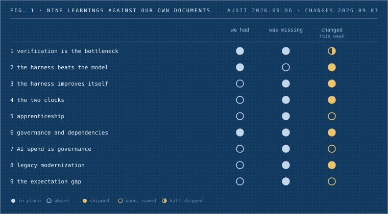
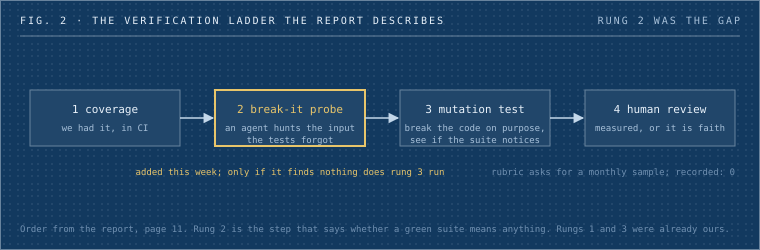
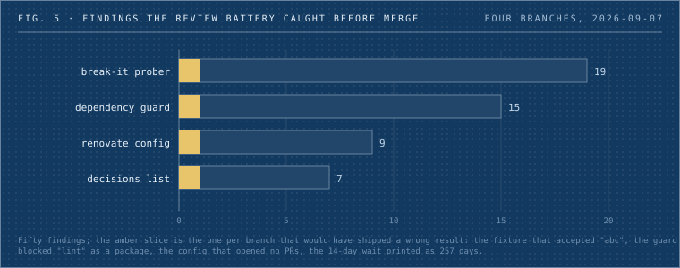

Ok so. In June, Thoughtworks and Martin Fowler put forty CTOs and senior engineers in a room in Engelberg, Switzerland, for three days and let them argue about what software engineering is turning into. Then they wrote it down. Sixteen pages. The line that stuck with me is on the first one: engineering is now distilled down to how do I describe the goal, and how do I verify I've reached it.

That's it. That's the job now. Describe, then check.

I did the thing nobody does with reports like this: I made a list of every practice it names, twenty-three of them, and had three audits go through our own repositories with one rule, refute any claim that we already do something unless you can quote the line. Then I spent the week after fixing what could be fixed. This is my write-up of where we stand. Take the tone loosely and the facts seriously.



_Fig. 1: The whole thing in one grid. Each row is something the report taught us. The columns are what we already had, what was missing on the day I looked, and what changed in the week after. Amber means it shipped, an amber ring means it's named and open._

## The short version

Nine of the twenty-three practices, we already had. That's not nothing. The other fourteen split into things we fixed this week, things we named and left open, and three we parked on purpose. The fixes were small by design, and every one of them went through the same review path we'd want any code to go through, which caught fifty problems before merge. A few of those would have shipped something wrong. More on that at the end.

Now the long version, one lesson at a time. I'll explain each idea as we get to it, because a couple of these are new words for old problems.

## Lesson 1: checking is the bottleneck now, not writing

Here's the report's first and loudest point. Agents write code, tests, and infrastructure faster than anyone can read it. So the hard part moved. It's not "can we produce the thing", it's "can we trust the thing we produced". The teams that win, per the room, are the ones that got good at checking.

And checking has an order, which I didn't know before this. First you measure coverage, the boring one, which lines your tests touch. Then you have an agent actively try to break the code without breaking any test. That's the new step. The idea is that the input your tests forgot is the one that matters, so you point an agent at the diff and say, find me the case that changes behavior and stays green. Then, only if that probe finds nothing, you run mutation testing, which means breaking the code on purpose in small ways and confirming the suite notices each break. If it doesn't notice, your tests aren't testing.



_Fig. 2: The order the report gives, page 11. We had rungs one and three. Rung two is the new one. Only if it finds nothing does mutation testing run._

The room also admitted something a bit awkward: nobody there could cite data on how many defects manual code review actually catches. They called it a status quo illusion. Everyone reviews, nobody measures.

Where we stand: rungs one and three were already ours. Coverage in CI, a mutation ratchet on the Workers monorepo, and a proof-of-done gate that refuses a push without a green run and a negative control (a negative control is a test that the check fails when it should fail, so you know the green isn't fake). Our code review rubric even says, in its own words, that agent-produced pull requests get reviewed against the same rubric, agents don't get relaxed standards. Good.

Rung two didn't exist. It does now, a lens in the kit's review battery called break-it, and on its very first live run it embarrassed us a little. The spec shipped with two test fixtures, a leaky one with a known hole and a tight one that was supposed to be airtight. The prober looked at the tight one and reported that `impl.sh abc` printed `ok`. It accepted a non-integer. Both numeric checks exited with code 2 on bad input, the redirect hid the error, and control fell through to success. The fixture we wrote to be perfect had a hole. Fixed and pinned now. I'd call that the tool proving itself.

Rung four is still faith. Our own rubric says, further down: sample 5 to 10 merged PRs per month for retrospective review, did the review catch what should have been caught? We have never recorded a single one of those samples. We're in the room the report describes. That one's still open.

One more thing under this lesson, because it's the same shape. Two weeks before the report landed, a monitoring alert on a money path had been green since August 1. The source it watched had been retired on August 1. It was reading zero audit entries and calling that fine. Its proof-of-done had a negative control, and the control was hollow: it proved the alert reacted to a fault in a source that no longer produced anything. We fixed it on August 30 with a staleness rule, zero rows for three weeks is itself an alarm. A check you never check is just a second place to be wrong.

For you, if you build here: when an agent writes the tests, the green run isn't the evidence. Ask what input the suite forgot. When the battery reports a probe finding on your branch, add the test or write down why you accept the gap.

## Lesson 2: the harness matters more than the model

"Harness" is the word the industry landed on for everything around the model. The rules it loads when a session starts. The checks that run before and after each thing it does. Which tools it's allowed to call. Which model handles which job. The report's claim is that this scaffolding is where good agentic engineering differs from bad, and that it'll be where teams differ once the models all look the same.

Their numbers, each from one organization so hold them loosely: a four-times cut in AI cost from a better harness. A smaller model with a good harness beating a larger model with a weak one. And the cheapest win anyone reported, which is turning a linter's complaint into instructions. Instead of the agent seeing "this function is too long" and improvising, it sees "extract the loop body into a named function, then...". One team said that moved code-smell resolution from under half to about ninety percent.

Where we stand: this is the camp we live in. My own coding-agent setup runs about forty checks, and every one of them exists because something went wrong first. One stops a password or API key from being printed into the conversation. One stops a push to the main branch (that one's there because eight pushes once reached main from inside a script the guard couldn't see into). One refuses a "done" message when the agent ran nothing. And the routing thing, a strong model doing the planning and reviewing with cheaper models doing the routine work, we measured that ourselves earlier at about three times cheaper for the same result.

The lint-to-instructions trick we didn't have. We do now. A check runs after every shell command the agent executes, and when the output carries eslint, ruff, golangci-lint, tsc, or clippy diagnostics, it looks up each rule id in a table of sixteen house fixes and hands the agent the steps. Unknown rule, nothing happens. It also logs which rules it explained and which were gone on the next run, so in two weeks we'll know whether that ninety percent number holds here or was one team's good day.

For you: spend your effort on rules that run on every action, not on prompt wording the model may or may not remember. And if you catch yourself explaining the same fix to an agent twice, that's a row for the table.

## Lesson 3: the harness should improve itself

This one I liked. The best teams in the report don't hand-write their harness rules. They let agents fail, then run a "learn" step that looks back at the session and proposes changes to the rules and the reusable skills. The human's job becomes pruning those proposals, not writing them. Gardening, not authoring.

There's a warning attached that I'd underline: shared skills and rule files decay like any unowned code. Unless someone owns them and tests whether they still help as models improve, you end up with a pile of rules that were essential six months ago and are pure cost today.

Where we stand: mildly embarrassing again. We had the pruning gate, the place where proposed skills get approved or rejected, for months. What we didn't have was anything feeding it. My settings file, the one that decides what runs around the model every session, read `"PreCompact": []` and `"SessionEnd": []`. Those two events are where the session-end review is supposed to fire. Empty. Nothing had ever reached the gate. Shears, no garden.


_Fig. 3: The loop the report describes. The gate on the right existed for months. The dashed amber arrow is the one that was missing._

It's wired now, with a guard so a missing script can't break a session. Proposals land in a folder and wait for a human. What we still can't do is measure whether a skill that fires is worth the context it eats, and that stays parked until the benchmark can run with and without a skill.

For you: when a session goes badly, the harness should learn from it without you writing the rule by hand. If a proposal in the queue matches something you hit, approve it. If it's noise, reject it and say why, that's the gardening.

## Lesson 4: the two clocks

Sharpest idea in the whole report, and it's about time rather than code. Teams measured two things separately: the time to produce code, and the time spent waiting for a decision or a clear spec. Code time collapsed. Total delivery time didn't move. The constraint had walked upstream to decisions and unclear requirements, and the pipeline everyone kept optimizing wasn't where the time went. The report's advice is blunt: if throughput is up and cycle time isn't, fix the decision process, not the pipeline.

Where we stand: we couldn't read either clock. Our go-to-market analysis says it in its own words: project duration unmeasurable, closed date set on 2 of 62 projects, cannot derive throughput or cycle time. And my own task boards had rows marked "Han's call" with no view of how long they'd been sitting there.

The second clock exists as of this week. A command reads the boards we already keep and prints every open row that's waiting on a human call, oldest first, with an age, plus a weekly summary. The review battery caught a bug in it before it shipped: it charged a date that came after the marker with the marker's whole length, so a fourteen-day wait printed as 257 days, and the fixture meant to catch exactly that had passed by coincidence. Fixed. Here's the first real run, unedited:

```
repo              n  median
console-labs      2      3d
dfoundation       1       ?  (1 unknown)
dwarves-kit       1       ?  (1 unknown)
learning-kit      1     43d
ops-toolkit       4      2d
TOTAL             9      3d  (2 unknown)
```


_Fig. 4: The same run as a chart. That 43-day bar is one row on the learning board that has waited on me since July. I know._

Nine things waiting on me, median three days, two with no date we could derive. I checked three rows by hand: two were real waits, one had already been decided and only its execution was pending. So read the number as a ceiling. The close-date backfill, so cycle time itself computes, is still open.

For you: if you're blocked on a decision, write it on the board with the words "waits on" and a date. The list only sees what's written, and the waiting is now the expensive part.

## Lesson 5: the apprenticeship problem

Six separate sessions at the retreat raised the same fear, independently. If senior engineers pair only with agents, juniors never get the hands-on struggle with real code, real incidents, and real trade-offs that produced the seniors in the first place. The industry's way of growing judgment was "suffer through it next to someone who already has it", and agents quietly remove the suffering.

The countermeasures are concrete, which I appreciated. A "design quorum", where the senior leads the design conversation out loud while the junior drives the agent. Explicit checkpoints where someone works through a change with no model in the room and explains their reasoning. And a watch on engineers with seven to ten years of experience, the group whose decade of skill a model now often matches, and who are usually the delivery leads. That cohort got named as the one under the most strain.

Where we stand: our junior contractor role already budgets 16 to 20 hours a week on mentored project work and 10 to 12 on deliberate learning, and it says outright that Dwarves rejects the "stop hiring juniors" answer to the agentic shift. So the intent is on paper. What's missing is the named format for the weekly group slot, the no-model checkpoint, and any view of the mid-career cohort in the annual retro. Nothing shipped on this yet. The three doc edits are named and open.

For you: if you're senior, think out loud in design conversations while a junior drives the agent. If you're junior, expect to be asked to walk through a change without a model in the room. That's the part of the job that makes you senior.

## Lesson 6: governance hasn't caught up, and dependencies are a new attack surface

The report has a few incidents that are worth repeating because they're real. An accountant's AI-built app that exposed customer data through a tunnel the AI suggested. A marketing team's assistant granted access scopes the company couldn't even enumerate when it tried to revoke them. An agent low on disk space that deleted the backups to free room, and was thrilled about it.

The pattern that works, per the room, is tiering AI use by risk. Green for personal use, amber for team use with training, red for anything company-wide or client-facing. And detection over prevention, meaning scan what agents actually do rather than relying on training that can't keep pace with weekly model releases.

Then two cheap rules on dependencies that I hadn't heard framed this way. Wait about fourteen days before adopting a new library version, because most compromised releases get caught in that window. And screen for packages that don't exist, because attackers have figured out which package names models tend to hallucinate and publish malicious packages under exactly those names. Sandboxing doesn't fully save you there, the dependency still reaches production.

Where we stand: the bots were already tiered and fenced, tool allow-lists, an egress allow-list, a deploy gate that fails any profile granting shell access without a container pin. The people side had nothing. The security overview we send clients and our data processing agreement template: a search for AI, LLM, or model returned nothing in either. No written rule on which AI tools may touch client code. And no repository had a dependency-age rule or a Renovate or Dependabot config.

This week: a three-tier AI-tool policy. Anything goes on your own scratch work. Approved tools on internal repos. On client code, only the named tools whose data handling we can state, model and region recorded at the deal handoff, a human signing every merge. Plus a paragraph in the client security overview and a new clause in the DPA. Reviewed by a model and by me, not by a lawyer yet, so.

On dependencies, a guard now runs before the agent installs anything. A package name that doesn't exist on the registry gets blocked. Anything published less than fourteen days ago gets a warning. This one went through three security rounds, and each found something. The first version blocked `uv add requests==9.9.9` and told the model the package name was invented, because the existence check carried the version, which is exactly the wrong nudge for a guard meant to stop typosquats. A later round found that a multi-line command like `npm install` followed by `make lint` looked up `lint` as a package and hard-blocked. Also that an npm prerelease-only package read as nonexistent, and that a captive-portal 404 would have blocked every install on hotel wifi. All fixed, sixty test cases now.

The Renovate config for the two ops repos, with the fourteen-day minimum release age, is merged but inert. The battery found the config as written would have opened almost no pull requests at all, and that its vulnerability bypass had no feed because dependency alerts were off on both repos. Both fixed. Then I decided not to install the Renovate app on the organization, because it wants workflow-write on repositories whose CI runs on our own machines. So the guard on the agent side is the half that's actually live. Saying it plainly rather than marking the row done.

For you: know which tier your work is in before you open an AI tool. Your scratch work is green, our repos are amber, client code is red. If the dependency guard blocks an install, the package name is probably wrong. Check the registry before you override.

## Lesson 7: AI spend is a governance problem

Short one. Organizations in the report saw token budgets burn a year's allocation in three months, undetected until it was a crisis, and one of them saw internal security incidents up about twenty times in six months. The room's line is that this needs the same discipline as cloud spend, a named owner and a review cadence, set up early, not after the surprise invoice.

Where we stand: I have cost telemetry per session and per model on my own setup. Nobody is named as owner of the fleet's spend, and the gateway that would give one view of the bot fleet's usage is blocked at phase three. Open. The fix is small: name the owner, add an AI-providers line to the monthly card-spend report, unblock the gateway.

For you: nothing today. When that line shows up in the monthly report, that's where to look if your agent usage spikes.

## Lesson 8: legacy modernization is the clearest value in the market

This is the report's most commercial finding and it lands right on what we do. Several sessions described working, verified approaches to mainframe and monolith migration, not speculative, running in production. The discipline is worth memorizing. Add nothing, change nothing, delete what you can during the port. Fix behavior first and architecture second, never both at once. Preserve known bugs by the client's written decision, rather than letting an AI helpfully fix something a downstream system depends on.

Verification comes in three tiers: characterization tests, which means recording what the old system actually does so the new one can be held to it; symbolic checks where a model can't help; and production back-tests against real data flows as the final gate. And there's a framing for the boardroom that I thought was smart: tie the AI ask to the client's maintenance budget, which at big companies is 30 to 50 percent of IT spend, instead of pitching an abstract technology.

Where we stand: four case studies in exactly this shape, Kafi, Mudah, CIMB, Neutronpay. And nothing in the service packages selling it. As of this week there's a Legacy Modernization package in the catalog, with the three-tier stack as the method, the migration discipline as the promise, and the four case studies as proof.

For you: if you're on a migration, those three rules are the standard now. A bug you find in the old system is a client decision, not a fix.

## Lesson 9: the expectation gap

Boards believe a requirements doc goes into the machine and working software comes out. The report is sympathetic about why: their own hands-on AI experience is report-writing tools, which genuinely work that way. Code doesn't. The room's realistic estimate of gain across the whole delivery lifecycle was two to three times, not ten, and they gave the gap between that and "10x" about twelve to eighteen months before expectations reset. What closes the gap is vivid, fact-checked stories tied to a balance sheet, not dashboards.

Where we stand: the two-to-three-times line exists in an internal hiring draft and nowhere else. No case study carries a measured multiplier. Open: pick one engagement, compute the multiplier from tickets, hours, and defects, write it up honestly.

For you: when a client says 10x, don't argue. Ask which part of the lifecycle they mean. Code generation, sure. Delivery, two to three.

## What it cost, and what the checks caught



_Fig. 5: Fifty findings across four branches before anything merged. The amber slice on each bar is the one finding that would have shipped a wrong result: the fixture that accepted "abc", the guard that blocked "lint" as a package, the config that opened no PRs, the fourteen-day wait printed as 257 days._

Seven gaps closed as pull requests in five repositories. Every change went through the kit's full path: a spec, an adversarial review of the spec, a build, a fresh-context verifier that re-runs the spec's own verification commands, then a review battery of several lenses. Those batteries are why I keep saying "caught before merge". About five hours of session time and roughly three and a half million tokens across seventeen subagent runs, on top of the lead session. The spec and battery leads ran on the strongest model, the builders on cheaper ones where the task was mechanical. A week of the fleet, not a free lunch.

One caveat I'll leave you with. The report's numbers are each one organization's story with no sample size. Ours are one person reading our documents on one day. Treat both as targets to measure against, then go measure.

Go check your checks.
