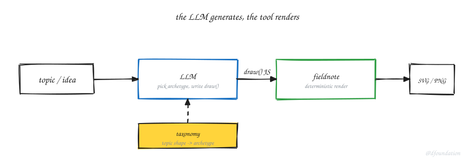
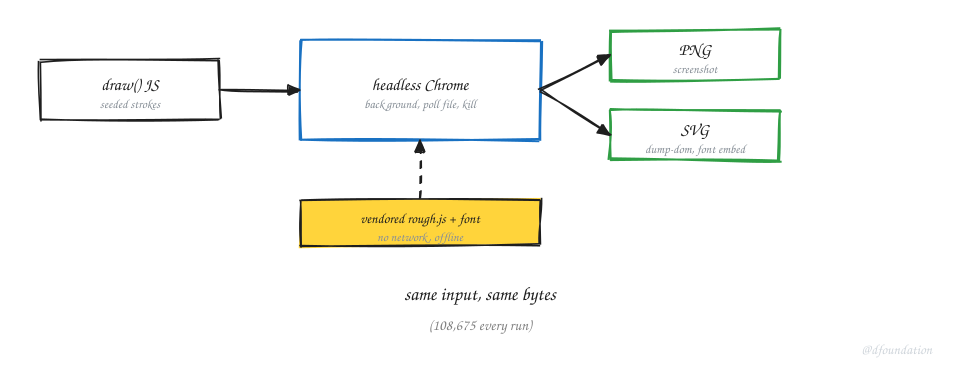
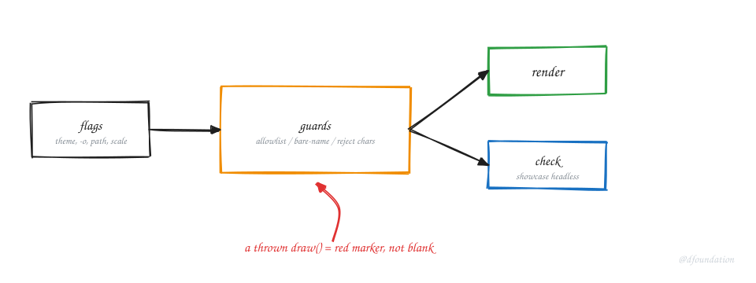

_Fig. 1. The split that made it work. The model writes the drawing; the tool only renders it._

I wanted our memo posts to carry the hand-drawn diagrams you have seen on this site, without me opening Excalidraw for each one. My first instinct was the obvious one: ask the model to generate the image. I doubted it out loud, because a model that redraws a picture from scratch every time gives you a different picture every time, and none of them look like ours.

So we built the tool the other way around. The model does not draw. It writes a short program that describes the diagram, and a small deterministic tool renders that program the same way every run. The tool cannot invent; it only draws what it was told, in our house style. That is `fieldnote`, and the split is the whole idea. The rest of this post is how the split is built, and the receipts that made it hold.

## Why the split is the point

A rendered diagram from a model is a slot machine. Same prompt, new pixels, off-brand half the time. Move the generation up into code and two things change. The output is reproducible: the same input yields the same bytes, which is how we caught our own regressions. And the style is fixed in the renderer, so every diagram inherits the house strokes and palette for free.

The receipt is boring and exact. Our example diagram renders to a PNG of 108,675 bytes. It stayed 108,675 bytes across a security refactor, a new drawing helper, and a font change. When a refactor is supposed to change nothing, a byte-identical render proves it changed nothing. A model-drawn image gives you no such handle.

## The render path

_Fig. 2. The machinery under "deterministic render." Nothing is fetched at run time, and the same input yields the same bytes._

A diagram file is plain JavaScript. It sets a size and defines a `draw(s)` function that calls drawing primitives. The renderer wraps that file in a minimal HTML page, loads it in headless Chrome, and captures the result. Two vendored dependencies, rough.js for the sketchy strokes and the hand font, sit next to the tool, so a render touches no network and cannot drift with an upstream release.

Determinism comes from three choices. The strokes are seeded, so the same program produces the same wobble every time. The font is embedded as a data URI in the SVG output, so the file is portable and renders the same on any machine. And the whole thing is offline. That is why the byte count is stable, and why the byte count is a test.

Headless Chrome fought us here. New-headless writes the screenshot and then never exits, so the tool backgrounds the browser, polls for the output file, and kills the process once it appears. A scale flag we tried for retina output hangs the browser outright, so the tool scales the SVG viewport instead. For the SVG path, `dump-dom` serializes the whole document onto one line, which breaks the obvious `sed` range that matches the opening and closing tag on the same line. The tool slices the single line instead. None of this is deep. All of it costs an afternoon if you meet it cold.

## The vocabulary the model writes against

The model does not freehand SVG. It composes about thirty named primitives: nodes, arrows, groups, bars, a radar, a legend, a hand-drawn ring for cycles. Each primitive takes the same shape of options, so an agent extending the set has one pattern to copy rather than a guess per call. Stroke style, for instance, is a single option shared across nodes, arrows, and groups: solid, dashed, dotted, accent, border. When we unified that vocabulary, the example render stayed byte-identical, because the old option names still alias to the new one. The back-compat is what let the byte count stay put, and the stable byte count is what proved the refactor changed nothing.

Above the primitives sits a taxonomy: a table that maps a topic's shape to an archetype. A process becomes a flowchart; a comparison becomes a matrix. The model reads the topic, finds the row, copies the nearest example, and fills in the real content. Generation stays dynamic, and the taxonomy keeps the choice consistent instead of ad hoc. This figure was chosen that way: the post argues a split, so its hero is a two-stage pipeline.

## The guards, and the bug a fresh pair of eyes found

_Fig. 3. What a review pass added. The dangerous input is refused before it reaches the page, and a broken drawing is visible, not silent._

The tool interpolates values into an HTML page and runs them in a browser. That is an injection surface. The theme flag is allow-listed, the output flag must be a bare filename so it cannot overwrite a path elsewhere, and the diagram path rejects quotes and brackets. We added these after a review, not before, which is the honest order.

The review also found the bug I would not have. A diagram file that throws still produces a valid, non-empty screenshot: a blank canvas. Every "is the file valid" check passes on it, so an empty drawing could ship green. The fix was to wrap the drawing call in a try/catch that paints a visible red error marker, so a broken diagram is obvious instead of silently blank. A separate `check` command now loads the whole component gallery in headless Chrome and fails if any primitive throws. The gallery had been called the regression surface for weeks with no way to run it; now there is one.

## The dead end, so you can skip it

We wanted Vietnamese labels, and the default hand font could not render them. I measured it before believing it: 2 of the 90 precomposed Vietnamese letters, and none of the tone marks. A fuller subset was never going to help, because the glyphs are simply not in that font. We swapped in a different hand font behind a flag, one that carries all 90 letters, and subset it to keep the file small. The lesson we are keeping: check the coverage before you plan the fix. The naive fix here would have been a day spent merging font subsets that never contained the glyph we needed.

## The tool teaches the model

The last piece is a contract the model reads. When someone shares a new reference diagram with a device the kit lacks, the contract tells the agent to archive the reference, find the missing primitive, add it, add a gallery cell, render, look, and commit. The kit is meant to grow, and the agent is the one that grows it. The taxonomy and the gallery are the two files that keep that growth honest: one says which diagram to reach for, the other proves the primitives still render.

## Where it leaks

The tool renders; it does not judge. A blank diagram used to pass every check, and only a review caught it. The taxonomy is ours, not a law: a topic with a shape the table does not name still needs a human to add the row. And the hand-drawn look is a choice with a cost. It reads as honest and personal on a blog; a formal venue may read it as unfinished.

## How to reproduce the thinking

When you want a model to make an artifact you will reuse, ask what part must be consistent and move that part into code. Let the model generate the variable part and let a dumb tool render the fixed part. Write down the choice the model has to make, so it makes the same one twice. Then keep a boring, exact receipt, a byte count, a checksum, a fixed test, so you can tell when a change that should do nothing actually did nothing.
