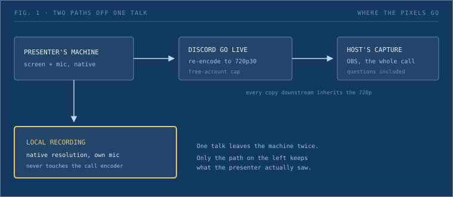
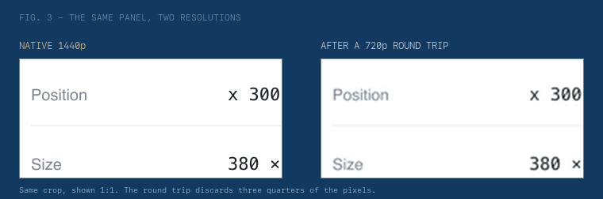

The technique, stated once: the presenter records their own screen and microphone locally, and that file is the master. The host records the call separately, and that file exists for the questions. Two tracks, cut together only if the session earns an edit.

Everything below is why, and the exact settings.

## The call is the wrong source

Discord has no recorder. Not in a menu, not behind a server setting. Voice and stage channels carry audio and video and then let them go.

So the reflex is to capture from outside: point OBS at the Discord window and grab what arrives. That works, and it hands you a copy of a copy.

A free Discord account streams Go Live at [720p and 30fps](https://support.discord.com/hc/en-us/articles/360040816151-Go-Live-and-Screen-Share). Nitro Classic raises it to 1080p60, full Nitro to 4K60. Most people on a work call have never bought Nitro, so their screen leaves the machine at a quarter of the pixels they are looking at, and every copy downstream inherits that number.



_Fig. 1: One talk leaves the machine twice. Only the left path keeps what the presenter was actually looking at._

## What 720p costs, measured

I tested the resolution half rather than assert it. I rendered a properties panel of the kind design tooling is full of, small labels and numeric fields at 11px, at 1440p. Then I pushed it down to 720p, back up to 1440p, and cut the same crop out of both.



_Fig. 2: The same crop, shown 1:1. The round trip discards three quarters of the pixels._

Softer, and less bad than I expected. The labels survive. What goes is edge definition, the crispness that makes a screen full of numbers comfortable to read rather than work.

Two honest caveats on that measurement. It models resampling only, so Discord's encoder adds compression on top at whatever bitrate the network allowed. And a round trip through a downscale is a floor, not the real pipeline. The real loss is worse than Figure 2 and I did not measure how much worse.

## The presenter's capture

The copy worth keeping never touches the call encoder. It comes off the presenter's own machine at whatever resolution their screen runs.

On macOS that is `Cmd+Shift+5`, which opens a bar with seven buttons. The first three take stills. The three after the divider record: entire screen, one window, selected portion.


_Fig. 3: The capture bar on macOS 26. Recording lives to the right of the divider; the three buttons on the left only take stills._

There is one trap. Open **Options** and set Microphone to the actual microphone. It defaults to **None**, and none of the interface objects when you record that way. You get a video that looks correct and plays silent, and the audio is not recoverable afterwards.

That gives four steps, in this order:

```
1. Cmd+Shift+5
2. Record Entire Screen        (right of the divider)
3. Options > Microphone > your mic     <- defaults to None
4. Record. Stop from the menu bar icon. File lands on the Desktop.
```

Windows is `Win+Alt+R` through Game Bar, `Win+Alt+M` for the microphone, and the file lands in `Videos\Captures`. Game Bar records one window rather than the whole screen, so a talk that moves between a browser, an editor and a terminal needs OBS on the presenter's side instead.

Neither path installs anything, which is the property that matters. You are asking someone to do this minutes before they speak.

Send the steps ahead of the session rather than explaining them during it. A presenter about to talk has no attention to spare for a settings menu.

## What the local track misses

The presenter's file holds their screen and their voice. It does not hold the room.

Questions arrive over the call from other people's microphones and never reach the local recording. Often the questions carry the most value: someone pushes back on a decision, the presenter explains reasoning they left out of the walkthrough, and that exchange is what a new joiner needs six months later.


_Fig. 4: The presenter's track wins on quality for everything it holds. It simply does not hold the discussion._

So the host records the call too, in OBS, whenever the Q&A is worth keeping. That capture is 720p and that is fine, because its job is the audio of people asking things.

## Limits worth stating

The 720p number is Discord's published cap rather than a bitrate I pulled off our own stage. I never captured a live session next to the presenter's local file and compared them, so the compression layered on top of the resampling stays an assumption here. Record the same screen both ways once if you want the real answer for your setup.

Consent sits outside the technique and still gates it. Say the session is being recorded before it starts. Some people speak differently once they know, and a few would rather not be recorded at all, which is a thing to learn before the fact.

We have run [OGIF](/ogif-intro) since 2023, and the sessions that survive are the ones somebody set up to record beforehand. The failure mode is quiet: nobody configures anything, the session runs, and the decision gets made by default in the direction of losing it.
