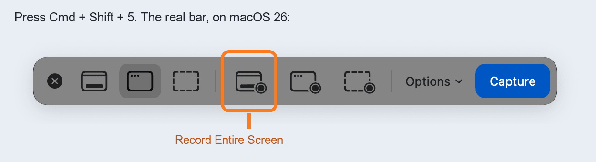
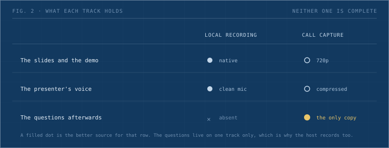

You give a talk on a Discord stage. Record it on your own machine.

Discord has no recorder, and its screen share is re-encoded on the way out, so a copy captured from the call looks soft. Your local recording keeps your screen sharp and your voice clean.

Setup takes about 20 seconds. Nothing to install.

The host records the call separately, because your local file will not have the questions. Two tracks, cut together only if the session earns an edit.

## Why the call is the wrong source

A free Discord account streams Go Live at [720p and 30fps](https://support.discord.com/hc/en-us/articles/360040816151-Go-Live-and-Screen-Share). Nitro Classic raises it to 1080p60, full Nitro to 4K60. Most people on a work call have never bought Nitro. Their screen leaves the machine at a quarter of the pixels they are looking at, and every copy downstream inherits that number.


_Fig. 1: One talk leaves the machine twice. Only the left path keeps what the presenter was looking at._

## What 720p costs

I measured the resolution half rather than assert it. I rendered a properties panel of the kind design tooling is full of, small labels and numeric fields at 11px, at 1440p. Then I pushed it to 720p, back up to 1440p, and cut the same crop out of both.


_Fig. 2: The same crop, shown 1:1. The round trip discards three quarters of the pixels._

Softer, and less bad than expected. The labels survive. What goes is edge definition, the crispness that makes a screen full of numbers comfortable to read rather than work.

Treat that as a floor. The test models resampling only. Discord's encoder adds compression on top, at whatever bitrate the network allowed, so the real loss is worse by an amount I did not measure.

## Mac

**1. Press `Cmd + Shift + 5`.** A control bar appears at the bottom of the screen. The first three buttons take stills. The three after the divider record: entire screen, one window, selected portion. Choose **Record Entire Screen**.



_Fig. 3: The capture bar on macOS 26. Recording lives to the right of the divider._

**2. Click Options and pick your microphone.** It defaults to **None**, and nothing warns you. You get a video that looks correct and plays silent, and the audio is not recoverable afterwards. This is the step people miss.

**3. Click Record before you start talking.**

**4. Stop from the icon in the menu bar.** The file saves to your Desktop as a `.mov`.

## Windows

Press `Win + Alt + R`. Xbox Game Bar records the active window. Check the mic is live with `Win + Alt + M`. The same shortcut stops the recording, and the file lands in `Videos\Captures`.

Game Bar records one window, not the whole screen. If your talk moves between a browser, an editor and a terminal, use OBS instead.

## Before you go live

| Check | Why |
|---|---|
| Record ten seconds and play it back | The only way to know the mic is on |
| Turn on Do Not Disturb | Notifications land in the video |
| Keep a few GB of disk free | A full disk stops the recording |
| Close the tabs you would not screenshot | Entire Screen means entire screen |
| Say the session is being recorded | Some people would rather not be |

## What your recording misses

Your file holds your screen and your voice. It does not hold the room.

Questions arrive over the call from other people's microphones and never reach your local recording. Often the questions carry the most value. Someone pushes back on a decision, you explain reasoning you left out of the walkthrough, and that exchange is what a new joiner needs six months later.



_Fig. 4: Your track wins on quality for everything it holds. It does not hold the discussion._

So the host records the call too, in OBS, whenever the Q&A is worth keeping. That capture is 720p and that is fine. Its job is the audio of people asking things.

## Afterwards

Send the file to whoever hosted. Fifteen minutes of screen recording is far past the Discord upload limit, so share it through Drive rather than attaching it.

## Limits

The 720p number is Discord's published cap, not a bitrate pulled off a live stage. Nobody captured a real session next to a presenter's local file and compared them, so the compression layered on top of the resampling stays an assumption here. Record the same screen both ways once if you want the real answer for your setup.

Consent sits outside the technique and still gates it. Say the session is recorded before it starts, not after.

We have run [OGIF](/ogif-intro) since 2023. The sessions that survive are the ones somebody set up to record beforehand. The failure mode is quiet: nobody configures anything, the session runs, and the decision gets made by default in the direction of losing it.

## The four steps, for pasting

```
1. Cmd+Shift+5
2. Record Entire Screen        (right of the divider)
3. Options > Microphone > your mic     <- defaults to None
4. Record. Stop from the menu bar. File lands on the Desktop.
```

Send these to the presenter before they go on, not while they are talking.
