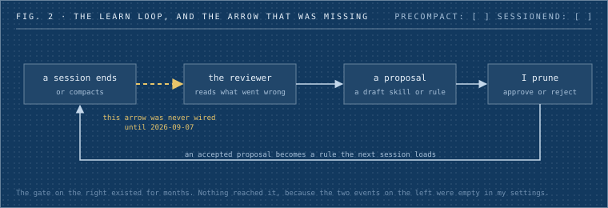
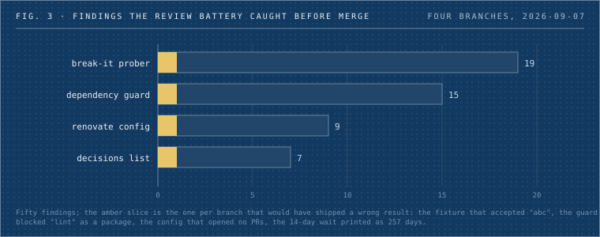
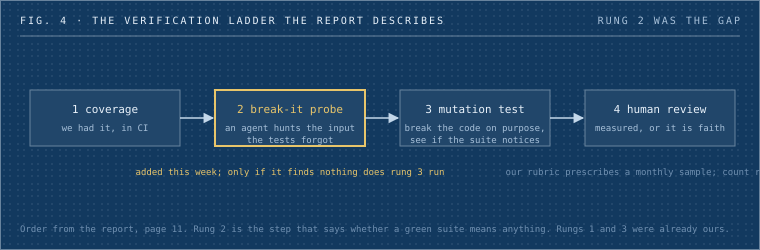
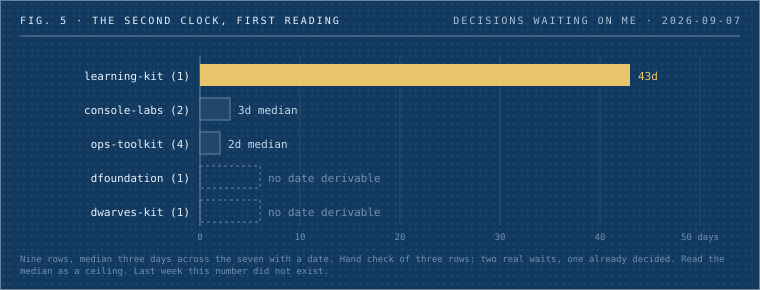

In June, Thoughtworks and Martin Fowler put forty CTOs and senior engineers in a room in Engelberg for three days and wrote up what they argued about. The report is sixteen pages. The sentence I keep coming back to is from the first of them: engineering is now distilled down to how do I describe the goal, and how do I verify I've reached it.

I read it on a Saturday and did what I'd want any of us to do with a report like that. I listed every practice it names, twenty-three of them, and went looking in our own repositories for each one. Not from memory. I had three audits run over the documents, with the instruction to refute any claim that we already do something unless they could quote the line. Then I spent the week closing what could be closed.

This is the record of that, with the receipts.


_Fig. 1: The whole post in one grid. Each row is a learning from the report; the columns are what we already had, what was missing on the day I looked, and what changed in the week after. Amber is shipped; an amber ring is open and named._

⠶⠶⠶⠶⠶⠶⠶ ⠿ ⠶⠶⠶⠶⠶⠶⠶

## What I found in our own documents

Some of it was good news. Our code review rubric already says agent-produced pull requests are reviewed against the same rubric, and agents do not get relaxed standards. Our junior contractor role already budgets 16 to 20 hours a week on mentored project work and 10 to 12 on deliberate learning, and it says outright that Dwarves rejects the "stop hiring juniors" answer to the agentic shift. Our bots run behind tool allow-lists, an egress allow-list, and a deploy gate that fails any profile granting shell access without a container pin. Nine of the twenty-three practices were already in place.

The rest was less comfortable, and I'd rather quote it than summarize it.

The review rubric, further down: sample 5 to 10 merged PRs per month for retrospective review. Did the review catch what should have been caught? We have never recorded a single one of those samples. The Engelberg room said nobody there could cite data on how many defects manual review catches, and called it a status quo illusion. We're in that room.

Our go-to-market analysis, in its own words: project duration unmeasurable. Closed Date set on 2 of 62 projects. Cannot derive throughput or cycle time. The report's sharpest finding is what it calls the two clocks: code time collapsed, delivery time didn't move, because decisions and unclear specs became the constraint. We can't even read the second clock.

The security overview we send to clients, and our data processing agreement template: a search for AI, LLM, or model returns nothing in either. We had no written rule on which AI tools may touch client code. The AI fluency census we ran is a survey, and says so.

My own coding-agent settings, the file that decides what runs around the model every session: `"PreCompact": []` and `"SessionEnd": []`. Those two events are where the kit's session-end review is supposed to fire, the one that looks at what went wrong and drafts a proposed skill or rule change for me to approve or reject. I had built the approve-or-reject gate months ago. Nothing had ever reached it, because the producer was never wired in.



_Fig. 2: The loop the report calls camp four. The gate on the right had existed for months. The dashed amber arrow is the one that was missing._

And one incident, from two weeks before the report landed. A monitoring alert on a money path had been green since August 1. The source it watched had been retired on August 1. The line count of audit entries it was reading was zero. Its proof-of-done had a negative control, and the control was vacuous: it proved the alert reacted to a fault in a source that no longer produced anything. We fixed it on August 30 with a staleness rule, zero rows for three weeks is itself an alarm, so it can never pass by reading nothing again.

⠶⠶⠶⠶⠶⠶⠶ ⠿ ⠶⠶⠶⠶⠶⠶⠶

## The comparison

One table, because a few of you asked for the learning-versus-practice shape. The source column names the document or the pull request the cell comes from.

| The report says                                                                                                                                             | What we had                                                                                                                                      | What was missing                                                           | Source                                                                                                   |
| ----------------------------------------------------------------------------------------------------------------------------------------------------------- | ------------------------------------------------------------------------------------------------------------------------------------------------ | -------------------------------------------------------------------------- | -------------------------------------------------------------------------------------------------------- |
| Verification is the bottleneck. Coverage, then an agent tries to break the code without failing a test, then mutation testing. Measure what review catches. | Coverage in CI. A mutation ratchet on the Workers monorepo. The proof-of-done gate.                                                              | The break-it step. The monthly review sample, never run.                   | code-review rubric; workers STATE doc                                                                    |
| The harness beats the model. Lint output rewritten as step-by-step fixes moved one team from under 50% to about 90% resolution.                             | About forty checks around the agent, each born from an incident. Cheap-worker routing, measured earlier at about 3x cheaper for the same result. | The lint-to-instructions step.                                             | my settings file; the routing note in my global rules                                                    |
| The harness should improve itself. Agents propose edits, humans prune. Skills decay without an owner.                                                       | The prune gate.                                                                                                                                  | The producer, unwired. Any test of whether a skill earns its context.      | `PreCompact: []`                                                                                         |
| The two clocks.                                                                                                                                             | Nothing.                                                                                                                                         | Cycle time, and any view of decisions waiting on me.                       | gtm analysis, 2 of 62                                                                                    |
| Apprenticeship. Senior leads design out loud, junior drives the agent. Checkpoints with no model in the room. Watch the 7 to 10 year cohort.                | The junior role's mentored hours.                                                                                                                | A named format. A no-model checkpoint. Any view of the mid-career cohort.  | junior contractor role doc; annual cohort retro template                                                 |
| Governance. Tier AI use by risk. Wait 14 days on new library versions. Screen for packages that don't exist.                                                | Bots tiered and fenced.                                                                                                                          | A policy for people. Any dependency rule.                                  | S25 security overview, S22 DPA, both with zero AI mentions; no renovate or dependabot config in any repo |
| AI spend is governance. Name an owner, review on a cadence.                                                                                                 | Per-session cost telemetry on my own setup.                                                                                                      | A named owner. Gateway fronting for the bot fleet, blocked at phase three. | the gateway verification note                                                                            |
| Legacy modernization is the clearest value pool.                                                                                                            | Four case studies in exactly this shape: Kafi, Mudah, CIMB, Neutronpay.                                                                          | Nothing in the service packages selling it.                                | S17 service packages                                                                                     |
| The expectation gap. Realistic gain is 2 to 3x, not 10x.                                                                                                    | The 2 to 3x line, in an internal hiring draft.                                                                                                   | A case study with a measured multiplier.                                   | talent acquisition draft                                                                                 |

⠶⠶⠶⠶⠶⠶⠶ ⠿ ⠶⠶⠶⠶⠶⠶⠶

## What we changed, told through what broke

Seven of the gaps closed this week, as pull requests in five repositories. I'm not going to list them as a victory lap, because the interesting part of each one is what the checks caught before it merged. Every change went through the kit's full path: a spec, an adversarial spec review, a build, a fresh-context verifier that re-runs the spec's own verification commands, then a review battery of several lenses. The batteries caught fifty findings across the four branches. These are the ones that mattered.



_Fig. 3: Fifty findings across four branches before anything merged. The amber slice on each bar is the one finding that would have shipped a wrong result._



_Fig. 4: The order the report gives, page 11. We had rungs one and three. Rung two is the new lens; only if it finds nothing does mutation testing run._

The break-it prober is a new lens in the review battery. Its job is to take a diff and its tests and find the input the tests forgot. To prove it worked, the spec shipped with two fixtures: a leaky implementation whose tests miss a real hole, and a tight one whose tests pin the boundary. On the first live run against the tight fixture, the prober reported that `impl.sh abc` printed `ok`. The fixture we wrote to be airtight accepted a non-integer, because both numeric tests exited with code 2 on non-integer input, the redirect hid the error, and control fell through to success. The fixture is tight now, and the case is pinned. I'd have accepted that fixture in review.

The dependency guard blocks an install of a package name that doesn't exist on the registry, and warns on anything published less than 14 days ago. It went through two security rounds in the build and a third in the battery. The build round found that the first version blocked `uv add requests==9.9.9` and told the model the name was invented, because the existence check carried the version, which is the exact wrong steer for a guard meant to stop typosquats. The battery round found that a multi-line command like `npm install` followed by `make lint` looked up `lint` as a package name and hard-blocked. Also that an npm prerelease-only package read as nonexistent, and that a captive-portal 404 would have blocked every install on hotel wifi. All fixed, sixty test cases now, and I've named the residue: a private scoped package that 404s on the public registry warns instead of blocks.

The decisions list is the smallest thing I could build for the two clocks. It reads the boards we already keep and prints every open row waiting on a human call, oldest first, with an age, plus a weekly summary. The battery found that it charged a date after the marker with the marker's whole length, so a fourteen-day wait printed as 257 days, and that the fixture meant to catch exactly that had passed by coincidence, because the marker phrase happened to be ten characters long. Fixed. Its first real run, unedited:

```
repo              n  median
console-labs      2      3d
dfoundation       1       ?  (1 unknown)
dwarves-kit       1       ?  (1 unknown)
learning-kit      1     43d
ops-toolkit       4      2d
TOTAL             9      3d  (2 unknown)
```



_Fig. 5: The same run as a chart. The 43-day bar is one row on the learning board that has waited on me since July._

Nine things waiting on me, median three days, two with no date I could derive. I checked three rows by hand: two were real waits, one had already been decided and only its execution was pending. So the number is a ceiling, and the marker vocabulary needs work. It's a number, though, and last week there wasn't one.

The Renovate configuration for the two operations repositories sets a 14-day minimum release age. The battery found that with caret ranges and lockfile maintenance off, the config as specced would have opened almost no pull requests at all, a no-op with a green validator. It also found that the vulnerability bypass had no feed, because dependency alerts were disabled on both repositories. Both fixed. Then I decided not to install the Renovate app on the organization, because it wants workflow-write on repositories whose CI runs on our own machines. So the config sits inert, and the dependency guard on the agent side is the half that's live. I'm saying that plainly rather than listing the row as done.

The lint-to-instructions check, the learn loop switched on with a guard so a missing script can't break a session, the three-tier AI-tool policy with a paragraph in the client security overview and a new clause in the DPA, and a Legacy Modernization package in the service catalog with the report's three-tier verification stack as the method and the four case studies as proof: all merged. The policy and the DPA clause were reviewed by a model and by me, not by a lawyer yet.

Five things are open and named. Run the review calibration sample once and record the number. Name the weekly group slot a design quorum and add a no-model walkthrough at each advancement review. Name an owner for AI spend and put a line for it in the monthly card-spend report. Backfill the close dates so cycle time computes. Write one case study with the multiplier actually computed.

⠶⠶⠶⠶⠶⠶⠶ ⠿ ⠶⠶⠶⠶⠶⠶⠶

## What it cost

About five hours of session time and roughly three and a half million tokens across seventeen subagent runs, on top of the lead session. Every spec and battery lead ran on the strongest model; the builders ran on cheaper ones where the task was mechanical. I'm stating it so that "seven gaps closed in a week" reads as what it was: a week of the fleet, not a free lunch.

⠶⠶⠶⠶⠶⠶⠶ ⠿ ⠶⠶⠶⠶⠶⠶⠶

## What I'm unsure about

Two things. The report's numbers are each one organization's story with no sample size, and mine are one person reading our documents on one Saturday. I've treated theirs as targets to measure against, and I'd ask you to do the same with mine. And I don't know whether the summit the report implies, checking output for less than it cost to produce, means anything for judgment-shaped work. It's a clear target for code. For a proposal or a hire or a pricing call, I have no idea what cheap checking looks like, and those stay on the human clock.

If the report is a mountain, generating code is the valley floor, the scaffolding around the model is the camp we're standing in, and checking output at the speed it's produced is the next pitch. We started climbing it by finding out that one of our own checks had been reading nothing for a month. That seems like the right place to start.
